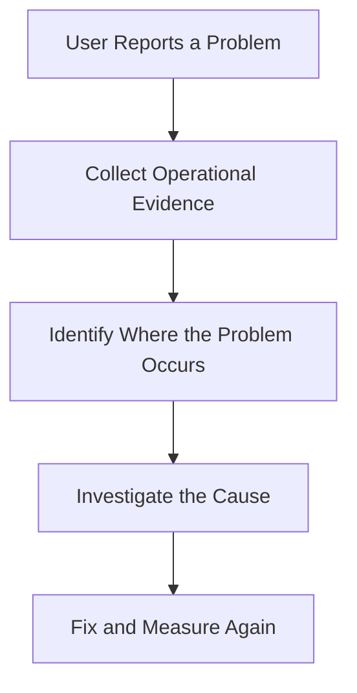
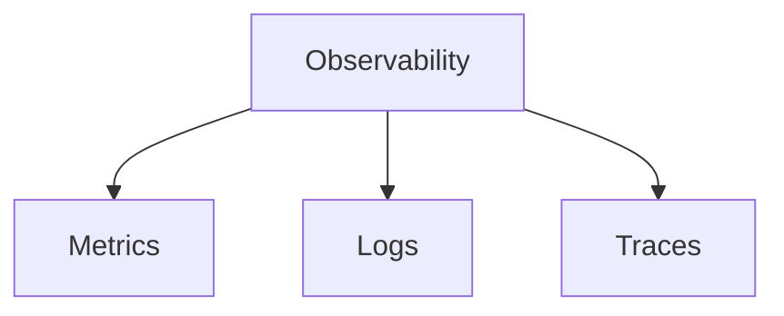
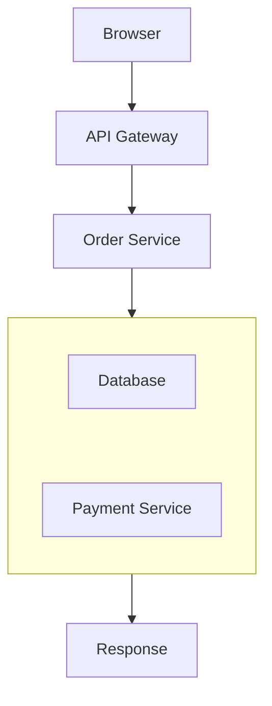
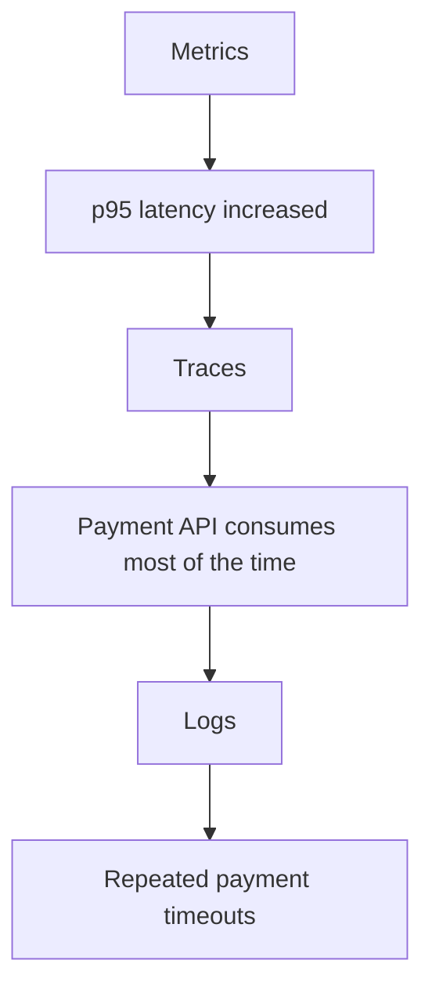
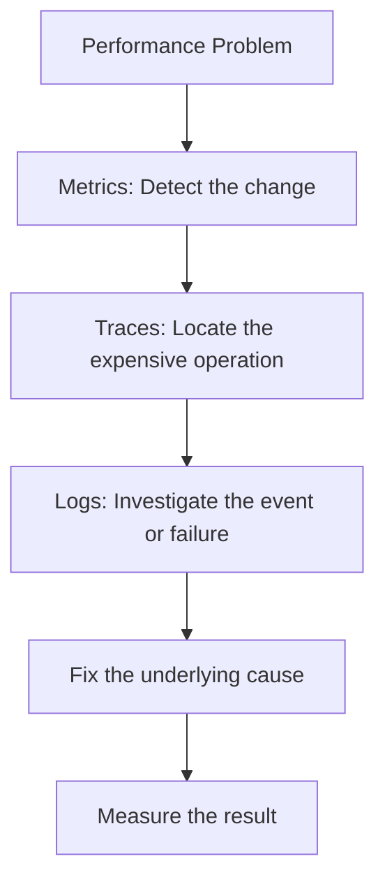
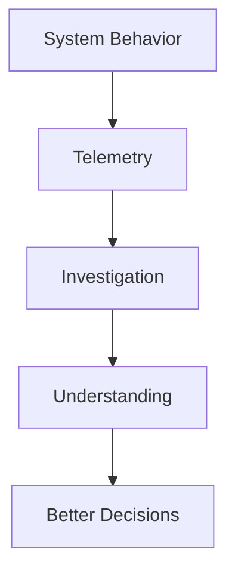
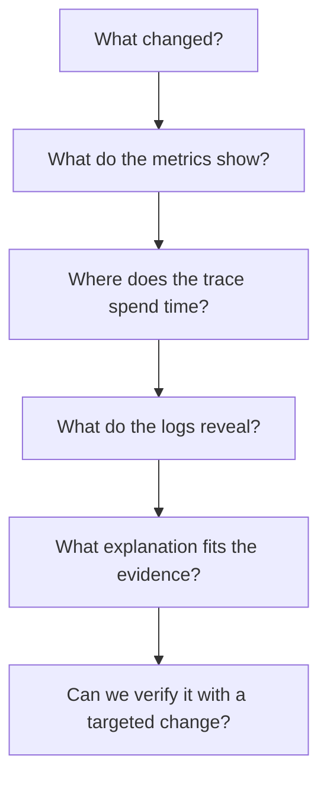

# 10.01 — Why Observability Matters

## Overview

**Core question:** How do we understand what is happening inside a system by examining the evidence it produces?

A system can be running but still be slow, partially broken, or failing for certain users. Without useful operational data, diagnosing the problem becomes guesswork.

Observability helps engineers understand system behavior, detect problems, investigate their causes, and verify whether a fix worked.

## Learning Objectives

By the end of this chapter, you should be able to:

- Explain observability and distinguish it from monitoring.
- Understand metrics, logs, and distributed traces.
- Measure latency, throughput, errors, and resource usage.
- Interpret p50, p95, and p99 latency.
- Design useful dashboards and actionable alerts.
- Trace requests across services and identify bottlenecks.
- Investigate incidents using evidence rather than guesses.
- Apply observability while considering cost, privacy, and system overhead.

---

# 1. What Is Observability?

**Observability is the ability to understand a system's internal behavior from the information it exposes about its operation.**

Imagine a user reports:

> "The checkout page is taking too long."

You need to determine whether the cause is:

- Slow application code.
- A database query.
- A payment provider.
- An overloaded server.
- A queue waiting for available workers.
- A network problem.

Observability provides evidence that helps you investigate these possibilities.



Without that evidence, engineers may change the wrong component and make the system more complicated without solving the problem.

---

# 2. Monitoring vs Observability

These concepts are related, but they are not identical.

| Monitoring | Observability |
|---|---|
| Tracks known conditions and expected failure signals. | Helps investigate system behavior, including unexpected problems. |
| Often uses dashboards, thresholds, and alerts. | Uses metrics, logs, traces, and contextual evidence. |
| Asks, "Is something wrong?" | Helps answer, "What is happening, and why?" |

For example, monitoring may alert you that request latency has increased.

Observability helps you investigate whether the increase came from database queries, application processing, network calls, or queueing.

**Monitoring detects signals. Observability helps explain them.**

---

# 3. The Three Common Pillars

Observability is commonly introduced through three types of telemetry:



- **Metrics:** Numeric measurements over time.
- **Logs:** Records of events that occurred.
- **Traces:** The journey of an individual request across components.

Each answers a different question.

| Type | Example question |
|---|---|
| Metrics | How many requests are failing? |
| Logs | What error occurred during this request? |
| Traces | Which operation consumed most of the request's time? |

Together, they provide a more complete picture than any one type alone.

---

# 4. Metrics — What Is Happening at Scale?

A **metric** is a numerical measurement collected over time.

Examples include:

```text
Request rate       = 800 requests/sec
Error rate         = 1.2%
CPU utilization    = 75%
Memory usage       = 4 GB
Database latency   = 120 ms
Queue depth        = 5,000 messages
```

Metrics help you understand trends, detect unusual behavior, and evaluate system capacity.

For example:

```text
Request Rate
     |
     |             /\
     |        /\  /  \
     |_______/  \/    \____
     |
     +----------------------> Time
```

A sudden increase in traffic may explain why CPU usage and latency also increased.

A metric becomes more useful when you can compare it with related measurements.

---

# 5. Logs — What Happened?

A **log** is a record of an event.

For example:

```text
2026-10-09 10:15:32 ERROR
Payment request timed out
order_id=ORD-1042
duration_ms=3000
```

A useful log helps answer:

- What happened?
- When did it happen?
- Which operation was involved?
- What context helps investigate it?

Applications commonly produce logs for:

- Errors.
- Authentication events.
- Failed operations.
- Dependency timeouts.
- Important business events.
- Unexpected application states.

Structured logs are often easier to search and analyze than unstructured messages.

For example:

```json
{
  "level": "error",
  "event": "payment_timeout",
  "order_id": "ORD-1042",
  "duration_ms": 3000
}
```

This is illustrative JSON, not a required logging format.

**Important:** Logs should not unnecessarily contain passwords, access tokens, payment credentials, or sensitive personal information.

---

# 6. Traces — Where Did the Time Go?

A **distributed trace** follows a request as it passes through multiple components.

Consider a checkout operation:



A trace can show the operations performed during that request and how long they took.

Example:

```text
Total request: 900 ms

API Gateway       20 ms
Order Service     80 ms
Database         100 ms
Payment Service  650 ms
Other work        50 ms
```

The payment service dominates this example's latency.

Instead of guessing which component is slow, you have evidence pointing toward the relevant operation.

A trace usually contains **spans**. Each span represents an operation, such as a database query or an HTTP request to another service.

---

# 7. How the Three Work Together

Suppose users report that checkout is slow.



The evidence suggests that the payment dependency is a major contributor.

The team can then investigate that dependency, review timeout behavior, and determine whether a fallback or other change is appropriate.

This is a simplified example. In a real incident, the evidence may reveal multiple interacting causes.

---

# 8. Observability and Performance

In Level 3, you learned:

> Measure → Find the bottleneck → Optimize → Measure again.

Observability supports that process.



A performance fix should be validated with measurements. Otherwise, you may improve one request while making another workload worse.

---

# 9. Observability Is Not Just for Failures

Observability is useful even when nothing appears broken.

It can help answer:

- Is traffic growing?
- Is latency gradually increasing?
- Are database connections approaching their limit?
- Is the queue backlog growing faster than workers can process it?
- Is a new release slower than the previous release?
- Does the system have enough capacity for expected demand?

This makes observability useful for both **incident response and ongoing system improvement**.

---

# 10. A Practical Example

Imagine a learning platform where students report that course pages load slowly.

The team investigates:

**Step 1 — Metrics**

```text
Request rate:       Normal
Error rate:         Normal
p95 latency:        Increasing
Database CPU:       High
```

**Step 2 — Traces**

The slow traces show that a course query consumes most of the request duration.

**Step 3 — Logs**

The application logs reveal that the query is retrieving far more records than the page needs.

**Step 4 — Fix**

The team changes the query to retrieve only the required data and investigates whether an appropriate index is needed.

**Step 5 — Verify**

The team compares latency and database load before and after the change.

This is the connection between observability, database optimization, and practical system design.

---

# 11. Common Mistakes

- **Collecting data without a question:** More telemetry does not automatically mean better understanding.
- **Relying only on CPU and memory:** A system can be slow while those resources appear healthy.
- **Logging everything:** Excessive logs increase cost and make useful evidence harder to find.
- **Ignoring request context:** Logs and traces are harder to correlate without suitable identifiers.
- **Treating correlation as proof of cause:** Two measurements changing together does not establish which caused the other.
- **Ignoring privacy:** Telemetry must not expose unnecessary secrets or sensitive data.
- **Fixing without verifying:** Always measure whether the change improved the intended behavior.

---

# 12. Key Principle

> **Observability turns system behavior into evidence that engineers can use to understand, diagnose, and improve the system.**



The goal is not to collect the largest possible amount of data. It is to collect useful evidence that helps answer important operational questions.

---

# 13. Quick Reference

| Concept | Meaning |
|---|---|
| Observability | Understanding internal system behavior from its outputs |
| Monitoring | Tracking known conditions and alerting on important signals |
| Telemetry | Data emitted by a system about its operation |
| Metric | Numerical measurement over time |
| Log | Record of an event |
| Trace | Journey of a request across operations or services |
| Span | One operation within a trace |
| Dashboard | Visual presentation of operational measurements |
| Alert | Notification that a condition needs attention |
| Correlation | Relationship between observations that may help investigation |

---

# 14. Knowledge Check

1. What problem does observability solve?
2. How is observability different from monitoring?
3. What is the difference between a metric, a log, and a trace?
4. If p95 latency increases, what additional evidence could help locate the cause?
5. Why is logging every possible event not necessarily a good strategy?
6. Why should engineers measure again after a performance fix?

## Answers

1. It helps engineers understand system behavior and investigate problems using operational evidence.
2. Monitoring tracks known conditions and signals; observability helps investigate behavior, including unexpected problems.
3. A metric is a numerical measurement, a log records an event, and a trace follows a request through operations.
4. Distributed traces can locate slow operations, while logs can provide details about errors or events.
5. Excessive logging increases cost, noise, and the difficulty of finding useful information.
6. To verify that the change improved the intended behavior without unacceptable side effects.

---

# Remember

When a system behaves unexpectedly, do not start by guessing.



**Next: 10.02 — Logs**
