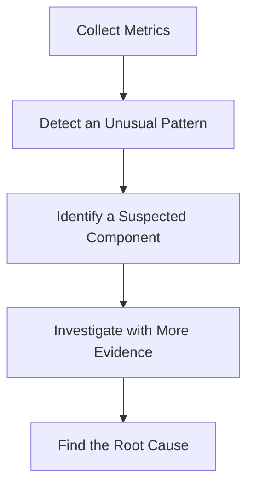
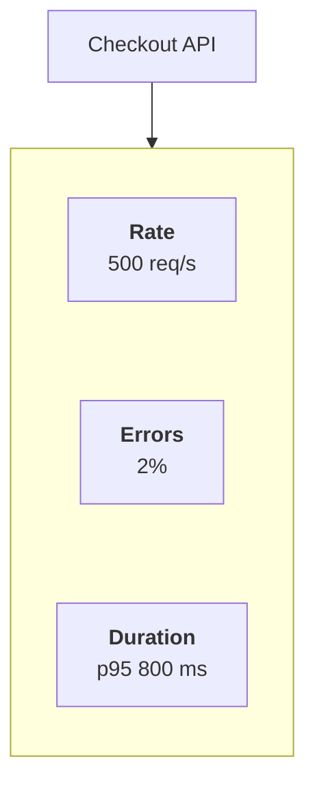
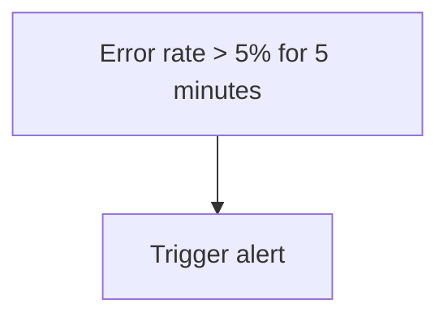
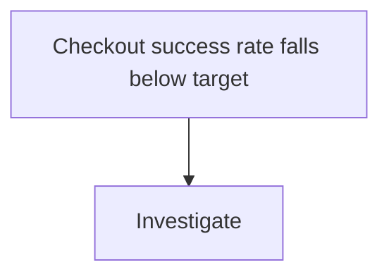
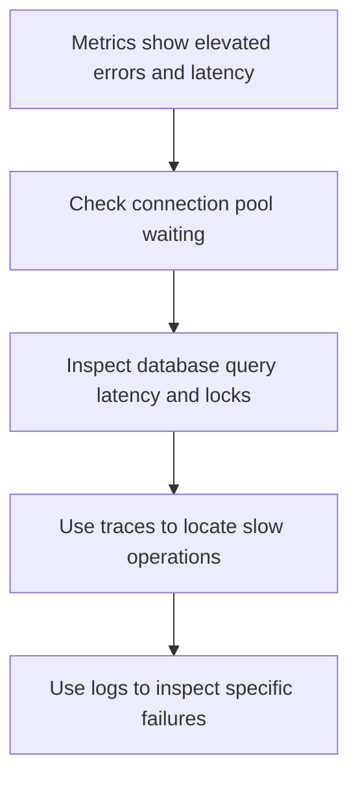
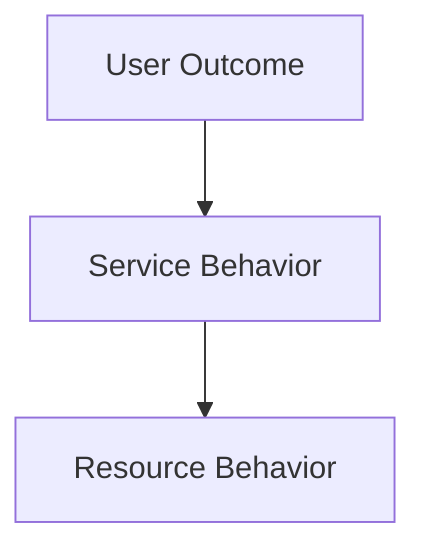
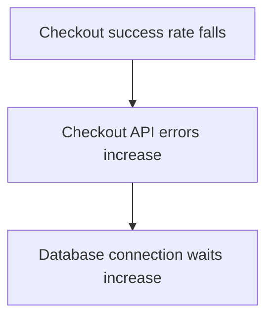

# 10.02 — Metrics

## Learning Objectives

By the end of this chapter, you should be able to:

- Explain what a metric is and why systems collect metrics.
- Distinguish counters, gauges, histograms, and summaries.
- Understand rate, count, units, labels, and cardinality.
- Use the RED and USE methods to identify performance problems.
- Distinguish infrastructure metrics from business metrics.
- Understand how metrics support dashboards, alerts, and investigations.
- Design a basic metric set for a web application.

---

# 1. What Is a Metric?

A **metric** is a numerical measurement used to understand how a system behaves over time.

Examples:

```text
HTTP requests per second: 250
Error rate:               2.5%
CPU utilization:          72%
Active database connections: 80
Request latency:          120 ms
```

A single measurement tells you what is happening at one moment. Measurements collected over time reveal trends, changes, and unusual behavior.

```text
Time ──────────────────────────────>

CPU:       35% → 42% → 58% → 91%
Errors:     2  →  3  →  8  →  45
Latency:  100ms → 130ms → 400ms → 1.2s
```

These trends may indicate that the system is approaching a capacity limit or experiencing a failure.

> **Metrics turn system behavior into measurable evidence.**

---

# 2. Why Do We Need Metrics?

Imagine users report that checkout is slow.

Without metrics, you might guess:

- The application server is overloaded.
- The database is slow.
- The payment provider is responding slowly.
- Too many requests are arriving.

Metrics help narrow down the possibilities.

For example:

| Metric | Observation |
|---|---:|
| Request rate | 800 requests/sec |
| Application CPU | 45% |
| Database CPU | 94% |
| Error rate | 4% |
| p95 request latency | 1.8 sec |

The database looks like a promising place to investigate, but these measurements alone do not prove the root cause.

You would investigate further using database diagnostics, traces, and logs.

The process is:



---

# 3. Four Common Metric Types

Metrics can represent different kinds of measurements. Four commonly encountered types are counters, gauges, histograms, and summaries.

## 3.1 Counter

A **counter** represents a cumulative value that increases as events occur. It may reset when the process restarts.

Examples:

- Total HTTP requests handled.
- Total failed payments.
- Total database queries executed.

```text
Time       Total Requests
10:00          1,000
10:01          1,250
10:02          1,600
10:03          2,050
```

The counter increases as new requests arrive.

The increase over a time interval is often more useful than the lifetime total.

For example:

```text
Requests during one minute
= 2,050 - 1,600
= 450 requests
```

That gives us a way to calculate request rate.

**Important:** If a counter resets, rate calculations must account for that reset. Monitoring systems commonly provide functions to handle counter resets.

## 3.2 Gauge

A **gauge** represents a value that can increase or decrease.

Examples:

- Current memory usage.
- Active connections.
- Queue depth.
- Number of running workers.

```text
Time       Active Connections
10:00              40
10:01              55
10:02              48
10:03              72
```

Unlike a counter, a gauge can move in either direction.

A queue depth might increase as work arrives and decrease as workers process it.

## 3.3 Histogram

A **histogram** records observations in buckets or ranges, along with information such as the number of observations and their sum.

It is useful for measurements such as request duration.

Imagine 1,000 requests:

```text
Duration          Requests
0–100 ms             400
100–250 ms           350
250–500 ms           180
500–1000 ms           50
Over 1000 ms          20
```

This distribution tells us more than a single average.

Most requests are fast, but some take much longer.

Histograms can support percentile estimates and help reveal slow outliers. The precision of those estimates depends on the bucket design and monitoring system.

## 3.4 Summary

A **summary** commonly tracks observations and calculates statistics such as a count, sum, and—in some implementations—quantiles over a configured time window.

It can be useful for measuring request durations.

However, summary quantiles are not necessarily easy to combine across multiple application instances. Histograms are often more suitable when you need to aggregate latency distributions across instances.

Exact behavior depends on the metrics library and monitoring system.

### Quick comparison

| Type | Represents | Example |
|---|---|---|
| Counter | Cumulative events | Total requests |
| Gauge | Current value | Active connections |
| Histogram | Distribution of observations | Request durations in buckets |
| Summary | Observations and calculated statistics | Request duration and quantiles |

---

# 4. Count vs Rate

A total count and a rate answer different questions.

Suppose an application has handled 60,000 requests.

That tells us how many requests it has handled since the counter began accumulating.

But it does not tell us whether the application is currently busy.

Compare:

```text
Scenario A
60,000 requests over 10 minutes
= 100 requests/sec

Scenario B
60,000 requests over 1 minute
= 1,000 requests/sec
```

The same total can represent very different workloads.

The basic formula is:

$$
\text{Rate}=\frac{\text{Events during interval}}{\text{Interval duration}}
$$

For example:

$$
\frac{900\text{ requests}}{30\text{ seconds}}
=30\text{ requests/sec}
$$

In production, monitoring tools usually calculate rates from counter samples over time.

**Use counts** to understand totals. Use **rates** to understand how quickly events are occurring.

---

# 5. Units Matter

A metric without a clear unit can be misleading.

Consider:

```text
Latency = 250
```

Does that mean 250 milliseconds, 250 seconds, or something else?

Prefer clear units:

```text
Request duration = 250 ms
Data transferred = 12 MB
Request rate = 300 requests/sec
Memory usage = 2 GB
```

Common metric units include:

- Milliseconds or seconds for duration.
- Bytes for memory and data size.
- Requests per second for traffic.
- Events per second for event rates.
- Percentages or ratios for proportions.

Be consistent when recording and displaying units.

For example, if one service records latency in seconds and another in milliseconds, combining them incorrectly can produce meaningless results.

---

# 6. Labels and Dimensions

Metrics often include labels, also called dimensions, that describe what a measurement relates to.

For example:

```text
http_requests_total{
  method="GET",
  route="/products",
  status="200"
}
```

This lets you distinguish requests by method, route, and status.

Instead of seeing only:

```text
Total requests = 10,000
```

you can inspect:

```text
GET /products → 6,000
POST /orders  → 2,000
GET /users    → 1,500
Other         →   500
```

Labels help answer questions such as:

- Which endpoint is receiving the most traffic?
- Which route is producing errors?
- Are POST requests slower than GET requests?
- Is one service behaving differently from another?

Choose labels that help answer real operational questions.

---

# 7. Cardinality: A Common Metrics Trap

**Cardinality** describes how many distinct combinations of label values exist for a metric.

Suppose you use these labels:

```text
method = GET, POST
status = 200, 400, 500
```

The number of possible combinations is relatively small.

Now imagine adding:

```text
user_id
request_id
order_id
```

These values may be unique or nearly unique for every event.

```text
user_id = 10001
user_id = 10002
user_id = 10003
...
```

The number of distinct metric series can grow enormously.

This can increase:

- Monitoring storage usage.
- Memory consumption.
- Query cost.
- Processing overhead.

This problem is known as **high cardinality**.

### Better approach

Use bounded labels for common metric breakdowns:

```text
method
route template
status class
service
region
```

Use logs or traces when you need to investigate individual requests, users, or orders.

For example, prefer a route template such as:

```text
/orders/{order_id}
```

rather than creating a separate metric label for every actual order path.

> **Metrics are for aggregated patterns, not for storing every unique event identity.**

---

# 8. Four Important Areas to Measure

For a web service, start with four practical questions.

## 8.1 Traffic

How much work is arriving?

Examples:

```text
Requests per second
Jobs received per second
Messages consumed per second
```

A sudden increase in traffic may explain rising resource usage.

## 8.2 Errors

How much work is failing?

Examples:

```text
HTTP 5xx responses
Failed payments
Failed jobs
Database operation errors
```

A useful measure is the error ratio:

$$
\text{Error Rate}=
\frac{\text{Failed Requests}}{\text{Total Requests}}\times100
$$

If 200 of 10,000 requests fail:

$$
\frac{200}{10,000}\times100=2\%
$$

Always define what counts as an error for the metric you are using. A client error such as an invalid request may not represent a system failure.

## 8.3 Latency

How long does work take?

Examples:

```text
HTTP request duration
Database query duration
Payment provider response time
Queue processing duration
```

Latency should be measured for the operation that matters. A fast health check does not prove that checkout is fast.

## 8.4 Saturation

How close is a resource to its useful capacity, and how much work is waiting for it?

Examples:

```text
CPU utilization
Memory pressure
Database connection pool usage
Queue depth
Worker pool occupancy
```

A resource may be approaching a limit even before the application starts returning errors.

---

# 9. RED Method

The **RED method** is a practical way to monitor request-driven services.

RED stands for:

- **Rate** — How many requests are being handled?
- **Errors** — How many requests are failing?
- **Duration** — How long do requests take?

For a checkout API:



These three signals give you a useful starting point for service health.

If request duration rises while rate remains stable, investigate slow processing or dependencies.

If the error rate rises sharply, investigate failed operations.

If rate suddenly increases, check whether the service and its dependencies can handle the additional workload.

RED is a useful starting framework, not a complete replacement for resource and dependency metrics.

---

# 10. USE Method

The **USE method** focuses on resources.

USE stands for:

- **Utilization** — How busy is the resource?
- **Saturation** — Is work queuing or waiting because the resource cannot keep up?
- **Errors** — Are operations involving the resource failing?

For a database connection pool:

| Signal | Example |
|---|---|
| Utilization | 90 of 100 connections are in use |
| Saturation | Requests are waiting to obtain connections |
| Errors | Connection acquisition timeouts |

For a CPU resource:

| Signal | Example |
|---|---|
| Utilization | CPU is busy 90% of the time |
| Saturation | Runnable work is waiting for CPU time |
| Errors | Hardware or operating-system errors, where relevant |

High utilization alone does not always mean a problem. The key is whether the resource is meeting demand and whether users are experiencing degraded service.

### RED vs USE

| Method | Main focus | Best starting point |
|---|---|---|
| RED | Requests and services | APIs, web services |
| USE | Resources | CPU, memory, connection pools, storage |

Using both gives you a broader view of system behavior.

---

# 11. Infrastructure Metrics vs Business Metrics

Infrastructure metrics describe how the system operates.

Examples:

```text
CPU utilization
Memory usage
Database latency
Network throughput
Connection pool usage
```

Business metrics describe whether the system is achieving its intended outcome.

Examples:

```text
Successful checkouts
Completed enrollments
Successful payments
Orders created
Registration completion rate
```

Consider an online store:

```text
CPU utilization = 40%
API latency = 100 ms
```

Everything looks healthy from these two measurements.

But suppose:

```text
Successful checkouts = sharply decreasing
```

The infrastructure may appear healthy while an application workflow is broken.

For example, a payment integration might be rejecting requests.

That is why you should measure both system health and user outcomes.

> **A system is not healthy merely because its servers are healthy.**

Business metrics should be designed with clear definitions. For example, distinguish a payment attempt from a successfully confirmed payment.

---

# 12. Aggregation and Averages

Metrics are often aggregated over time.

Suppose five requests take:

```text
100 ms
110 ms
120 ms
130 ms
1,500 ms
```

The average is:

$$
\frac{100+110+120+130+1500}{5}=392\text{ ms}
$$

But four of the five requests completed in 130 ms or less.

The average does not fully describe the distribution.

That is why latency monitoring often includes percentiles such as p50, p95, and p99. These help describe how slower requests behave.

You will study percentiles in more detail in the dedicated latency-percentile chapters.

For now, remember:

> **Do not rely on average latency alone.**

Also ensure that aggregation is meaningful. Averaging already-averaged values from groups of different sizes can produce misleading results unless the groups are weighted appropriately.

---

# 13. Metrics and Alerting

Metrics can help trigger alerts when a meaningful condition occurs.

For example:



Or:



Good alerts should indicate a condition that needs attention.

Avoid alerting on every small fluctuation. Too many noisy alerts cause alert fatigue and can make important failures easier to miss.

An alert should ideally answer:

- What is wrong?
- How severe is it?
- Which service or workflow is affected?
- What should the responder investigate first?

Metrics provide evidence for the alert. Logs and traces often provide the details needed to diagnose the problem.

---

# 14. Example: Monitoring a Checkout API

Imagine your checkout API receives 5,000 requests in one minute.

The measurements show:

```text
Total requests:       5,000
Failed requests:       150
Request duration p95:  1.2 sec
Database connections:  95 / 100
```

First, calculate the error rate:

$$
\frac{150}{5000}\times100=3\%
$$

The system has a 3% failure rate for this sample.

The high connection usage suggests that database connection capacity may be involved. The p95 latency indicates that a meaningful portion of requests are taking a relatively long time.

But neither observation proves the cause.

A sensible investigation is:



The purpose of metrics is to identify the pattern and guide the next investigation.

---

# 15. Choosing a Small, Useful Metric Set

You do not need hundreds of metrics to start monitoring a service.

For a basic API, consider:

| Metric | Why it matters |
|---|---|
| Request rate | Shows incoming workload |
| Error rate | Shows failed requests |
| Request duration distribution | Shows latency behavior |
| CPU utilization | Shows CPU demand |
| Memory usage or pressure | Shows memory constraints |
| Active connections | Shows connection usage |
| Connection acquisition wait | Reveals pool contention |
| Dependency latency | Shows time spent waiting on other services |
| Business success rate | Shows whether users achieve their goal |

Choose metrics based on the system's risks and requirements. Add more when you have a specific question to answer.

---

# 16. Common Mistakes

### Mistake 1 — Collecting metrics without a purpose

A metric is useful when it helps answer an operational or business question.

### Mistake 2 — Using only infrastructure metrics

Healthy CPU and memory values do not guarantee that users can complete their workflows.

### Mistake 3 — Relying only on averages

Averages can hide slow requests and uneven performance.

### Mistake 4 — Adding unique identifiers as labels

High-cardinality labels can make monitoring expensive and difficult to operate.

### Mistake 5 — Confusing counters and gauges

A total request counter increases cumulatively; active connections can rise and fall.

### Mistake 6 — Treating correlation as proof of cause

Two metrics changing together does not prove that one caused the other.

### Mistake 7 — Collecting metrics but never using them

Metrics should support dashboards, alerts, investigations, and engineering decisions.

---

# 17. Hands-On Exercise: Design Metrics for Checkout

You are designing observability for:

```text
POST /api/checkout
```

The endpoint validates a cart, creates an order, and requests payment processing.

## Task A — Choose metrics

Identify at least one metric for each category:

- Traffic
- Errors
- Latency
- Saturation
- Business outcome

## Task B — Choose metric types

Match each measurement to a suitable type.

| Measurement | Likely type |
|---|---|
| Total checkout requests | Counter |
| Active checkout operations | Gauge |
| Checkout duration distribution | Histogram |
| Current queue depth | Gauge |
| Total confirmed payments | Counter |

These are common choices, not universal rules for every metrics platform.

## Task C — Calculate the error rate

During one minute:

```text
Total checkout requests = 2,400
Failed checkout requests = 72
```

Calculate:

$$
\text{Error Rate}=\frac{72}{2400}\times100
$$

Answer: **3%**

## Task D — Investigate

Suppose the next minute shows:

```text
Request rate:       stable
Error rate:         rising
p95 latency:        rising
Database pool:      100% utilized
```

Write down two hypotheses you would investigate.

Possible starting points include connection pool waiting, slow queries, or a dependency causing requests to hold database connections longer than expected. Use further evidence to determine the actual cause.

---

# 18. System Design View

Metrics help connect three levels of system behavior:



For example:



This sequence suggests a possible relationship worth investigating. It is not proof of causation until further evidence supports it.

A useful monitoring strategy links user-facing outcomes to the services and resources that influence them.

---

# 19. Quick Reference

| Concept | Meaning |
|---|---|
| Metric | Numerical measurement of system behavior |
| Counter | Cumulative event measurement |
| Gauge | Value that can increase or decrease |
| Histogram | Distribution-oriented observations, often stored in buckets |
| Summary | Observations with calculated statistics such as count, sum, or quantiles |
| Rate | Events per unit of time |
| Label / Dimension | Attribute used to break down a metric |
| Cardinality | Number of distinct label combinations or series |
| RED | Rate, Errors, Duration |
| USE | Utilization, Saturation, Errors |
| Infrastructure metric | Measurement of technical system behavior |
| Business metric | Measurement of user or business outcomes |

---

# 20. Knowledge Check

1. What is the difference between a counter and a gauge?
2. Why is request rate often more useful than a lifetime request count when investigating current load?
3. What does a histogram help you understand?
4. Why can adding `user_id` or `request_id` as metric labels be dangerous?
5. What do RED and USE stand for?
6. Why should infrastructure metrics be paired with business metrics?
7. If error rate and database connection usage rise together, have you proven that the database caused the errors?
8. Why should you avoid relying only on average latency?

## Answers

1. A counter accumulates events; a gauge represents a value that can increase or decrease.
2. Rate shows how quickly events are occurring during a time interval, which better reflects current workload.
3. It helps describe the distribution of observations, such as request durations across latency ranges.
4. Unique identifiers can create enormous numbers of distinct metric series, increasing storage and query costs.
5. RED means Rate, Errors, Duration. USE means Utilization, Saturation, Errors.
6. Infrastructure can look healthy while users are unable to complete important workflows.
7. No. The relationship is a clue, not proof. Further investigation is required.
8. An average can hide slow requests and important tail-latency behavior.

---

# Remember

Metrics help you answer:

```text
How much work is happening?
How often is it failing?
How long does it take?
Which resources are under pressure?
Are users achieving the intended outcome?
```

Start with a small set of meaningful metrics, use consistent units, avoid high-cardinality labels, and investigate patterns rather than assuming a metric proves the root cause.

**Next: 10.03 — Logs**
