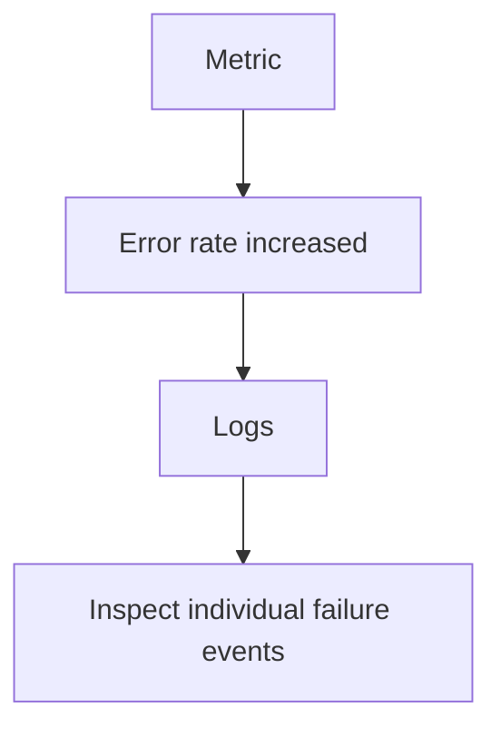
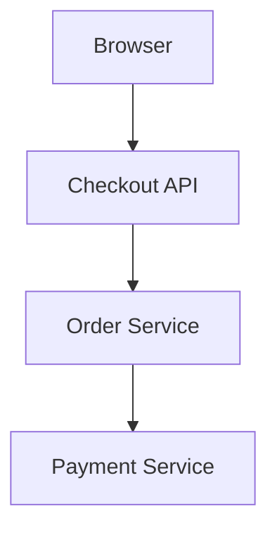
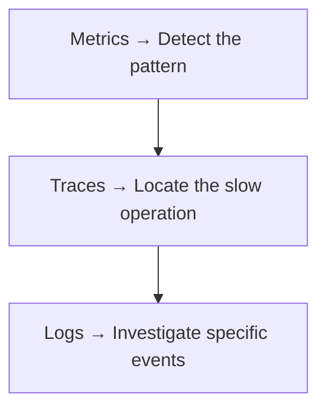
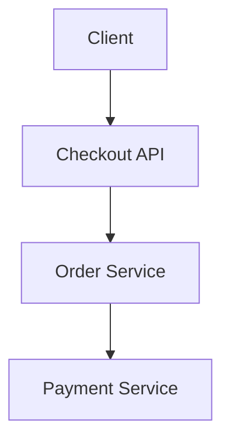
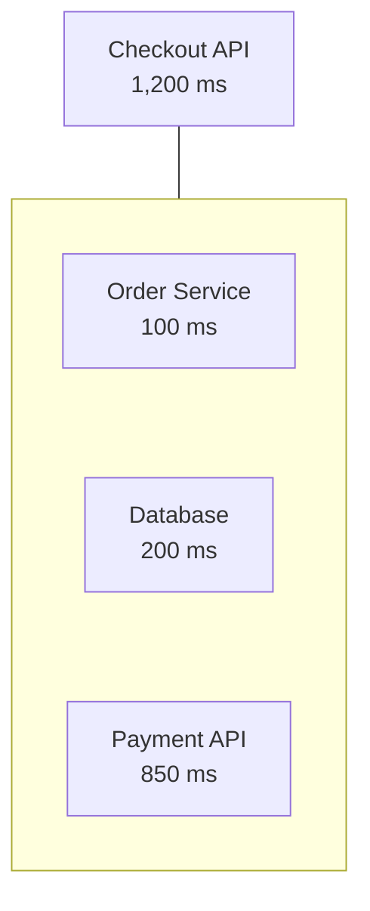
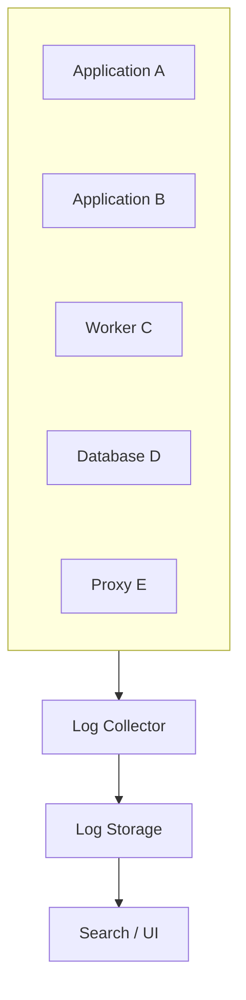

# 10.03 — Logs

## Learning Objectives

By the end of this chapter, you should be able to:

- Explain what logs are and why applications generate them.
- Distinguish logs from metrics and distributed traces.
- Understand log levels and structured logging.
- Recognize the importance of timestamps, request IDs, and context.
- Investigate errors using logs without guessing.
- Understand log aggregation, retention, and storage costs.
- Recognize sensitive-data risks in logging.
- Design a basic logging strategy for a web application.

---

# 1. What Is a Log?

A **log** is a record of an event that happened inside a system.

For example:

```text
2026-10-09 10:30:12 INFO  Order created
2026-10-09 10:30:13 WARN  Payment provider responded slowly
2026-10-09 10:30:15 ERROR Payment request timed out
```

Each entry provides evidence about something that happened.

An application may generate logs when it:

- Receives a request.
- Creates an order.
- Encounters an error.
- Connects to a database.
- Calls an external service.
- Starts or stops a process.
- Rejects an invalid operation.

> **Logs help answer: "What happened, and what information was available when it happened?"**

---

# 2. Why Do Systems Need Logs?

Imagine your checkout API starts returning errors.

Metrics show:

```text
Error rate: 6%
```

That tells you the problem exists, but not exactly what happened to an individual request.

Logs might show:

```text
ERROR Payment request failed
reason=connection_timeout
provider=payment-api
```

Another entry might show:

```text
ERROR Order creation failed
reason=insufficient_inventory
```

These are different failures that may contribute to the overall error rate.

Logs provide details that aggregated metrics generally do not.



Logs are useful for debugging, incident investigation, auditing, and understanding application behavior.

---

# 3. Logs vs Metrics vs Traces

These three signals answer different questions.

| Signal | Main question | Example |
|---|---|---|
| Metrics | What is happening over time? | Checkout error rate is 6% |
| Logs | What happened in a particular event? | Payment request timed out |
| Traces | Where did a request spend its time? | Payment API consumed 800 ms |

Imagine a checkout request:



Metrics show that checkout latency is increasing.

A trace reveals that the Payment Service is taking most of the time.

Logs provide details about a particular payment attempt, such as a timeout or provider error.

A practical investigation may look like:



This is a useful workflow, not a mandatory sequence. You may start with logs or traces when you already have a specific request or error to investigate.

---

# 4. What Should a Log Entry Contain?

A useful log entry typically includes:

- **Timestamp:** When the event occurred.
- **Severity:** How important the event is.
- **Message:** What happened.
- **Context:** Relevant details about the operation.
- **Identifiers:** Request or trace IDs that help connect related events.

Example:

```text
timestamp=2026-10-09T10:30:15Z
level=ERROR
service=checkout-api
event=payment_request_failed
request_id=req-82af
trace_id=trace-71bc
reason=connection_timeout
```

These fields make it easier to search and correlate events.

The exact format depends on the logging library and platform.

---

# 5. Log Levels

Log levels indicate the severity or importance of an event.

Common levels include:

| Level | Typical purpose | Example |
|---|---|---|
| `DEBUG` | Detailed diagnostic information | Selected pricing rule |
| `INFO` | Normal significant events | Order created |
| `WARN` | Unexpected condition that may need attention | Retry limit nearly reached |
| `ERROR` | An operation failed | Payment request failed |
| `FATAL` / `CRITICAL` | Severe failure that may prevent continued operation | Required startup configuration missing |

Not every logging framework supports the same levels or names.

## Choosing a level

Consider these events:

```text
User opens product page      → Usually not ERROR
Order created successfully   → INFO
Optional recommendation API
responds slowly              → WARN, depending on impact
Payment operation fails      → ERROR
Application cannot start    → FATAL or CRITICAL
```

The correct level depends on the event's impact and the application's conventions.

> **Do not mark every unusual event as an error.**

If normal activity produces excessive error logs, important failures become harder to find.

---

# 6. Unstructured vs Structured Logging

## Unstructured logging

A plain-text message:

```text
Payment failed for order 812 because the provider timed out
```

Humans can read it, but automated searching may depend on the exact wording.

## Structured logging

The same event can be recorded as fields:

```json
{
  "timestamp": "2026-10-09T10:30:15Z",
  "level": "ERROR",
  "event": "payment_failed",
  "order_id": "812",
  "reason": "provider_timeout"
}
```

Now a logging platform can filter by:

```text
event = payment_failed
reason = provider_timeout
```

Structured logging commonly uses JSON or another consistent field-based format.

### Why it helps

- More reliable searching.
- Easier filtering and grouping.
- Consistent dashboards and investigations.
- Better integration with log aggregation tools.
- Less dependence on parsing arbitrary message text.

Plain-text logs can still be useful, especially for local development. Structured logs become particularly valuable when many services generate large volumes of events.

---

# 7. Context Makes Logs Useful

Consider this entry:

```text
ERROR Request failed
```

It tells you very little.

Now consider:

```text
level=ERROR
service=checkout-api
event=payment_failed
request_id=req-82af
route=POST /api/checkout
reason=provider_timeout
duration_ms=3000
```

This gives you a starting point for investigation.

Useful context may include:

- Service name.
- Environment, such as production or staging.
- Operation or route template.
- Error category.
- Duration.
- Request ID.
- Trace ID.
- Dependency name.

Only include fields that help answer operational questions.

Avoid recording every available value indiscriminately.

---

# 8. Request IDs and Trace IDs

In a distributed application, one request can produce log entries in multiple services.



Suppose each service generates unrelated log entries.

Finding the complete journey becomes difficult.

A **request ID** can identify a request within an application or request flow.

A **trace ID** identifies a distributed trace that connects work across services.

For example:

```text
Checkout API
request_id=req-82af
trace_id=trace-71bc

Order Service
request_id=req-82af
trace_id=trace-71bc

Payment Service
request_id=req-82af
trace_id=trace-71bc
```

The exact request-ID strategy depends on the architecture. A trace ID is especially useful when work crosses service boundaries.

You can search for the trace ID to find related log entries, then inspect the distributed trace to understand timing and dependencies.

**Important:** IDs should be propagated consistently across the request path. A service that creates a new unrelated identifier at every step makes correlation harder.

---

# 9. Timestamps and Clock Accuracy

Logs need timestamps so events can be placed in order.

Consider:

```text
10:30:01 Checkout request received
10:30:02 Order created
10:30:04 Payment failed
```

This gives a basic timeline.

But in distributed systems, different machines may have slightly different clocks.

For example:

```text
Service A clock: 10:30:04.100
Service B clock: 10:30:03.900
```

The timestamps may suggest that Service B logged an event first, even if the real ordering is more complicated.

Good practice includes:

- Use a consistent timestamp format.
- Prefer UTC for centralized logs.
- Keep system clocks synchronized.
- Use trace/span relationships to understand request structure and timing.
- Avoid relying on timestamps alone to prove causal ordering.

A trace often provides a better representation of the request's parent-child relationships than log timestamps alone.

---

# 10. Log Correlation

**Log correlation** means connecting related events using shared identifiers or contextual fields.

Example:

```text
Search:
trace_id = trace-71bc
```

Results:

```text
Checkout API → Request received
Order Service → Order validated
Payment Service → Provider timeout
Checkout API → Checkout failed
```

This lets you reconstruct a useful story from separate records.

Correlation can use:

- Request IDs.
- Trace IDs.
- Span IDs.
- Order or job IDs, where appropriate.
- Service names and timestamps.

Avoid using unique identifiers as metric labels just because they are useful in logs. Logs and metrics have different storage and aggregation characteristics.

---

# 11. Logging Errors Correctly

Suppose a database operation fails.

A weak log might be:

```text
ERROR Something went wrong
```

A better log might be:

```text
level=ERROR
event=order_persistence_failed
operation=insert_order
error_type=database_unavailable
trace_id=trace-71bc
```

This explains the failed operation without requiring a huge message.

Where appropriate, include an exception type and stack trace. Stack traces can be valuable for debugging application defects, but they should be handled carefully because they may contain internal implementation details.

Avoid logging the same failure repeatedly at every layer unless each entry adds useful context. Duplicate logs create noise and increase costs.

---

# 12. Logs Are Not a Substitute for Metrics

Suppose your service produces 10 million log entries per day.

Searching every entry to calculate the current request rate or error ratio is often inefficient.

Metrics are designed for efficient aggregation over time.

Use:

```text
Metrics:
Requests/sec
Error rate
Latency distribution
CPU utilization
```

Use logs for:

```text
Specific error
Failed operation
Exception details
Relevant request context
```

A useful distinction:

> **Metrics summarize patterns. Logs record events.**

A monitoring system may derive metrics from logs in some architectures, but that does not remove the need to understand their different roles.

---

# 13. Logs Are Not a Substitute for Traces

Imagine a checkout request produces 20 log entries.

You can read them, but it may still be difficult to understand which operation consumed most of the time.

A trace can show the timing structure:



Logs can then provide details about the Payment API operation.

Use traces to understand the request journey and timing relationships.

Use logs to investigate the events and errors that occurred during that journey.

---

# 14. Centralized Logging

In a small application, logs may be written to a local console or file.

In a distributed system, logs can come from many places:



Centralized logging allows engineers to search across services from one place.

Common approaches include:

- Shipping logs to a centralized platform.
- Collecting structured logs from containers.
- Forwarding infrastructure and application logs to a managed service.
- Storing logs in a searchable backend.

The specific tool is less important than the architectural requirements:

- Reliable collection.
- Searchable fields.
- Access control.
- Retention rules.
- Cost management.
- Protection of sensitive information.

---

# 15. Log Retention and Cost

Logs consume storage and processing resources.

Suppose an application generates:

```text
2 GB of logs per day
```

Over 30 days:

```text
2 GB × 30 = 60 GB
```

That is before considering indexing overhead, replication, compression, and backups.

Keeping every log forever may be unnecessary and expensive.

A retention policy should consider:

- Operational usefulness.
- Security and audit requirements.
- Legal obligations.
- Storage costs.
- Search requirements.
- Data sensitivity.

For example, high-volume debug logs might be retained for a short period, while specific audit records may require a different retention policy.

Do not apply one retention rule blindly to every log category.

---

# 16. Sampling and Log Volume

Some systems generate enormous numbers of repetitive events.

For example:

```text
INFO Health check passed
INFO Health check passed
INFO Health check passed
...
```

Logging every routine event may create noise without providing much value.

Possible approaches include:

- Logging only meaningful state changes.
- Reducing the verbosity of routine events.
- Sampling repetitive diagnostic events.
- Aggregating repeated failures.
- Keeping full error details where they are operationally important.

Sampling means recording only a portion of selected events. It should be used carefully because it can omit rare but important evidence.

Do not sample security or audit events without confirming that doing so meets the relevant requirements.

---

# 17. Security and Privacy

Logs can accidentally expose sensitive information.

Avoid logging:

- Passwords.
- Authentication tokens.
- Session secrets.
- Full payment-card details.
- Private keys.
- Unnecessary personal information.

For example, do not log:

```json
{
  "email": "customer@example.com",
  "password": "secret123",
  "authorization": "Bearer ..."
}
```

Instead, record only what is needed:

```json
{
  "event": "login_failed",
  "reason": "invalid_credentials",
  "request_id": "req-82af"
}
```

Even identifiers and error details may be sensitive in some environments.

Use appropriate access controls, redaction, retention, and data-handling policies.

Also treat client-provided log values as untrusted input. Sanitize or encode them appropriately to prevent log injection, where malicious input manipulates the appearance or structure of log records.

> **Logs should help diagnose systems without becoming a source of data exposure.**

---

# 18. Logging and Failure Scenarios

Different failures require different logging strategies.

| Situation | Useful log information |
|---|---|
| Invalid request | Validation failure category and request context |
| Database unavailable | Operation, dependency, error category |
| External API timeout | Dependency, duration, timeout details |
| Worker failure | Job ID, attempt number, error category |
| Application startup failure | Configuration area and exception details, without secrets |
| Permission denied | Action, resource category, decision context, where appropriate |

The goal is to record enough information to investigate without dumping entire request bodies or sensitive data.

For asynchronous jobs, include a stable job identifier and attempt number so failures can be connected across retries.

---

# 19. A Practical Investigation

Imagine users report that some checkouts fail.

Metrics show:

```text
Checkout error rate: 5%
```

You search the logs and find:

```text
10:30:14 ERROR
event=payment_failed
trace_id=trace-71bc
reason=provider_timeout
duration_ms=3000
```

Search for the same trace ID:

```text
10:30:11 INFO
event=checkout_started
trace_id=trace-71bc
```

```text
10:30:12 INFO
event=order_validated
trace_id=trace-71bc
```

```text
10:30:14 ERROR
event=payment_failed
trace_id=trace-71bc
reason=provider_timeout
```

This suggests that the payment operation timed out.

Next, inspect the trace to determine how long the request spent in the payment call and whether other operations contributed to the delay.

Then investigate the payment dependency's metrics and logs.

The important distinction is:

```text
Metric → Detects an elevated failure rate
Log → Identifies a specific failed event
Trace → Shows the request's operation and timing structure
```

One log entry rarely proves the complete root cause. Combine evidence from the relevant signals.

---

# 20. Hands-On Exercise: Design Logs for Checkout

You are building:

```text
POST /api/checkout
```

The request validates a cart, creates an order, and calls a payment provider.

## Task A — Choose important events

Decide which events deserve logs:

- Checkout started.
- Cart validation failed.
- Order created.
- Payment request timed out.
- Checkout completed.

Avoid logging every tiny internal step unless it helps diagnose a real problem.

## Task B — Design a structured error log

Create a record with fields such as:

```json
{
  "timestamp": "2026-10-09T10:30:15Z",
  "level": "ERROR",
  "service": "checkout-api",
  "event": "payment_failed",
  "request_id": "req-82af",
  "trace_id": "trace-71bc",
  "reason": "provider_timeout",
  "duration_ms": 3000
}
```

These values are illustrative.

## Task C — Review it for safety

Ask:

- Does it contain a password or token?
- Does it contain unnecessary personal information?
- Can the event be found using its trace ID?
- Is the error category clear?
- Would the log help an engineer decide what to investigate next?

## Task D — Find related events

Imagine the payment failure occurs in the Payment Service.

How would you find the related checkout and order events?

**Answer:** Search using the propagated trace ID or another appropriate correlation identifier, then inspect the related entries and distributed trace.

---

# 21. Common Mistakes

### Mistake 1 — Logging vague messages

`Something went wrong` provides little diagnostic value.

### Mistake 2 — Logging everything

Excessive logs increase noise, storage costs, and investigation time.

### Mistake 3 — Logging sensitive data

Secrets and unnecessary personal information should not be recorded.

### Mistake 4 — Using inconsistent fields

Different names for the same concept make cross-service searches harder.

### Mistake 5 — Treating timestamps as perfect ordering

Distributed clocks can differ. Use trace relationships and other evidence to understand event order.

### Mistake 6 — Logging the same error at every layer

Duplicate entries can obscure the original failure.

### Mistake 7 — Using logs to replace metrics and traces

Each signal serves a different purpose. Combine them when investigating complex behavior.

### Mistake 8 — Keeping logs indefinitely

Retention should balance operational value, compliance, privacy, and cost.

---

# 22. Quick Reference

| Concept | Meaning |
|---|---|
| Log | Record of an event |
| Log level | Classification of event severity |
| Structured logging | Recording events as consistent fields |
| Context | Information that explains the event |
| Request ID | Identifier used to correlate a request |
| Trace ID | Identifier connecting operations in a distributed trace |
| Log correlation | Finding related events across records or services |
| Centralized logging | Collecting logs from multiple sources into a shared system |
| Retention | How long logs are kept |
| Sampling | Recording only a selected portion of events |
| Log injection | Malicious input manipulating log content or structure |
| Redaction | Removing or masking sensitive information |

---

# 23. Knowledge Check

1. What is a log?
2. How are logs different from metrics?
3. Why is structured logging useful?
4. What is the difference between a request ID and a trace ID?
5. Why should distributed systems use consistent timestamps and synchronized clocks?
6. Why can excessive log volume become a problem?
7. Which types of information should generally never be written to application logs?
8. Why are logs not a replacement for distributed traces?

## Answers

1. A record of an event that occurred in a system.
2. Metrics summarize numerical behavior over time; logs record individual events with contextual details.
3. Structured fields make events easier to search, filter, aggregate, and correlate.
4. A request ID identifies a request within a defined scope; a trace ID connects operations belonging to a distributed trace. Their scopes depend on the architecture.
5. Consistent timestamps help build timelines, while clock synchronization reduces—but does not eliminate—ordering ambiguity.
6. Excessive logs increase storage and processing costs, add noise, and make useful events harder to find.
7. Passwords, authentication tokens, session secrets, private keys, and unnecessary sensitive personal or payment information.
8. Logs describe events; traces represent the connected operations and timing of a request across services.

---

# Remember

Useful logs answer:

```text
What happened?
When did it happen?
Which service was involved?
Which request or operation was affected?
What error or condition occurred?
Where should the investigation continue?
```

Record meaningful events, use consistent structured fields, propagate correlation identifiers, protect sensitive information, and retain logs according to their purpose.

**Next: 10.04 — Distributed Tracing**
