# 10.04 — Distributed Tracing

## Learning Objectives

By the end of this chapter, you should be able to:

- Explain what distributed tracing is and why it matters.
- Understand traces, spans, trace IDs, and parent-child relationships.
- Follow a request across multiple services.
- Use traces to investigate latency and failures.
- Understand trace context propagation.
- Recognize sampling, instrumentation, and tracing overhead.
- Distinguish distributed tracing from metrics and logs.

---

# 1. What Is Distributed Tracing?

In a simple application, one request may be handled by one process.

But a modern application may involve several services:

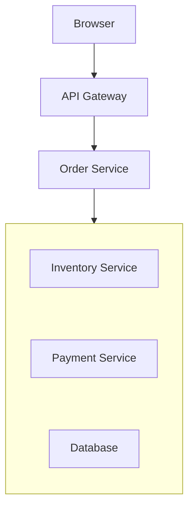

When a request becomes slow, which component is responsible?

The API Gateway? The Order Service? The database? The payment provider?

**Distributed tracing** helps you follow a request as it travels through these components.

> **A distributed trace records the connected operations involved in handling a request across services and other instrumented components.**

It helps answer:

- Which components did the request visit?
- How long did each operation take?
- Which dependency was slow?
- Where did an error occur?
- Which operations happened sequentially or concurrently?

---

# 2. Why Metrics and Logs Are Not Enough

Suppose checkout latency increases.

Your metrics show:

```text
Checkout p95 latency: 1.8 seconds
```

Your logs show:

```text
Payment request failed: timeout
```

These are useful clues, but they may not explain the complete request journey.

A trace might show:

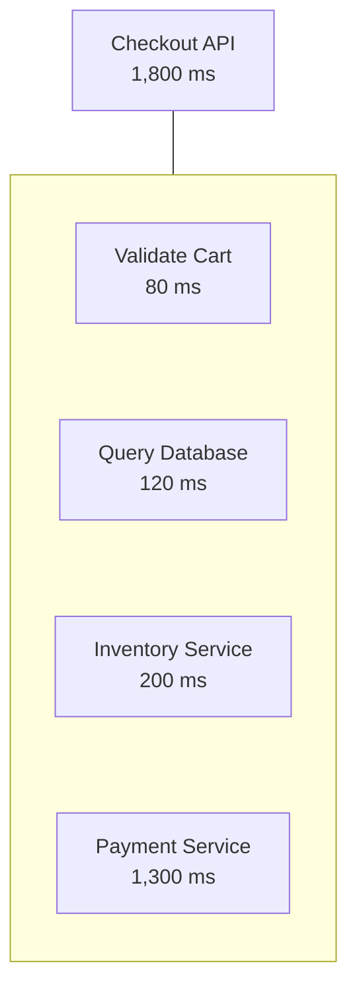

Now you can see that the payment operation dominates the request's duration.

The investigation becomes more focused.

| Signal | What it helps answer |
|---|---|
| Metrics | Is the system behaving unusually? |
| Logs | What happened during a particular event? |
| Traces | Where did the request travel, and how long did its operations take? |

A useful workflow is:

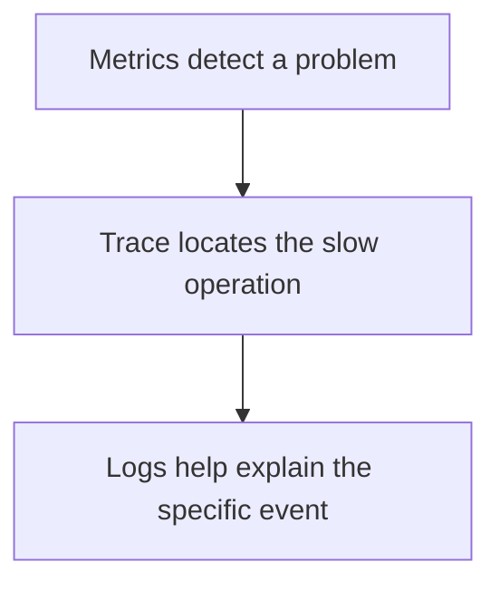

This is a common workflow, not a mandatory sequence.

---

# 3. What Is a Trace?

A **trace** represents the connected work associated with an operation, often a user request.

For example:

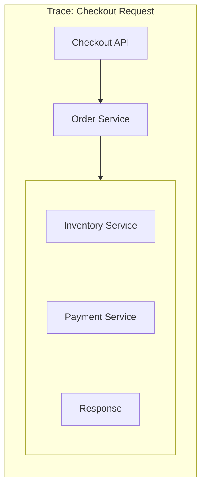

The trace groups the related operations so you can understand them as one request journey.

A trace typically contains:

- A trace ID.
- Multiple spans.
- Timing information.
- Parent-child relationships.
- Service and operation names.
- Status or error information.
- Optional attributes and events.

The exact information available depends on the instrumentation and tracing system.

---

# 4. What Is a Span?

A **span** represents one operation within a trace.

Examples:

- Handling an HTTP request.
- Executing a database query.
- Calling another service.
- Publishing a message.
- Processing a background job.

Consider:

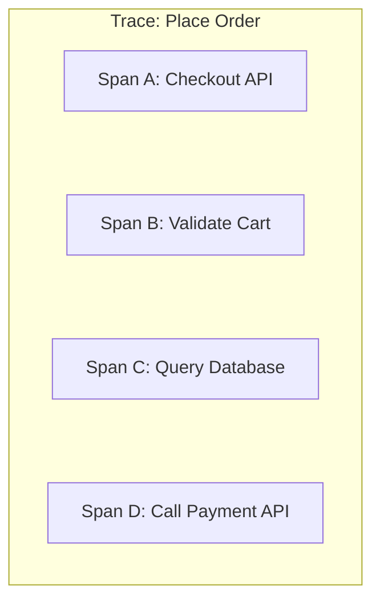

Each span can record information such as:

```text
Operation: Call Payment API
Start:     10:30:00.200
Duration:  800 ms
Status:    Error
```

A span can contain child spans representing more detailed work.

For example:

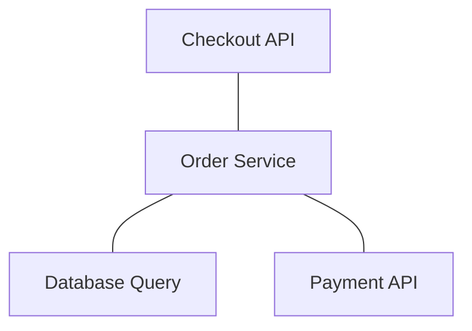

The parent-child relationship helps describe how operations are connected.

> **A trace is the complete journey; a span is one operation within that journey.**

---

# 5. Understanding Trace IDs and Span IDs

Distributed tracing commonly uses two important identifiers.

## Trace ID

Identifies the overall trace.

Related spans belonging to the same trace share that trace ID.

## Span ID

Identifies one particular span within the trace.

A child span also records its parent relationship.

Example:

```text
Trace ID: trace-abc123

Span A:
  Span ID: span-001
  Parent:  none

Span B:
  Span ID: span-002
  Parent:  span-001

Span C:
  Span ID: span-003
  Parent:  span-001
```

Conceptually:

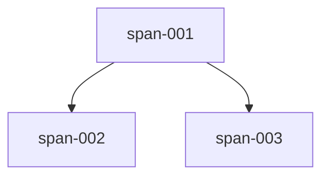

All three spans belong to the same trace.

The trace ID connects them; span IDs distinguish individual operations.

A trace ID is not the same as a request ID, although an application may use both.

---

# 6. A Trace Waterfall

Many tracing tools display a trace as a timeline or waterfall.

Imagine a request with these operations:

```text
Time (ms)   0      200      400      600      800     1000
            |-------|--------|--------|--------|--------|

Checkout    [------------------------------------------]
Database       [----]
Inventory           [------]
Payment                    [--------------------------]
```

The horizontal position shows when an operation started.

The bar length shows its duration.

In this example:

- Checkout spans the overall request.
- The database query finishes early.
- Inventory takes less time than payment.
- The payment operation dominates the timeline.

A waterfall can reveal:

- Long-running operations.
- Unexpected delays.
- Sequential dependencies.
- Concurrent operations.
- Time spent waiting on downstream services.

The displayed timing is only as useful as the trace's instrumentation and timing accuracy.

---

# 7. Sequential vs Parallel Operations

Tracing is particularly useful when operations happen concurrently.

Consider two independent operations:

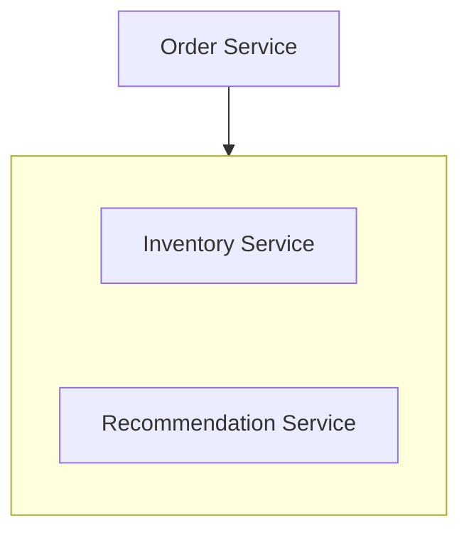

Suppose:

```text
Inventory Service:       300 ms
Recommendation Service:  500 ms
```

If they run concurrently, the combined waiting time may be close to the slower operation's duration, plus overhead.

```text
Time ───────────────────────────────>

Inventory       [------ 300 ms ------]
Recommendation  [---------- 500 ms ----------]
```

But if they run sequentially:

```text
Inventory       [------ 300 ms ------]
Recommendation                         [---- 500 ms ----]
```

The combined duration is approximately 800 ms, plus overhead.

A trace helps distinguish these execution patterns.

**Important:** Parallel operations do not always reduce end-to-end latency. Dependencies, resource contention, and coordination can change the result.

---

# 8. How Does a Trace Cross Service Boundaries?

A trace is useful only if related operations can be connected across services.

Consider:

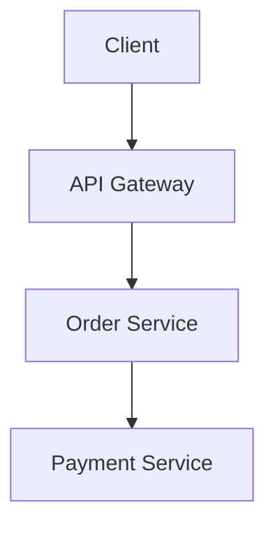

The API Gateway begins a trace.

When it calls the Order Service, tracing context is propagated.

The Order Service then propagates the context to the Payment Service.

Conceptually:

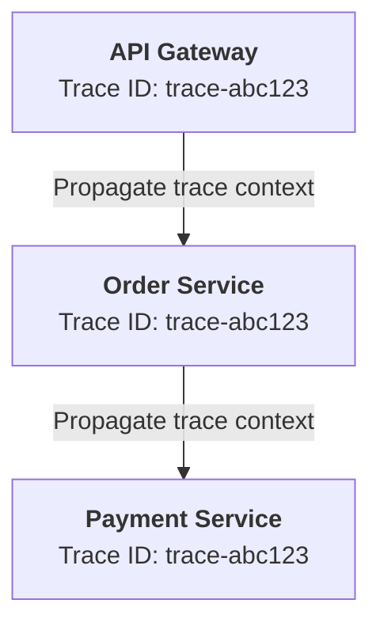

Each service creates its own spans while preserving the connection to the overall trace.

Without context propagation, the tracing system may show disconnected traces instead of one connected request journey.

---

# 9. Trace Context Propagation

**Trace context propagation** means carrying tracing information from one operation to the next.

For HTTP services, tracing systems commonly use headers to transmit context.

For example, W3C Trace Context defines headers such as:

```http
traceparent: 00-<trace-id>-<parent-span-id>-01
```

The values shown here are placeholders.

The receiving service extracts the context and creates a new span linked to the existing trace.

Conceptually:

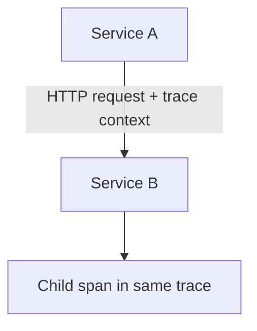

Propagation can also occur through message queues and background jobs, using the appropriate mechanism for that system.

For asynchronous processing, the relationship may be more complex than a simple parent-child HTTP call, but the context can still connect the related work.

---

# 10. What Happens When Context Is Lost?

Suppose:

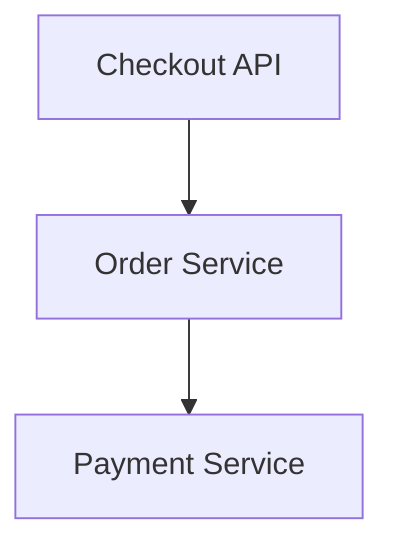

But the Order Service does not propagate the tracing context.

The tracing platform might show:

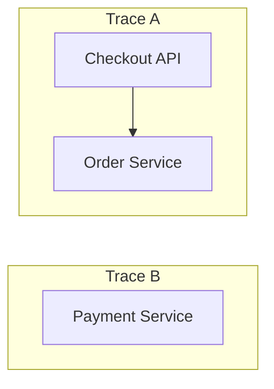

Now it is difficult to tell whether Trace B belongs to the original checkout request.

This is a common instrumentation problem.

To improve trace continuity:

- Use supported tracing libraries or automatic instrumentation.
- Propagate context across HTTP calls.
- Propagate context through queues and jobs where appropriate.
- Ensure services preserve incoming context correctly.
- Verify that tracing works across service boundaries.

Do not assume that installing a tracing library automatically instruments every dependency or communication mechanism.

---

# 11. Instrumentation

**Instrumentation** is the process of collecting information from application code or infrastructure.

Tracing instrumentation can be:

### Automatic

A supported library or agent records operations such as HTTP requests and database calls.

### Manual

Developers create spans around important application operations.

For example:

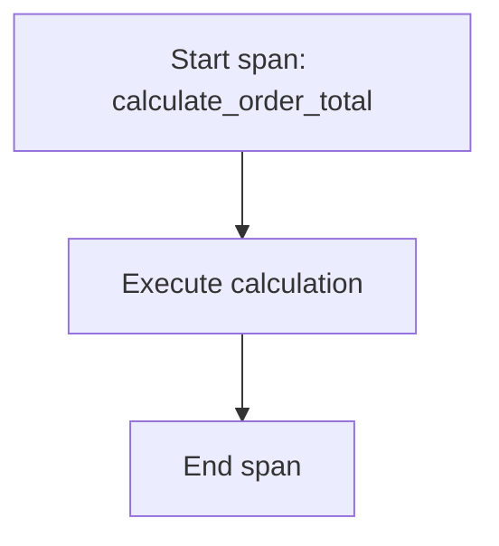

Manual spans are useful when you want to measure meaningful business or application operations that automatic instrumentation does not capture.

### A practical approach

Start with automatic instrumentation for common supported frameworks and libraries.

Add manual instrumentation where it answers a specific question.

Avoid creating spans for every tiny function. Excessive spans increase overhead and make traces harder to interpret.

---

# 12. What Can a Span Contain?

A span can include attributes that describe the operation.

Example:

```text
Span: Database Query

service.name = order-service
db.operation = SELECT
db.system = postgresql
duration_ms = 120
status = OK
```

A span may also include events that occurred during its lifetime.

For example:

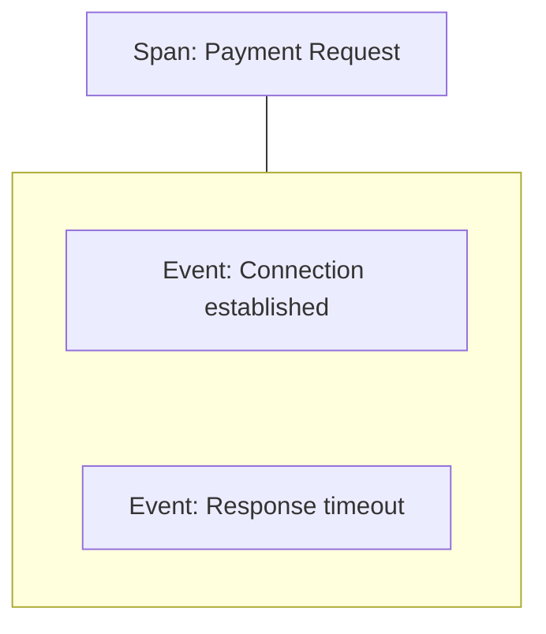

Attributes and events help explain the operation without requiring a separate span for every detail.

Be careful with sensitive information. Do not automatically attach complete SQL statements, request bodies, access tokens, or personal data to every span.

---

# 13. Errors in Traces

Traces can help identify where a request failed.

Example:

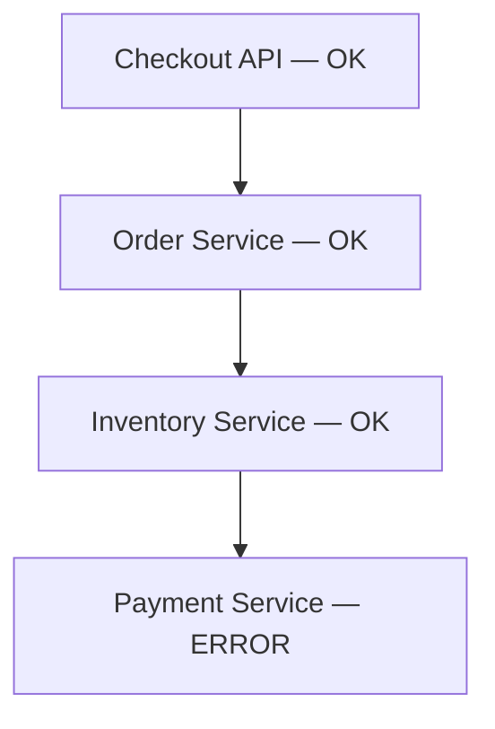

The trace may show:

```text
Payment Service
Duration: 3,000 ms
Status:   Error
Reason:   Timeout
```

This identifies the operation that reported the failure.

However, an error in a span does not always prove that the component caused the entire incident.

For example:

- A downstream timeout may originate from network trouble.
- A service may report an error because an upstream deadline expired.
- A client may time out even though the remote operation later succeeds.

Use logs, metrics, and dependency information to establish the underlying cause.

---

# 14. Trace Duration vs Request Duration

The duration of the overall request and the duration of an individual span are different measurements.

Suppose:

```text
Checkout API:       1,000 ms
Database Query:       200 ms
Payment API:          600 ms
Application Work:     200 ms
```

The child durations should not automatically be added together to calculate the total.

Why?

Because child operations may overlap, and span boundaries may include different portions of work.

For sequential operations, durations may add up approximately to the overall time.

For parallel operations, their sum can exceed the overall request duration.

```text
Overall duration: 1,000 ms

Child A: 600 ms ─────────────
Child B: 500 ms ──────────

Combined child time: 1,100 ms
```

The children overlap, so the total request can finish in less time than the sum of child durations.

> **Use the trace timeline and relationships, not just the sum of span durations.**

---

# 15. Distributed Tracing and Retries

Retries can create additional spans.

For example:

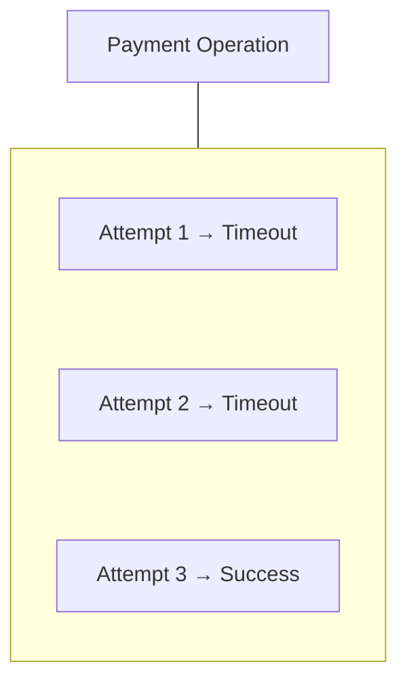

A useful trace may expose:

- How many attempts occurred.
- How long each attempt took.
- Whether delays occurred between attempts.
- Whether retries contributed to the total request duration.

This can help explain why an operation that eventually succeeds still takes several seconds.

Tracing should record retries in a way that preserves the relationship between the overall operation and individual attempts.

Remember that retries can also increase downstream load. A trace helps diagnose their behavior; it does not automatically make the retry strategy safe.

---

# 16. Sampling: Do We Trace Every Request?

A busy service may receive millions of requests.

Recording every span for every request can be expensive.

**Sampling** means recording only a selected portion of traces or spans.

For example:

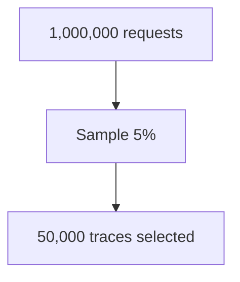

This example assumes a simple 5% request-based sampling policy. Actual tracing systems may use more sophisticated strategies.

### Common approaches

**Head-based sampling:** The decision is made near the beginning of a trace, often before the full outcome is known.

**Tail-based sampling:** The decision is made after some or all trace data is available, allowing policies to consider outcomes such as errors or high latency.

Tail-based sampling can help retain interesting traces, but it usually requires additional collection and buffering infrastructure.

### The Sampling Trade-off

| Higher sampling rate | Lower sampling rate |
|---|---|
| Records a larger proportion of traces. | Records a smaller proportion of traces. |
| Usually provides more trace coverage and a better chance of capturing unusual behavior. | Reduces trace data volume and typically lowers storage and processing costs. |
| Increases telemetry volume and may increase overhead. | May miss rare errors or slow requests unless the sampling policy specifically preserves them. |

**Important:** A higher sampling rate does not guarantee that every important trace will be captured. With head-based sampling, the decision is usually made before the full request outcome is known. Tail-based sampling can select traces based on observed outcomes, such as errors or high latency, but requires additional processing and buffering.

Sampling policies should balance diagnostic needs, trace volume, and operational cost.

For critical workflows, consider policies that preserve more error or slow-request traces where practical.

---

# 17. Tracing Overhead

Tracing itself consumes resources.

Potential costs include:

- CPU for instrumentation.
- Memory for span data.
- Network traffic to collectors.
- Storage for recorded traces.
- Processing by the tracing backend.

For a high-traffic service, the overhead can become significant.

Manage it by:

- Choosing sensible sampling policies.
- Avoiding unnecessary spans and attributes.
- Using efficient instrumentation.
- Monitoring collector health and dropped telemetry.
- Avoiding excessive high-cardinality attributes.

Observability must not create an unnecessary performance or reliability problem of its own.

---

# 18. Trace Storage and Collectors

In production, applications commonly send tracing data to a collector or telemetry pipeline.

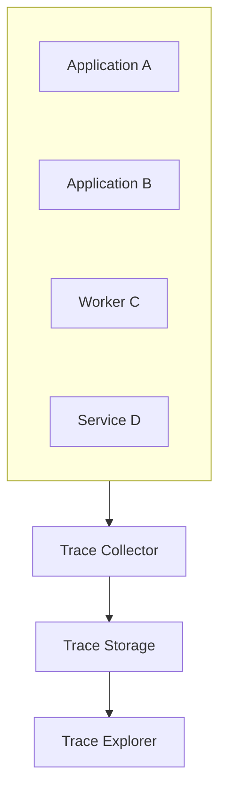

The collector may receive, process, sample, or export telemetry depending on the architecture.

A tracing UI can then display:

- Trace lists.
- Waterfall timelines.
- Service relationships.
- Span attributes.
- Error information.
- Latency distributions or related summaries.

A collector is not mandatory in every deployment. Some systems send data directly to a backend, while others use a more elaborate pipeline.

The important idea is to separate trace generation from the systems that store and help engineers explore the data when the architecture benefits from doing so.

---

# 19. Trace a Complete Checkout Request

Consider this flow:

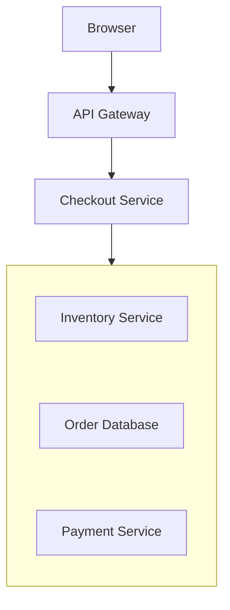

A trace might look like:

```mermaid
flowchart TD
  accTitle: A checkout trace
  accDescr: The checkout service takes 1,500 ms: validate cart 50 ms, inventory service 180 ms, order database 220 ms and payment service 1,000 ms, which is connection setup 80 ms and payment request 900 ms.
  R["Checkout Service<br/>1,500 ms"] --- G
  subgraph G[" "]
    direction TB
    I0["Validate Cart<br/>50 ms"] ~~~ I1["Inventory Service<br/>180 ms"] ~~~ I2["Order Database<br/>220 ms"] ~~~ I3["Payment Service<br/>1,000 ms"]
  end
  I3 --- G2
  subgraph G2[" "]
    direction TB
    J0["Connection Setup<br/>80 ms"] ~~~ J1["Payment Request<br/>900 ms"]
  end
```

The trace suggests that the payment operation is the largest contributor to latency.

Next, you might:

1. Compare payment latency metrics with normal behavior.
2. Inspect payment-related logs for the trace ID.
3. Check the payment provider's status and timeout behavior.
4. Determine whether retries or connection setup add unnecessary delay.
5. Apply a targeted change and measure again.

Do not assume the provider is at fault solely because its span is long. The delay could also involve networking, connection management, instrumentation boundaries, or an upstream deadline.

---

# 20. Trace a Background Job

Distributed tracing is not limited to synchronous HTTP requests.

Consider an order workflow:

```mermaid
flowchart TD
  accTitle: An order workflow
  accDescr: Checkout API, then Message Queue, then Order Worker, then Email Service.
  N0["Checkout API"] --> N1["Message Queue"] --> N2["Order Worker"] --> N3["Email Service"]
```

The API publishes a message. A worker processes it later.

The tracing context can be propagated through the message so that the producer and consumer operations remain related.

Conceptually:

```mermaid
flowchart TD
  accTitle: A trace across a queue
  accDescr: The trace covers the checkout API and publishing the order event; the order worker then updates the order and sends the email.
  T["Trace"] --- C["Checkout API"] & P["Publish Order<br/>Event"]
  P --> W["Order Worker"] --- G
  subgraph G[" "]
    direction TB
    I0["Update Order"] ~~~ I1["Send Email"]
  end
```

Because the worker may begin much later, trace relationships and timing need to be interpreted carefully. Some asynchronous workflows are better represented using linked spans rather than assuming every operation is one continuous synchronous parent-child chain.

This is especially useful for investigating slow jobs, failed message processing, and delayed downstream actions.

---

# 21. Distributed Tracing and Privacy

Trace attributes can accidentally contain sensitive information.

Avoid collecting unnecessary:

- Authentication tokens.
- Passwords.
- Full payment details.
- Complete request or response bodies.
- Personal data.
- Unrestricted SQL or database parameters.

Prefer bounded, useful attributes:

```text
service.name = checkout-service
operation = create_order
payment.provider = provider_a
error.type = timeout
```

Also consider who can access trace data and how long it is retained.

Trace IDs and span IDs are useful for correlation, but they should not be treated as authentication credentials or authorization mechanisms.

---

# 22. Common Mistakes

### Mistake 1 — Assuming a trace automatically explains the root cause

A trace shows the recorded operations and their timing. Further investigation may still be required.

### Mistake 2 — Losing trace context between services

Missing propagation can split one request journey into disconnected traces.

### Mistake 3 — Instrumenting everything

Too many spans can create overhead and clutter.

### Mistake 4 — Sampling without understanding the consequences

Rare failures may be missed if sampling is not designed with diagnostic needs in mind.

### Mistake 5 — Treating span durations as additive

Overlapping spans can make their combined duration exceed the total request duration.

### Mistake 6 — Ignoring asynchronous work

Queues and background workers need suitable context propagation to connect related operations.

### Mistake 7 — Recording sensitive attributes

Tracing data needs the same careful privacy and access-control practices as logs.

### Mistake 8 — Assuming a long span identifies the responsible team

A slow operation identifies where time was observed, not necessarily the underlying cause or owner of the problem.

---

# 23. Hands-On Exercise: Investigate a Slow Checkout

You receive a report that checkout is taking too long.

The trace shows:

```mermaid
flowchart TD
  accTitle: The slow checkout trace
  accDescr: The checkout API takes 1,600 ms: validate cart 70 ms, inventory service 180 ms, order database 250 ms and payment service 1,050 ms.
  R["Checkout API<br/>1,600 ms"] --- G
  subgraph G[" "]
    direction TB
    I0["Validate Cart<br/>70 ms"] ~~~ I1["Inventory Service<br/>180 ms"] ~~~ I2["Order Database<br/>250 ms"] ~~~ I3["Payment Service<br/>1,050 ms"]
  end
```

## Task A — Identify the dominant operation

Which span contributes the most time?

**Answer:** Payment Service, at 1,050 ms.

## Task B — Form hypotheses

List two possible reasons for the delay.

Examples:

- The payment provider is responding slowly.
- The request is waiting for a connection or experiencing network delays.

Other possibilities include retries, connection setup, or upstream/downstream timing behavior.

## Task C — Find supporting evidence

Which additional signals would you inspect?

- **Metrics:** Payment latency, timeout rate, and error rate.
- **Logs:** Specific payment failures associated with the trace ID.
- **Dependency evidence:** Provider health, connection behavior, and timeout configuration.

## Task D — Evaluate a change

Suppose an improvement reduces payment duration from 1,050 ms to 300 ms.

Measure the complete request again. Check whether total checkout latency improved and whether the change introduced any new failures or resource pressure.

The lesson is to use tracing to locate a likely constraint, then verify the cause and the improvement with additional evidence.

---

# 24. System Design View

Distributed tracing connects service architecture to real runtime behavior.

```mermaid
flowchart TD
  accTitle: Architecture to decisions
  accDescr: Architecture, then Services and Dependencies, then Instrumented Operations, then Trace, then Observed Latency and Failures, then Targeted Engineering Decision.
  N0["Architecture"] --> N1["Services and Dependencies"] --> N2["Instrumented Operations"] --> N3["Trace"] --> N4["Observed Latency and Failures"] --> N5["Targeted Engineering Decision"]
```

Architecture diagrams show how components are intended to connect.

Traces show how instrumented operations actually behaved for a particular request.

That difference is valuable when debugging real systems.

---

# 25. Quick Reference

| Concept | Meaning |
|---|---|
| Distributed tracing | Following connected operations across components |
| Trace | A connected representation of work for an operation or request |
| Span | One operation within a trace |
| Trace ID | Identifier for the overall trace |
| Span ID | Identifier for one span |
| Parent span | Span that represents the parent operation |
| Context propagation | Carrying trace context across service boundaries |
| Waterfall | Timeline visualization of spans |
| Instrumentation | Collecting telemetry from application or infrastructure |
| Sampling | Selecting which traces or spans to record |
| Head-based sampling | Making a sampling decision near trace start |
| Tail-based sampling | Making a decision after trace data is available |
| Collector | Component that receives or processes telemetry |
| Span attribute | Structured information describing an operation |

---

# 26. Knowledge Check

1. What is distributed tracing?
2. What is the difference between a trace and a span?
3. What do trace IDs and span IDs identify?
4. Why is context propagation important?
5. How can a trace help identify a latency bottleneck?
6. Why might child-span durations add up to more than the total request duration?
7. What is the difference between head-based and tail-based sampling?
8. Why might a long span not prove that the service itself is the root cause?
9. How can tracing be used for asynchronous jobs?
10. Why should sensitive data be excluded from span attributes?

## Answers

1. It records connected operations so a request's journey across instrumented components can be investigated.
2. A trace represents the connected work; a span represents one operation within that work.
3. A trace ID identifies the overall trace, while a span ID identifies an individual operation.
4. It allows services to connect their spans to the same trace rather than creating unrelated records.
5. It shows where operations occur in the request timeline and which spans account for significant latency.
6. Child operations may overlap or run concurrently.
7. Head-based sampling decides near the start; tail-based sampling decides after trace data is available.
8. The observed delay may involve network conditions, dependencies, connection setup, retries, or other factors outside the component's core processing.
9. Propagate tracing context through messages and jobs, using parent-child relationships or span links as appropriate.
10. Trace data may be widely collected and searchable, creating privacy and security risks if sensitive information is included.

---

# Remember

A distributed trace helps you answer:

```text
Which components did the request visit?
Where did it spend its time?
Which operation reported an error?
Which downstream dependency needs investigation?
How did the work connect across service boundaries?
```

Use traces to locate slow or failing operations, logs to inspect specific events, and metrics to understand whether the behavior is widespread or unusual.

**Next: 10.05 — Dashboards**
