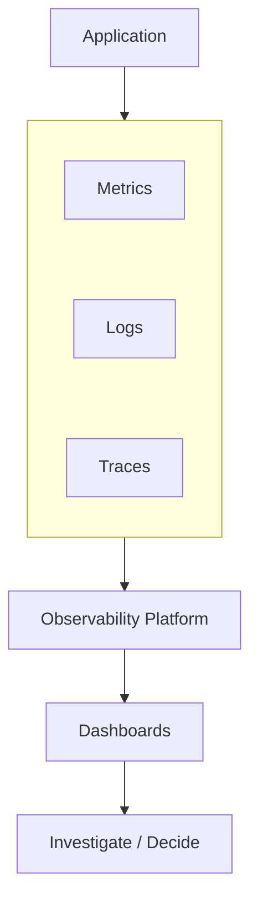
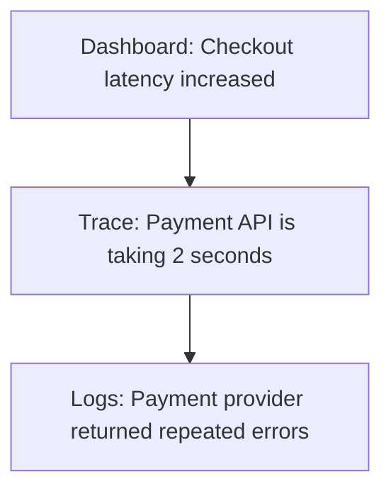
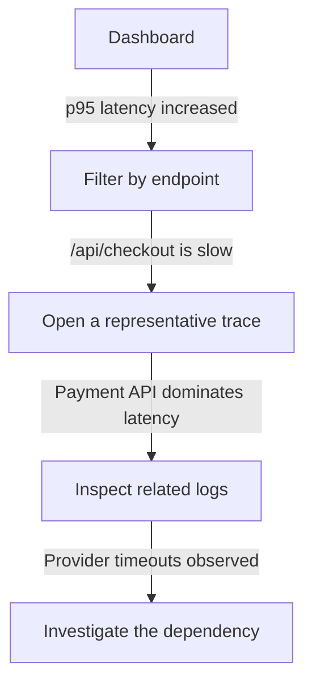
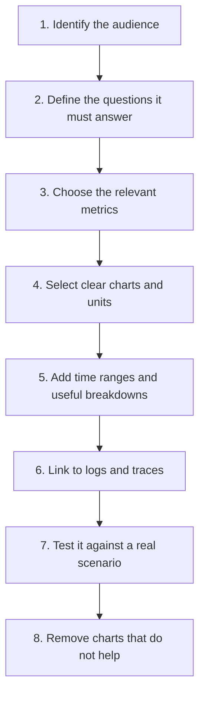
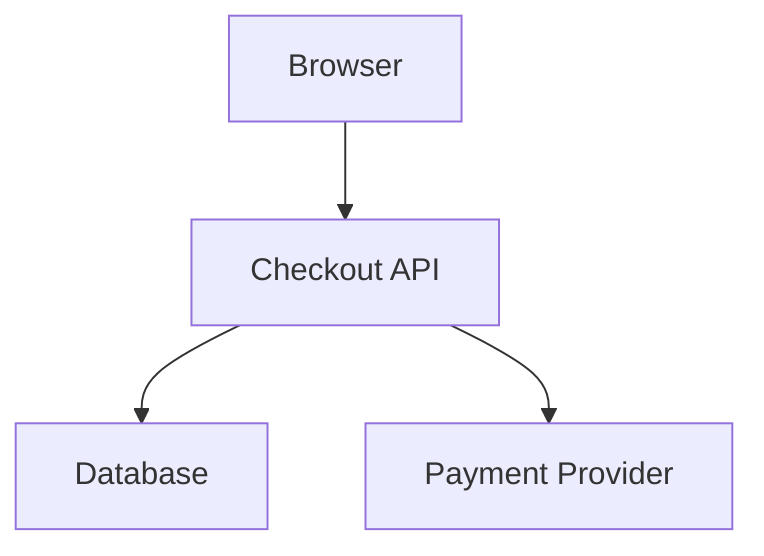
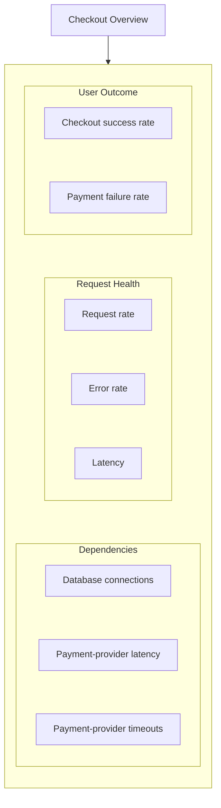
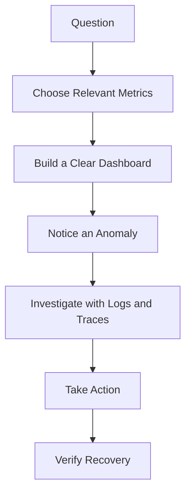

# 10.05 — Dashboards

## Learning Objectives

By the end of this chapter, you should be able to:

- Explain what an observability dashboard is and why it matters.
- Distinguish useful dashboards from collections of charts.
- Choose appropriate metrics for different system components.
- Design dashboards around user outcomes and operational questions.
- Understand the relationship between dashboards, logs, traces, and alerts.
- Recognize common dashboard design mistakes.
- Build a basic dashboard for a web application.

---

# 1. What Is a Dashboard?

A **dashboard** is a visual display of important measurements and system information that helps people understand what is happening.

For example, an e-commerce dashboard might show:

- Request rate
- Error rate
- Response latency
- Database health
- Checkout success rate

Instead of inspecting individual logs or querying metrics manually, an engineer can see important signals together.

> **A dashboard turns system data into information that helps people make decisions.**

A dashboard does not automatically explain why something went wrong. It helps you notice the problem and decide where to investigate.

---

# 2. Where Does a Dashboard Fit?

In the observability workflow, telemetry is collected and presented for analysis.



Dashboards primarily visualize data. Logs and traces provide additional detail when a metric reveals something unusual.

For example:



Each signal contributes different evidence.

---

# 3. Start With a Question, Not a Chart

A common mistake is to build a dashboard by adding every available metric.

A better approach is to begin with a question.

| Operational question | Useful dashboard signal |
|---|---|
| Can users complete checkout? | Checkout success and failure rates |
| Is the API responding quickly? | Request latency |
| Is the API failing? | Error rate |
| Is traffic increasing? | Request rate |
| Is the database overloaded? | Database utilization, active connections, and query latency |
| Is background work falling behind? | Queue depth and oldest-message age |

Each chart should help answer a meaningful question.

**A dashboard is useful when it helps someone understand the system or decide what to do next.**

---

# 4. The Four Golden Signals

A widely used starting point for service dashboards is the four golden signals.

**Latency**

How long does a request take?

Example: API request duration in milliseconds.

**Traffic**

How much demand is the system receiving?

Example: requests per second.

**Errors**

How often are requests failing?

Example: percentage of requests returning server errors.

**Saturation**

How close is a resource to its useful capacity?

Example: database connection pool usage or queue buildup.

These signals provide a practical starting point for understanding service health. They do not replace business-specific metrics or deeper investigation.

---

# 5. Example: An API Dashboard

Imagine an online store with a checkout API.

A useful overview could contain:

```text
+--------------------------------------------------+
|              CHECKOUT API                        |
+--------------------------------------------------+
| Request Rate  | Error Rate   | Request Latency   |
|  850 req/s    |    0.8%      |    p95: 420 ms    |
+--------------------------------------------------+
| Database Connections | Checkout Success Rate     |
|       72 / 100       |          98.9%            |
+--------------------------------------------------+
| Request Rate and Errors Over Time                |
|                                                  |
|       [Time-series charts]                       |
+--------------------------------------------------+
```

The values are illustrative, not live measurements.

This dashboard answers several initial questions:

- Is traffic within the expected range?
- Are requests failing?
- Are users experiencing slow responses?
- Is the database connection pool approaching its limit?
- Are customers successfully completing checkout?

If latency and error rate rise together, the engineer can investigate the relevant traces and logs.

---

# 6. Organize Dashboards by Purpose

Different audiences need different views.

## Service overview

For engineers responding to incidents:

- Request rate
- Error rate
- Latency
- Saturation
- Dependency health

## Infrastructure

For understanding resource constraints:

- CPU and memory utilization
- Disk I/O
- Network throughput
- Connection usage
- Resource saturation

## Business operations

For understanding user and business outcomes:

- Orders completed
- Payment success rate
- Checkout abandonment
- Signup completion
- Revenue-related measurements, where appropriate

## Background processing

For queues and workers:

- Queue depth
- Oldest queued-message age
- Processing rate
- Failed jobs
- Retry volume

Avoid forcing every audience into one enormous dashboard. Separate views can serve different questions while preserving links between related information.

---

# 7. Choose the Right Chart

The chart should make the data easier to understand.

| Chart type | Useful for |
|---|---|
| Time series | Latency, request rate, CPU usage over time |
| Single-value/stat | Current error rate or active connections |
| Bar chart | Comparing errors across services |
| Table | Comparing endpoints or database queries |
| Heatmap | Understanding distributions, such as request latency |
| Status indicator | Showing a clearly defined health condition |

Use a chart because it clarifies a question—not merely because the dashboard tool offers it.

A single-value chart can be useful for a current reading, but trends often reveal more than a number in isolation.

---

# 8. Time Is Essential

Most operational dashboards need a time range.

For example:

```text
Last 15 minutes
Last 1 hour
Last 24 hours
Custom range
```

Time context helps answer:

- When did the problem begin?
- Did it start after a deployment?
- Is it getting worse?
- Does it happen at particular times?
- Did recovery actually occur?

Use consistent time ranges when comparing related charts. Otherwise, you may compare measurements from different periods and draw the wrong conclusion.

Also consider the chart's aggregation interval. A very coarse interval can hide brief spikes, while extremely fine-grained data can be noisy.

---

# 9. Show Trends, Not Just Current Values

Suppose CPU usage is currently 65%.

That number alone tells you little.

Compare two situations:

```text
Situation A
CPU: 65%, stable for an hour

Situation B
CPU: 65%, rising rapidly from 20%
```

The current value is identical, but the operational meaning is different.

Time-series charts reveal direction and change.

The same applies to:

- latency,
- error rate,
- traffic,
- queue depth,
- database connections.

**A trend often provides more context than a single snapshot.**

---

# 10. Avoid Misleading Averages

Suppose most API requests are fast, but a smaller group is extremely slow.

An average can conceal that experience.

A latency dashboard may include:

- p50 latency
- p95 latency
- p99 latency

These percentiles describe different parts of the latency distribution. They help reveal whether a significant minority of requests is much slower than the typical request.

You will study them in detail in **10.08 — Latency Percentiles** and **10.09 — p50 / p95 / p99**.

For now, remember:

> **Do not rely on average latency alone when evaluating user experience.**

---

# 11. Dashboards and Alerts Are Different

A dashboard helps a person inspect system behavior.

An alert notifies someone when a defined condition requires attention.

| Dashboard | Alert |
|---|---|
| Helps explore system state | Signals a condition requiring action |
| Usually inspected by a person | Can notify automatically |
| Shows context and trends | Should identify a meaningful problem |
| May contain many useful measurements | Should focus on actionable conditions |

For example:

```text
Dashboard:
Checkout error rate over time

Alert:
Checkout error rate has exceeded its defined
threshold for the required evaluation period
```

A dashboard can help investigate an alert, but it does not replace alerting.

Alert design is covered in **10.06 — Alerting**.

---

# 12. Connect Dashboards to Logs and Traces

A dashboard should not be the end of the investigation.

Consider this sequence:



The exact navigation depends on the observability platform.

The principle is to move from a broad signal toward detailed evidence.

Where possible, dashboards should link to relevant logs, traces, service views, or deployment information.

---

# 13. Dashboard Design Mistakes

| Mistake | Why it hurts |
|---|---|
| Too many charts | Important signals become hard to find |
| No clear purpose | Viewers cannot tell what decisions the dashboard supports |
| Only current values | Trends and incident timing are hidden |
| Only averages | Slow requests can be concealed |
| Missing units | Values become ambiguous |
| Inconsistent time ranges | Comparisons can become misleading |
| Too much infrastructure detail in the overview | User-facing problems become harder to spot |
| High-cardinality breakdowns everywhere | Dashboards can become expensive or difficult to use |
| No links to diagnostic evidence | Investigation takes longer |
| Unclear thresholds or labels | Viewers may misinterpret the data |

Keep the overview focused. Put specialized diagnostics in separate dashboards when necessary.

---

# 14. A Practical Dashboard Design Workflow

Use this sequence when creating a dashboard.



A dashboard should be tested during an incident simulation or realistic investigation—not only judged by how polished it looks.

---

# 15. Hands-On Exercise: Design a Checkout Dashboard

You are responsible for an online store.

The checkout flow uses:



Recently, customers reported that checkout is slow and some payments fail.

Design a dashboard that helps the engineering team investigate.

## Step 1 — Select the signals

Include:

- Checkout request rate
- Checkout error rate
- Request latency, including a high percentile
- Payment success and failure rates
- Database connection usage
- Payment-provider latency or timeout rate

## Step 2 — Group the charts



## Step 3 — Define the investigation path

If checkout latency rises:

1. Check whether traffic also increased.
2. Check whether errors increased.
3. Compare database and payment-provider latency.
4. Open traces for slow checkout requests.
5. Inspect related logs for errors or timeouts.

## Step 4 — Review your design

Ask:

- Does every chart answer a useful question?
- Can the team identify when the problem began?
- Can the team distinguish a user-facing failure from an infrastructure symptom?
- Can the team move from a metric to the relevant trace or logs?

The goal is not to build the biggest dashboard. It is to make the next useful decision easier.

---

# 16. Key Principle

> **A good dashboard is organized around operational questions, not around the quantity of telemetry available.**

It should help a person:

- notice a meaningful change,
- understand its scope,
- identify what to investigate next,
- and verify whether recovery occurred.

Dashboards provide visibility. Logs and traces provide deeper evidence. Alerts bring attention to conditions that require action.

---

# 17. Quick Reference

| Concept | Meaning |
|---|---|
| Dashboard | Visual view of important system measurements |
| Golden Signals | Latency, traffic, errors, and saturation |
| Time Series | Measurements displayed over time |
| Saturation | How close a resource is to its useful capacity |
| Business Metric | Measurement of a user or business outcome |
| Diagnostic Link | Link from an overview to related logs, traces, or details |
| Alert | Notification for a defined condition requiring attention |
| Dashboard Audience | People and decisions the dashboard is designed to support |

---

# 18. Knowledge Check

### Question 1

What is the main purpose of a dashboard?

**Answer:** To present relevant system information in a way that helps people understand behavior and make decisions.

### Question 2

What are the four golden signals?

**Answer:** Latency, traffic, errors, and saturation.

### Question 3

Why is a dashboard with dozens of unrelated charts often unhelpful?

**Answer:** It makes important signals harder to identify and does not necessarily help answer a clear operational question.

### Question 4

How is a dashboard different from an alert?

**Answer:** A dashboard supports inspection and investigation; an alert notifies someone when a defined condition needs attention.

### Question 5

Why should a dashboard show data over time?

**Answer:** Trends help identify when a problem started, whether it is worsening, and whether recovery occurred.

### Question 6

What should you inspect after a dashboard reveals increased latency?

**Answer:** Relevant traces and logs, along with related metrics, to determine where the time is being spent and what may be causing the problem.

---

# Remember



**A dashboard should make understanding the system easier—not make the system look more complicated.**

**Next: 10.06 — Alerting**
