# 10.06 — Alerting

## Learning Objectives

By the end of this chapter, you should be able to:

- Explain what alerting is and why production systems need it.
- Distinguish alerts, metrics, dashboards, and logs.
- Understand thresholds, evaluation windows, and alert conditions.
- Design actionable alerts around user impact and system health.
- Recognize noisy alerts, false positives, and missed incidents.
- Understand alert severity, routing, grouping, and escalation.
- Build a basic alerting strategy for a web application.

---

# 1. What Is Alerting?

**Alerting** is the process of detecting a condition that needs attention and notifying the appropriate person or system.

Imagine an online store whose checkout API suddenly starts failing.

Without alerting, the engineering team might discover the problem only after customers complain.

With alerting, the system can detect a significant increase in checkout failures and notify the team.

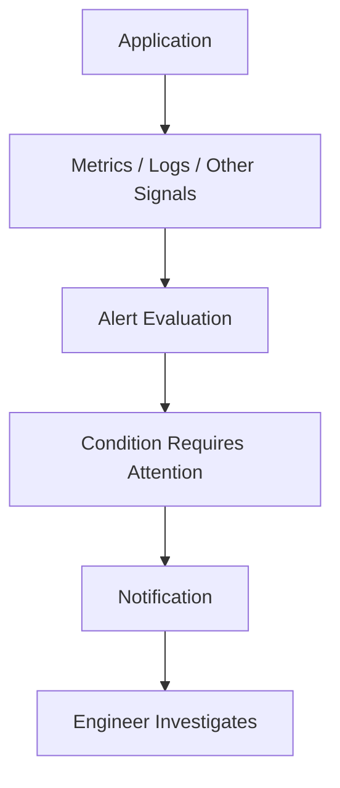

> **An alert should bring attention to a condition that someone may need to act on.**

Not every unusual measurement deserves an alert.

---

# 2. Alert vs Metric vs Dashboard

These concepts work together but have different responsibilities.

| Concept | Main purpose | Example |
|---|---|---|
| Metric | Measures system behavior | Checkout error rate is 8% |
| Dashboard | Helps inspect system behavior | Shows checkout errors rising over time |
| Alert | Notifies someone about a meaningful condition | Checkout errors have exceeded the defined limit |
| Log | Records an event | Payment provider returned an error |
| Trace | Shows the journey and timing of a request | Checkout spent 2 seconds waiting for payment |

A metric provides evidence. A dashboard helps a person explore it. An alert brings attention to a condition that requires action.

---

# 3. Why Do Systems Need Alerts?

Production systems operate continuously, and people cannot watch every dashboard all the time.

Alerting helps teams detect problems such as:

- Increased request failures.
- Excessive latency.
- Database connection exhaustion.
- Queue backlogs.
- Failed background jobs.
- Service unavailability.
- Approaching resource limits.

Without suitable alerts:

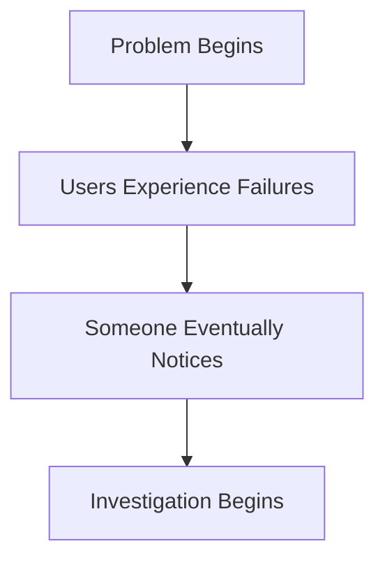

With a useful alert:

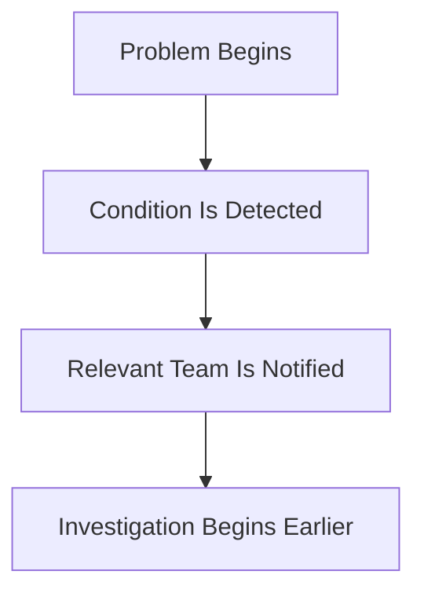

An alert does not prevent the failure by itself. It helps reduce the time between a problem occurring and the team responding.

---

# 4. How an Alert Works

A typical alerting rule evaluates a signal against a condition.

For example:

```text
Signal:
Checkout API error rate

Condition:
Error rate exceeds 5%

Evaluation:
Condition remains true for 5 minutes

Action:
Notify the on-call engineer
```

The values are illustrative, not universal recommendations.

Conceptually:

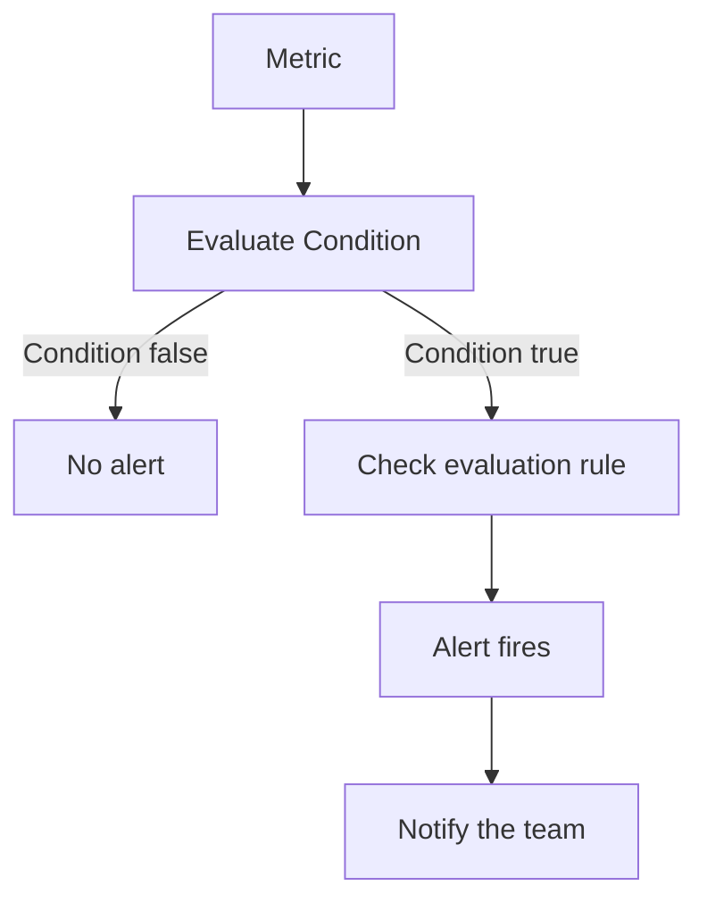

Alerting platforms differ in how they evaluate conditions, handle missing data, and manage notification state.

---

# 5. Thresholds

A **threshold** is a boundary used to identify a condition that may require attention.

Examples:

```text
CPU usage > 90%
```

```text
Checkout error rate > 5%
```

```text
Oldest queued message age > 10 minutes
```

A threshold may be:

- A fixed value.
- A percentage.
- A rate.
- A duration.
- A comparison with a baseline.
- A condition involving several signals.

The correct threshold depends on the system's normal behavior, service requirements, and consequences of failure.

**A threshold is not automatically a good alert just because it is easy to configure.**

---

# 6. Why a Single Measurement Can Be Misleading

Suppose CPU usage briefly reaches 95%.

That spike might last only a few seconds and cause no meaningful impact.

If the alert fires immediately, the team may receive unnecessary notifications.

Instead, the rule might require:

```text
CPU usage > 90%
for 5 consecutive minutes
```

Conceptually:

```text
CPU usage
  |
95%        /\ 
  |        /  \       /\
90% ------/----\-----/--\---------
  |                 threshold
  |
  +--------------------------------> Time
```

A short spike and sustained high usage can have different operational meanings.

However, not every alert should wait several minutes. A confirmed payment-processing outage may require immediate notification.

The evaluation window should reflect the risk and expected behavior.

---

# 7. Evaluation Windows and Persistence

An **evaluation window** defines the period over which a condition is assessed.

For example:

```text
Error rate > 5%
over the last 5 minutes
```

Some systems also support rules such as:

```text
Condition must remain true
for 3 minutes
```

These are related concepts, but their exact behavior depends on the alerting platform.

Evaluation windows help reduce reactions to brief fluctuations.

The trade-off is important:

| Shorter evaluation | Longer evaluation |
|---|---|
| Can detect problems sooner | Can reduce noise from brief spikes |
| May produce more transient alerts | May delay notification |
| Useful for urgent conditions | Useful for conditions that need to persist |

Do not delay urgent failure detection merely to make alerts quieter.

---

# 8. Alert on Symptoms and User Impact

A common mistake is alerting on every infrastructure measurement.

For example:

```text
CPU usage > 80%
```

High CPU may be normal during a traffic spike. It does not necessarily mean users are experiencing a problem.

Compare that with:

```text
Checkout requests are failing
and checkout latency is increasing.
```

The second condition is more directly connected to user impact.

A useful approach is to prioritize **symptoms that matter to users**, then use infrastructure alerts to detect resource problems that require attention.

For example:

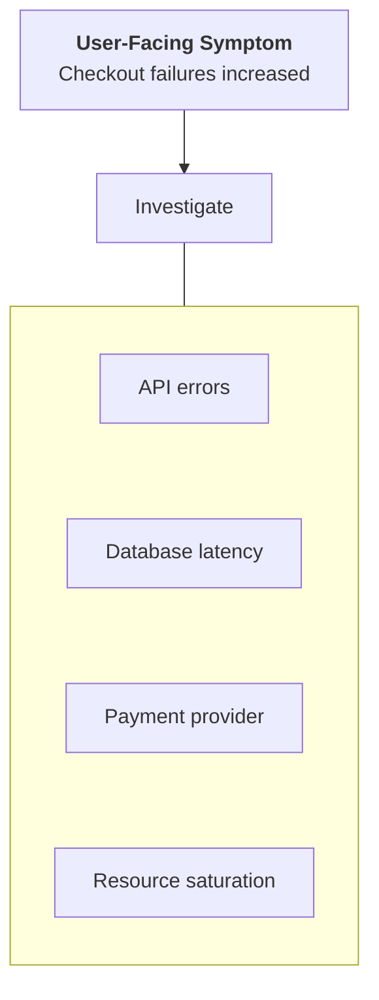

Infrastructure alerts still matter. They are especially useful when they identify a meaningful capacity risk or failure before users experience it.

---

# 9. The Four Golden Signals and Alerting

The four golden signals introduced in **10.05 — Dashboards** provide a useful starting point.

| Signal | Example alert condition |
|---|---|
| Latency | A significant proportion of requests exceed the service's latency objective |
| Traffic | Traffic drops unexpectedly or exceeds safe capacity |
| Errors | Request failures exceed an acceptable level |
| Saturation | A constrained resource approaches a dangerous limit |

Not every change in these signals should trigger an alert.

For example, low traffic at night may be normal. A traffic drop during an expected peak could indicate a serious problem.

**Interpret the measurement in its operational context.**

---

# 10. Alert Severity

Different conditions require different levels of urgency.

A simple severity model might look like this:

| Severity | Meaning | Example |
|---|---|---|
| Critical | Major user impact or essential service failure | Checkout is unavailable |
| Warning | A problem is developing or needs timely investigation | Database connections are approaching the configured limit |
| Informational | Useful operational information without immediate action | A scheduled maintenance task completed |

The names and levels vary between organizations.

The important point is that severity should communicate urgency and expected response—not merely how large a metric value looks.

For example, CPU at 95% may be less urgent than a lower CPU reading accompanied by widespread checkout failures.

---

# 11. Actionable vs Non-Actionable Alerts

An **actionable alert** gives the recipient a reason to respond.

Consider:

```text
CPU usage = 82%
```

What should the engineer do?

The answer is unclear without more context.

Compare:

```text
Checkout API latency is above its service objective.
The problem has persisted for 10 minutes.
Inspect the checkout dashboard and dependency traces.
```

The second alert provides more useful context.

A good alert should answer:

1. What is wrong?
2. Which system or service is affected?
3. How urgent is it?
4. What evidence supports the alert?
5. Where should the recipient investigate?

Where possible, link to a relevant dashboard or runbook.

---

# 12. False Positives and False Negatives

Alert quality has two important failure modes.

## False positive

An alert fires even though the condition does not represent a problem requiring action.

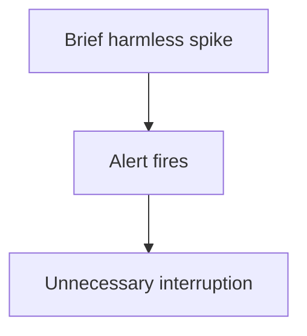

## False negative

A real problem occurs, but no alert fires.

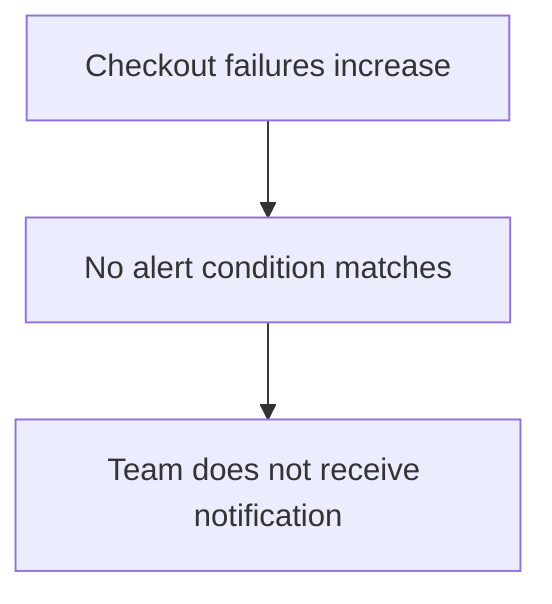

Both are harmful.

Too many false positives cause alert fatigue. Too many false negatives leave important incidents undetected.

The goal is not to maximize the number of alerts. It is to detect meaningful problems reliably.

---

# 13. Alert Fatigue

**Alert fatigue** happens when people receive so many notifications that they begin to ignore, dismiss, or respond slowly to them.

For example:

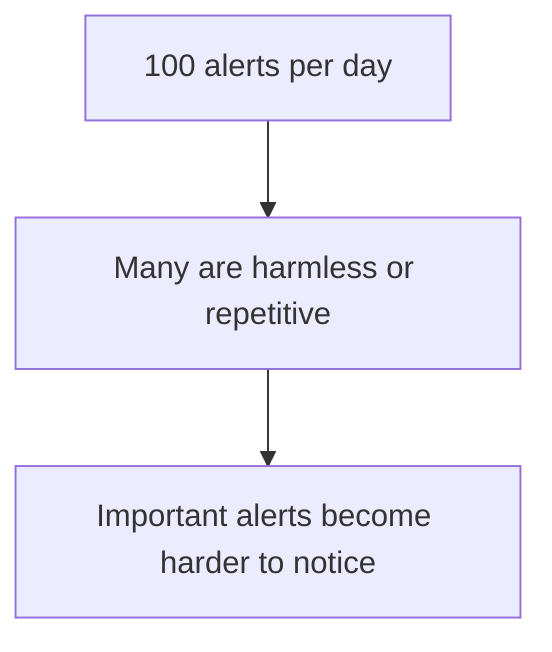

Common causes include:

- Alerts for harmless fluctuations.
- Duplicate alerts for the same incident.
- Thresholds that are too sensitive.
- Alerts without clear actions.
- Notifications for conditions nobody owns.
- Recovery notifications that add unnecessary noise.

Ways to reduce alert fatigue:

- Remove alerts that do not require action.
- Group related notifications.
- Tune thresholds using observed behavior.
- Define ownership and escalation paths.
- Review alerts after incidents.
- Separate urgent notifications from informational events.

A quieter alerting system is useful only if it continues to detect important problems.

---

# 14. Alert Grouping and Deduplication

Suppose one database failure affects ten application instances.

Each instance reports a similar error.

Without grouping, the team might receive ten notifications for one underlying incident.

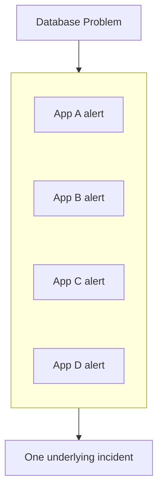

**Grouping** combines related alerts. **Deduplication** avoids repeatedly notifying the team about the same active condition.

This makes it easier to identify the underlying incident rather than treating every affected component as a separate problem.

Grouping must be designed carefully: unrelated incidents should not be merged simply because they share a label.

---

# 15. Alert Routing and Escalation

Not every alert should go to the same person.

For example:

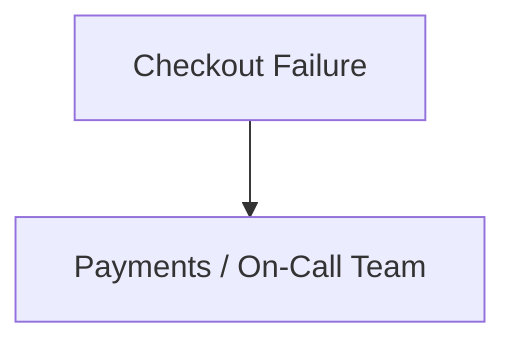

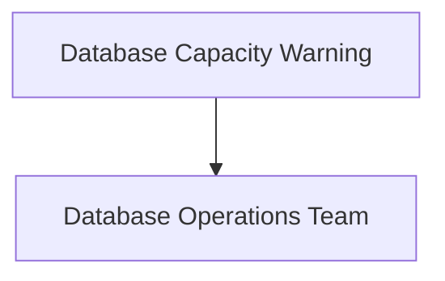

An alerting system can route notifications based on service, severity, ownership, or other configured attributes.

An **escalation policy** defines what happens if an urgent alert is not acknowledged or resolved within the required period.

Conceptually:

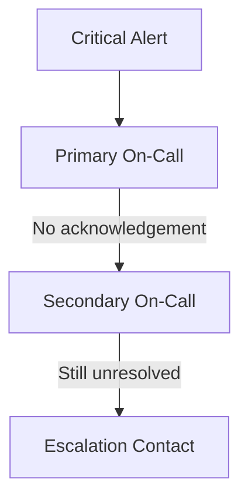

The actual sequence depends on the organization's incident-response process.

An alert is only useful if it reaches someone who can respond.

---

# 16. Alert States

Many alerting platforms distinguish between states such as:

- **Normal:** The condition is not currently firing.
- **Pending:** The condition is true but has not yet met the rule's firing requirements.
- **Firing:** The alert condition has been met.
- **Resolved:** The condition is no longer firing.

These labels are common but not universal.

Conceptually:

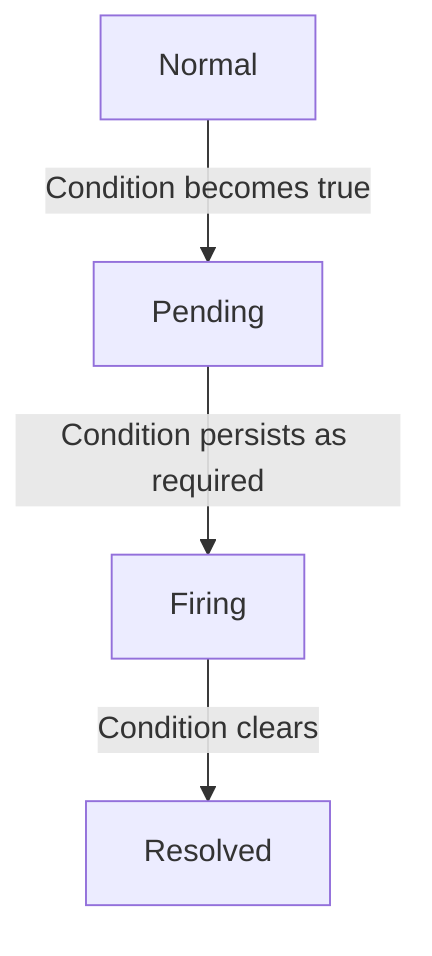

Some platforms also have separate states for missing data, evaluation errors, or notification delivery failures.

Understand the platform's behavior before relying on a particular state transition.

---

# 17. Missing Data Is Not Always Healthy

Suppose a monitoring system stops receiving metrics from an application.

It might mean:

- The application crashed.
- The monitoring agent failed.
- Network communication broke.
- Telemetry ingestion is delayed.
- The application is healthy but temporarily not emitting that metric.

Missing data is therefore not automatically equivalent to zero or healthy.

Alert rules should define how missing data is interpreted, especially for essential services.

For example, a heartbeat metric that stops arriving may itself be a useful signal.

Be careful, though: monitoring systems can fail too. Critical monitoring pipelines may need independent health checks.

---

# 18. Alerting on Service Objectives

Some teams define **service-level objectives (SLOs)** to describe the reliability or performance they intend to provide.

For example:

```text
99.9% of eligible checkout requests
should succeed over the defined measurement window.
```

An alert can be based on how quickly the service is consuming its allowed error budget.

This can be more meaningful than alerting on every individual error-rate fluctuation.

Conceptually:

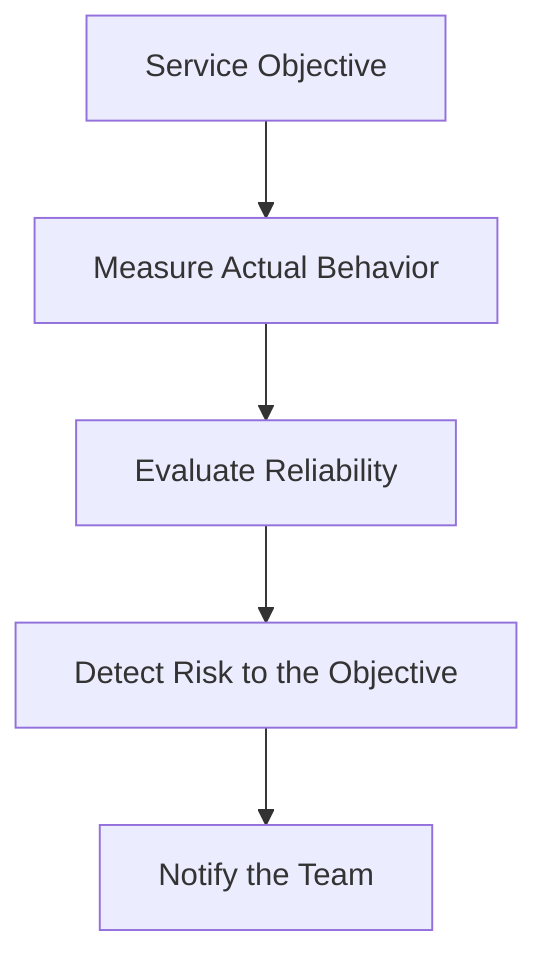

SLOs and error budgets require careful definitions of eligible requests, measurement windows, and acceptable behavior. They are covered more deeply in reliability engineering topics.

---

# 19. Static Thresholds vs Baselines

A fixed threshold is not appropriate for every metric.

Consider request traffic:

```text
Daytime traffic: high
Nighttime traffic: low
```

A fixed minimum-traffic alert might trigger every night even when the system is behaving normally.

A baseline-aware rule may compare current behavior with an expected pattern.

| Static threshold | Baseline-aware condition |
|---|---|
| Compares against a fixed boundary | Compares against expected behavior |
| Easier to understand and maintain | Can adapt to recurring patterns |
| May generate noise when normal behavior changes | Can be harder to explain and tune |

Baseline-aware alerting is not automatically superior. It can produce confusing results if the baseline is inaccurate or the workload changes unexpectedly.

Start with clear, explainable rules where possible.

---

# 20. Avoid Alerting on Every Log Error

Suppose an application logs an error every time a client submits invalid input.

Alerting on every such event could generate large amounts of noise.

Instead, distinguish between:

```text
Individual event
```

and:

```text
A meaningful rate or pattern of events
```

For example, a single failed request may be expected. A sustained rise in server-side failures may require attention.

Log-based alerts can still be valuable for specific critical events, such as a security incident or a failed essential background job. Their conditions should reflect the event's importance and expected frequency.

---

# 21. Alerting and Dependencies

A service can fail because a dependency is failing.

Consider:

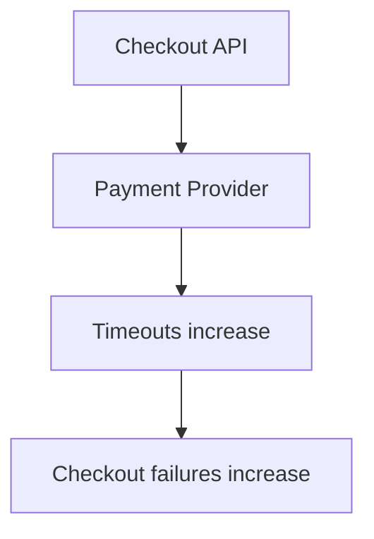

You may need both:

- An alert for user-facing checkout failures.
- An alert for the payment provider's elevated timeout rate.

The first describes the impact. The second helps identify a possible cause.

Avoid generating an independent page for every downstream symptom if one underlying incident explains them all.

---

# 22. Alerting Does Not Equal Automatic Recovery

An alert can notify a team about a failure, but it does not necessarily repair the system.

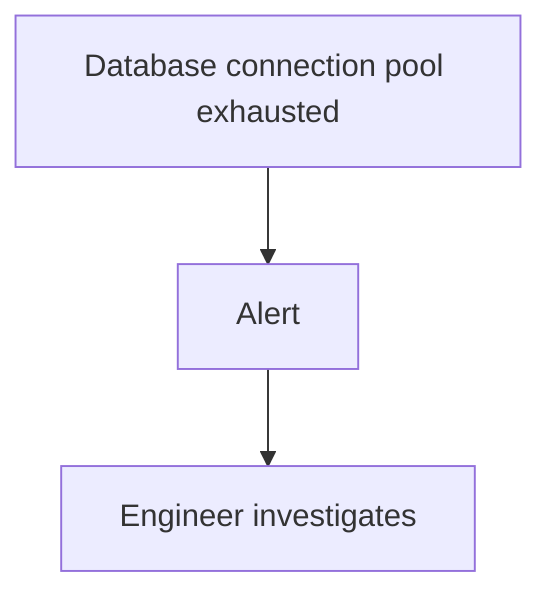

Some systems also support automated responses, such as restarting a failed process or scaling a worker pool.

However, automation must be designed carefully. An automated action can make a problem worse if the underlying cause is misunderstood.

For example, repeatedly restarting an application will not fix a database that is overloaded by the application's traffic.

**Detection, notification, and recovery are separate responsibilities.**

---

# 23. Hands-On Exercise: Design Checkout Alerts

Imagine an online store with:

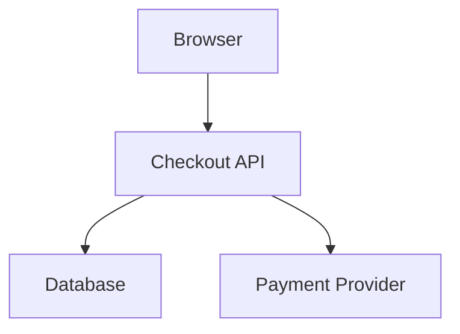

The team wants to detect important problems without receiving unnecessary notifications.

## Step 1 — Define the conditions

Create a draft rule for each scenario:

| Scenario | Possible signal |
|---|---|
| Customers cannot complete checkout | Checkout failure rate |
| Checkout becomes unusually slow | Request latency |
| Payment provider becomes unreliable | Payment timeout rate |
| Database capacity is at risk | Connection pool saturation |
| Background order processing falls behind | Queue age or depth |

## Step 2 — Decide the urgency

Ask whether the condition requires:

- Immediate on-call response.
- Timely investigation during working hours.
- Dashboard visibility without a notification.

The answer depends on customer impact and operational requirements.

## Step 3 — Define the evaluation behavior

For each rule, decide:

- Threshold or comparison method.
- Evaluation window.
- Whether the condition must persist.
- How missing data should be handled.
- Who receives the notification.

## Step 4 — Make the alert actionable

Include:

- Service name.
- Condition and measured value.
- Severity.
- Relevant time window.
- Dashboard or diagnostic link.
- Runbook or response guidance, if available.

## Step 5 — Test the rules

Simulate both a harmless short spike and a sustained real failure.

Check that the first does not create unnecessary noise and the second reliably notifies the right team.

Do not use the same arbitrary thresholds for every production service. Tune them to the workload and service requirements.

---

# 24. Common Mistakes

### Mistake 1 — Alerting on every metric

Most measurements are useful for analysis, but not every change needs immediate action.

### Mistake 2 — Choosing arbitrary thresholds

A threshold should reflect expected behavior, capacity, and user impact.

### Mistake 3 — Ignoring evaluation windows

Brief fluctuations may generate unnecessary notifications.

### Mistake 4 — Making every alert critical

Severity should communicate actual urgency.

### Mistake 5 — Sending alerts without context

The recipient should know what failed and where to begin investigating.

### Mistake 6 — Ignoring missing telemetry

A silent monitoring pipeline may hide a real problem.

### Mistake 7 — Duplicating notifications

Group related alerts where appropriate to avoid overwhelming responders.

### Mistake 8 — Treating alerts as recovery

Detection and notification do not guarantee that the system will recover.

### Mistake 9 — Never reviewing alert quality

Workloads and architectures change. Alert rules need periodic review.

---

# 25. Key Principle

> **An alert should be reliable, actionable, and connected to a meaningful operational risk.**

A good alerting strategy balances two requirements:

```text
Detect important problems quickly
              +
Avoid unnecessary interruptions
```

Too little alerting allows incidents to go unnoticed. Too much low-quality alerting makes important notifications easier to miss.

The goal is not more alerts. It is better detection and response.

---

# 26. Quick Reference

| Concept | Meaning |
|---|---|
| Alert | Notification about a condition requiring attention |
| Threshold | Boundary used to evaluate a signal |
| Evaluation Window | Period used to assess an alert condition |
| False Positive | Alert fires without a real actionable problem |
| False Negative | A real problem occurs without an alert firing |
| Alert Fatigue | Reduced responsiveness caused by excessive or noisy alerts |
| Severity | Indication of urgency and impact |
| Grouping | Combining related alerts |
| Deduplication | Avoiding repeated notifications for the same active condition |
| Routing | Sending an alert to the appropriate team |
| Escalation | Passing an unacknowledged or unresolved alert to another contact |
| SLO | A defined target for a service's reliability or performance |

---

# 27. Knowledge Check

### Question 1

What is the purpose of alerting?

**Answer:** To detect meaningful conditions and notify the people or systems responsible for responding.

### Question 2

Why shouldn't every metric change trigger an alert?

**Answer:** Many changes are normal or harmless. Excessive alerts create noise and can hide important incidents.

### Question 3

What is the difference between a false positive and a false negative?

**Answer:** A false positive alerts when no actionable problem exists; a false negative misses a real problem.

### Question 4

Why are evaluation windows useful?

**Answer:** They help distinguish sustained problems from brief fluctuations, though urgent failures may need immediate detection.

### Question 5

Why should an alert include context and links?

**Answer:** They help the recipient understand the problem and move quickly into investigation.

### Question 6

Does an alert automatically recover a failed system?

**Answer:** No. It detects and communicates a condition. Recovery requires a human response or deliberately designed automation.

### Question 7

Why does alert grouping matter?

**Answer:** It reduces duplicate notifications when multiple alerts describe the same underlying incident.

---

# Remember

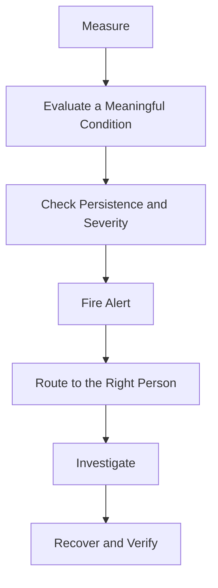

**Good alerting does not try to report everything. It helps the right person notice the right problem at the right time.**

**Next: 10.07 — Log Aggregation**
