# 10.07 — Log Aggregation

## Learning Objectives

By the end of this chapter, you should be able to:

- Explain why production systems need log aggregation.
- Understand how logs move from multiple sources into a central platform.
- Identify the roles of collectors, processing pipelines, storage, and search.
- Understand how structured logs and correlation IDs support investigations.
- Recognize log delivery, retention, cost, and security trade-offs.
- Design a basic centralized logging pipeline for a distributed application.

---

## 1. What Is Log Aggregation?

An application produces logs to record events such as requests, errors, database failures, and background-job execution.

In a small application, these logs might be stored on one machine.

But a production system may run across several components:

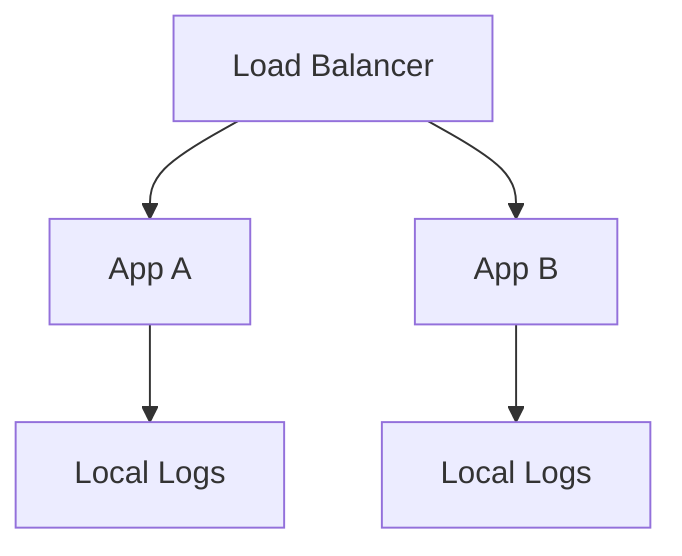

Suppose a customer reports that checkout failed. The request might have passed through App A, a payment service, and App B.

An engineer must find the relevant events across these components.

**Log aggregation** collects logs from multiple sources into a shared system so they can be searched and analyzed together.

> **Log aggregation makes distributed application logs easier to find, correlate, and investigate.**

---

## 2. Local Logs vs Centralized Logs

| Local logging | Centralized logging |
|---|---|
| Logs stay on or near the machine that produced them. | Logs are collected into a shared platform. |
| Simple for development and small deployments. | Useful for applications with multiple instances and services. |
| Cross-machine searches can be difficult. | Supports searching across many sources. |
| Logs may be lost when local storage disappears. | Central retention can preserve logs beyond an instance's lifetime, subject to delivery and storage reliability. |
| Each machine may require separate investigation. | Engineers can investigate related events from one interface. |

Centralized logging does not eliminate local logging. Applications can still write to standard output, standard error, or local files while a collector forwards the records elsewhere.

---

## 3. How Log Aggregation Works

A typical pipeline looks like this:

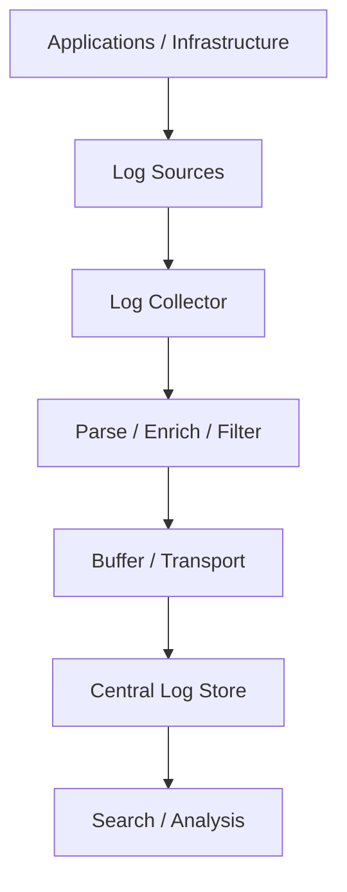

### Log sources

Applications, web servers, databases, containers, and background workers produce log records.

### Log collector

A collector reads records from supported sources and forwards them.

### Processing pipeline

Records may be parsed, normalized, enriched with metadata, or filtered.

### Buffer and transport

Logs are transmitted to the destination. Buffering can help absorb temporary slowdowns or interruptions.

### Central storage

The platform stores logs and may index selected fields for faster searches.

### Search and analysis

Engineers filter records, identify patterns, and investigate incidents.

These stages are logical responsibilities. A particular product may combine several of them.

---

## 4. Log Collectors

A **log collector** is software that gathers logs and sends them to a logging platform.

For example:

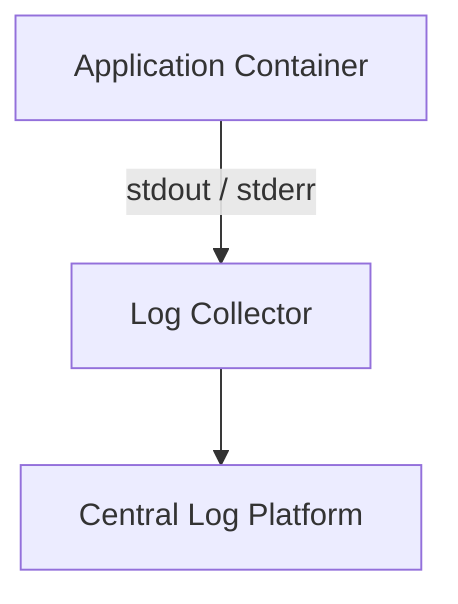

Collectors may run:

- On a virtual machine or host.
- As a daemon on each machine.
- As a sidecar alongside a container.
- As part of a managed cloud logging service.
- In a centralized logging gateway.

Examples of commonly used technologies include Fluent Bit, Fluentd, Vector, and OpenTelemetry Collector. Their capabilities and supported pipelines differ.

Remember the responsibility boundary:

- **Application:** Produces logs.
- **Collector:** Gathers and forwards logs.
- **Logging platform:** Stores, searches, and analyzes them.

---

## 5. Why Containers Need Centralized Logging

Containers may be replaced, restarted, or deleted.

Consider:

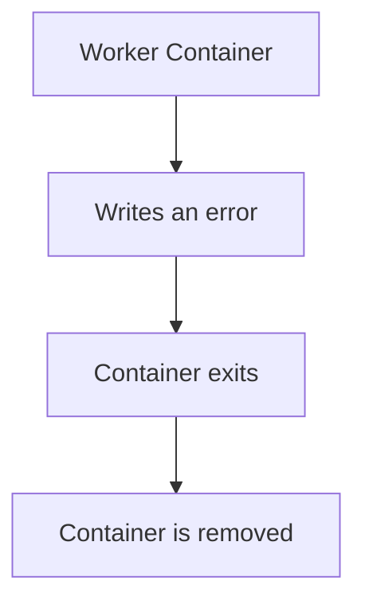

If the only copy of the log was stored inside the container's writable filesystem, the record may become unavailable.

A common design is to write logs to standard output and standard error and let the container platform or logging agent collect them.

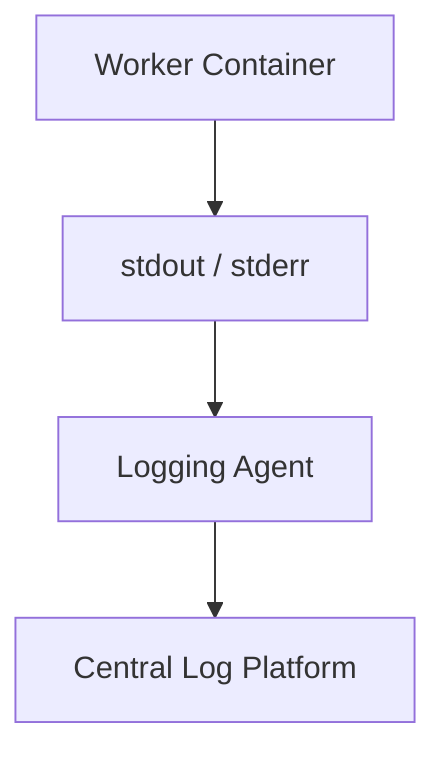

This makes logs less dependent on the lifetime of an individual container.

The pipeline still needs appropriate buffering, delivery, and retention policies.

---

## 6. Structured Logs Make Aggregation More Useful

Consider this plain-text message:

```text
Payment failed for order 123 at 10:45
```

A person can understand it, but automated searching can be harder when different services format their messages differently.

Structured logging makes records easier to search, group, and analyze consistently.

Use stable field names and data types across services where practical.

---

## 7. Enrichment: Adding Context

A processing pipeline can attach metadata to explain where a record came from.

For example:

```json
{
  "service": "checkout-api",
  "environment": "production",
  "region": "ap-south-1",
  "instance": "checkout-7f8c",
  "level": "error",
  "message": "Database request failed"
}
```

Some fields may come from the application; others may be added by the collector or logging infrastructure.

Useful metadata includes:

- Service name.
- Environment.
- Region or availability zone.
- Instance or container identity.
- Application version.
- Deployment identifier.
- Request or trace identifiers.

Add context that helps investigation. Avoid unnecessary metadata and sensitive information that increases risk or cost.

---

## 8. Correlation IDs Connect Related Logs

Each service generates its own logs. A shared identifier helps connect records associated with the same request.

```text
Trace ID: abc123

Checkout API  → trace_id=abc123
Payment       → trace_id=abc123
Order Service → trace_id=abc123
```

An engineer can search for `abc123` to find related records.

Important distinctions:

- **Request ID:** Identifies a request within the scope defined by the application.
- **Trace ID:** Identifies a distributed trace.
- **Span ID:** Identifies an individual operation within a trace.

These identifiers are related, but they are not interchangeable. Correct propagation and consistent logging are necessary for reliable correlation.

---

## 9. Log Aggregation vs Distributed Tracing

These capabilities complement each other.

| Log aggregation | Distributed tracing |
|---|---|
| Collects and searches event records. | Shows a request's path through operations and services. |
| Helps investigate what events were recorded. | Helps understand operation relationships and timing. |
| Useful for error messages and contextual details. | Useful for identifying slow dependencies and latency breakdowns. |
| Searches records using fields and identifiers. | Searches traces and spans using trace data and attributes. |

For example:

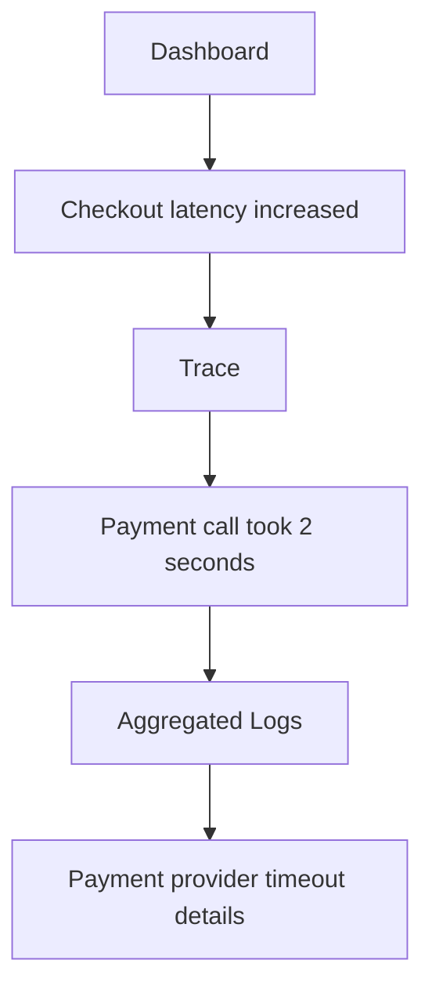

The trace helps locate the slow operation. The logs may provide additional details about what happened.

---

## 10. Searching Aggregated Logs

A central logging system becomes useful when engineers can search by meaningful fields.

For example:

```text
service = "checkout-api"
level = "error"
environment = "production"
```

Or:

```text
trace_id = "abc123"
```

Common investigation questions include:

- Which services are reporting errors?
- When did the errors begin?
- Are failures concentrated in a particular region or version?
- Which requests are affected?
- Did a deployment coincide with the problem?
- What events occurred before the failure?

The exact query syntax depends on the logging platform.

The design goal is to make common operational questions easy to answer.

---

## 11. Indexing and Search Performance

Logging platforms often index selected fields to make searches faster.

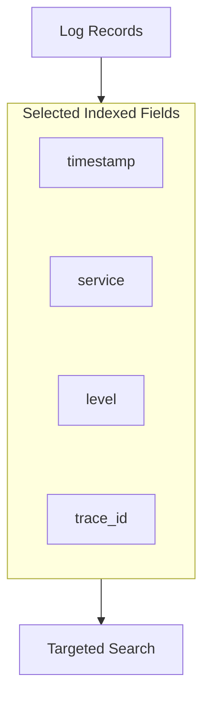

Indexing improves searchability but consumes resources and may increase ingestion and storage costs.

Not every field needs to be indexed.

Fields with many distinct values—known as high-cardinality fields—can be expensive to index in some systems. A field such as `trace_id` may still be important for targeted investigation, so the decision should reflect real search patterns and platform capabilities.

---

## 12. Log Volume and Cost

Imagine an application produces 10,000 log events per second.

Even small records can create substantial data volume.

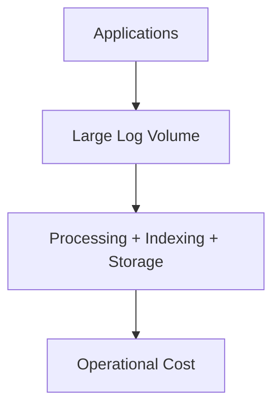

Costs may include:

- Data ingestion.
- Processing.
- Indexing.
- Storage.
- Search workloads.
- Retention.
- Network transfer.

Ways to control costs include:

- Avoiding repeated, low-value messages.
- Choosing appropriate log levels.
- Reducing oversized records.
- Filtering unnecessary events where safe.
- Sampling repetitive high-volume events when appropriate.
- Indexing only useful fields.
- Setting retention periods based on operational and compliance requirements.

Do not remove essential security, audit, or incident-investigation records merely to reduce cost.

---

## 13. Retention and Log Rotation

**Retention** defines how long logs are kept before they are deleted or archived according to policy.

A typical lifecycle might be:

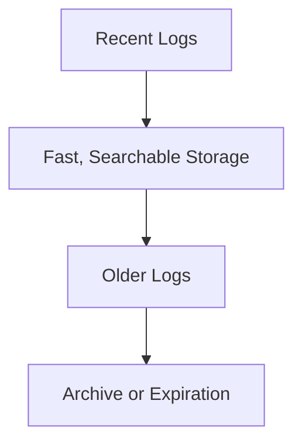

Local files also need rotation or size limits so they do not consume unlimited disk space.

Centralized logging does not eliminate the need to manage local storage.

---

## 14. What Happens When the Logging Pipeline Fails?

Logging infrastructure is itself a dependency.

Suppose:

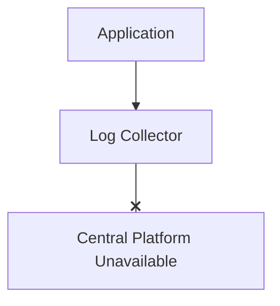

Possible behaviors include:

- Buffering and retrying.
- Queueing records locally.
- Dropping records when buffers fill.
- Blocking the producer, depending on the integration.
- Continuing local logging while forwarding is unavailable.

The exact behavior depends on the collector and its configuration.

This creates an important trade-off:

> **Logging should preserve useful evidence without allowing logging failures to unnecessarily take down the application.**

For high-value records, durability and delivery guarantees may matter more. For high-volume, low-value events, bounded resource use may be more important.

Choose the design according to the consequences of losing or delaying records.

---

## 15. Delivery Is Not Automatically Guaranteed

Centralized logging does not necessarily guarantee that every generated record arrives.

Logs may be lost because of:

- A process crashing before data is flushed.
- Full local buffers.
- Network failures.
- Collector failures.
- Ingestion limits.
- Storage problems.
- Misconfigured filters.

Buffering and retries can reduce loss but may introduce duplicates, delays, and additional resource usage.

For strict auditing requirements, evaluate delivery guarantees explicitly. Ordinary application logs should not automatically be treated as a durable audit record.

---

## 16. Security and Privacy

Logs can contain sensitive information, intentionally or accidentally.

Centralized logging may make these records accessible to more users and services.

Follow these principles:

1. Never log passwords, authentication tokens, or other secrets.
2. Redact sensitive fields before records enter broadly accessible storage.
3. Restrict access according to role and need.
4. Protect log transport and storage.
5. Audit access to sensitive logs where required.
6. Define retention and deletion policies.
7. Sanitize untrusted input to reduce log-injection risks.

**Centralization improves access to evidence, but it also increases the importance of controlling access to that evidence.**

---

## 17. Example: Investigating a Failed Payment

A customer reports that an order failed.

The request passes through:

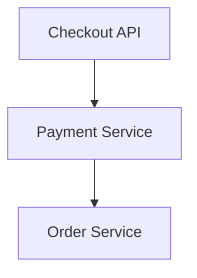

The team has centralized logging.

### Step 1 — Identify the request

Find its request ID or trace ID from available context.

```text
trace_id = "abc123"
```

### Step 2 — Search across services

```text
Checkout API  → payment request started
Payment       → provider request timed out
Order Service → order status update failed
```

### Step 3 — Inspect timing

Open the distributed trace to understand where the request spent its time.

### Step 4 — Determine what is known

A timeout does not prove that the payment provider failed to process the payment. The result may be uncertain.

### Step 5 — Respond safely

Verify the payment outcome using an authoritative status or reconciliation mechanism. Follow the established recovery procedure rather than blindly repeating a potentially non-idempotent payment operation.

This demonstrates how aggregated logs support investigation without necessarily providing the complete answer on their own.

---

## 18. Hands-On Exercise

Imagine an application with:

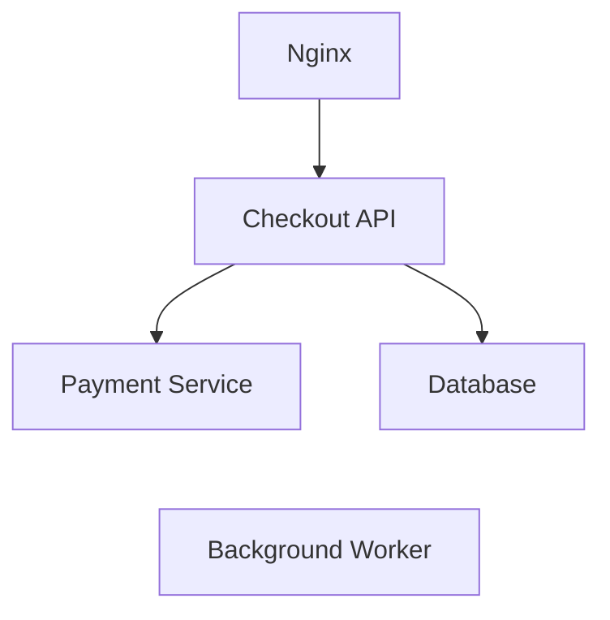

Design a basic centralized logging pipeline.

### Step 1 — Identify the sources

Collect logs from Nginx, the checkout API, payment service, database where appropriate, background worker, and relevant infrastructure.

### Step 2 — Standardize key fields

Consider a common record format:

```json
{
  "timestamp": "2026-10-10T05:15:00Z",
  "level": "error",
  "service": "checkout-api",
  "environment": "production",
  "message": "Payment request timed out",
  "trace_id": "abc123"
}
```

### Step 3 — Choose collection and storage

Decide how logs are collected, processed, transported, stored, indexed, and retained.

### Step 4 — Plan for failure

Ask:

- What happens if the central platform becomes unavailable?
- How large can the local buffer become?
- What happens when the buffer fills?
- Can the application continue if log forwarding is delayed?

### Step 5 — Protect the data

Define which fields must never be logged and who can access production logs.

### Step 6 — Test an investigation

Simulate a failed payment and confirm that an engineer can find related records across services using a shared identifier.

---

## 19. Common Mistakes

- **Collecting logs without useful search:** Central storage is less valuable if records cannot be filtered effectively.
- **Using inconsistent field names:** Inconsistent schemas make cross-service searches harder.
- **Logging everything:** Excessive low-value records increase cost and hide important events.
- **Assuming every log arrives:** Collection pipelines can fail, delay, or drop records.
- **Ignoring collector health:** A quiet central platform may mean forwarding has stopped.
- **Indexing every field:** Indexing has resource and cost implications.
- **Storing secrets in logs:** Centralization can expose sensitive information more widely.
- **Treating logs as proof of every outcome:** A timeout or missing event can leave uncertainty.

---

## 20. Key Principle

> **Log aggregation makes records from multiple components available in one searchable place, helping engineers reconstruct what happened across a distributed system.**

A good logging pipeline balances:

- Searchability.
- Delivery reliability.
- Useful context.
- Storage and ingestion cost.
- Security and privacy.
- Application performance.

Centralized logging is not about storing as much data as possible. It is about preserving the right evidence and making it useful when the system behaves unexpectedly.

---

## 21. Quick Reference

| Concept | Meaning |
|---|---|
| Log Aggregation | Collecting logs from multiple sources for centralized analysis |
| Log Collector | Software that gathers and forwards logs |
| Log Processing | Parsing, enriching, filtering, or transforming records |
| Central Log Store | Shared storage for collected logs |
| Structured Logging | Recording events using consistent fields |
| Enrichment | Adding useful metadata to log records |
| Correlation ID | Identifier used to connect related records or operations |
| Trace ID | Identifier for a distributed trace |
| Indexing | Creating structures that support efficient searches |
| Retention | How long logs are kept |
| Buffering | Temporarily storing logs while awaiting delivery |
| Log Loss | Records that are not successfully retained |
| Log Rotation | Managing local log files as they grow |

---

## 22. Knowledge Check

### Question 1

What problem does log aggregation solve?

**Answer:** It collects logs from multiple components into a shared system, making cross-service investigation easier.

### Question 2

What does a log collector do?

**Answer:** It gathers logs from sources and forwards them, sometimes also processing or enriching them.

### Question 3

Why are structured logs useful?

**Answer:** Consistent fields make it easier to search, filter, group, and correlate records.

### Question 4

How does a trace ID help?

**Answer:** It helps find records associated with the same distributed trace when the identifier is propagated and logged correctly.

### Question 5

What can happen if the central logging platform becomes unavailable?

**Answer:** Depending on the pipeline, logs may be buffered, delayed, written locally, dropped, or cause backpressure.

### Question 6

Why should fields be indexed selectively?

**Answer:** Indexing can improve search performance but increases resource usage and cost.

### Question 7

Why is centralized log access a security concern?

**Answer:** Logs may contain sensitive information, and centralization can make that information available to more users and services.

---

## Remember

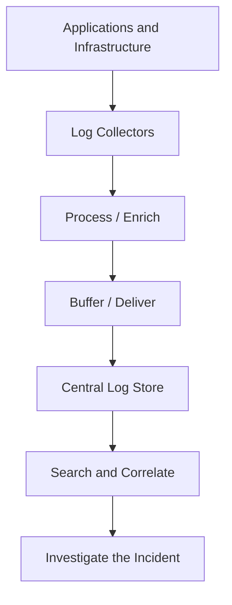

**Good log aggregation makes distributed-system evidence easier to find, connect, and trust.**

**Next: 10.08 — Latency Percentiles**
