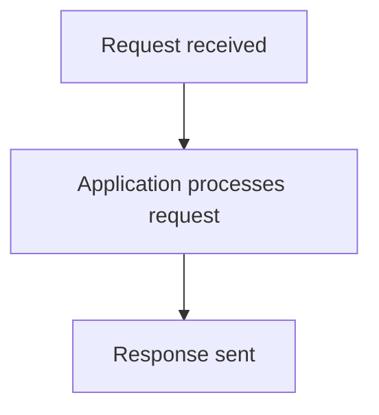
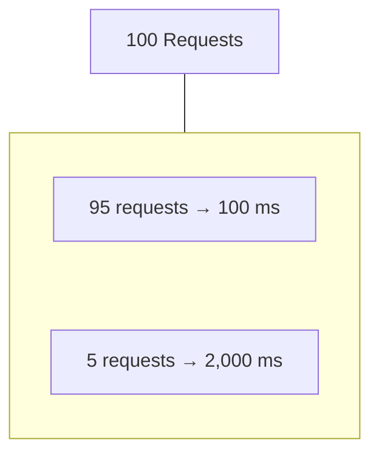
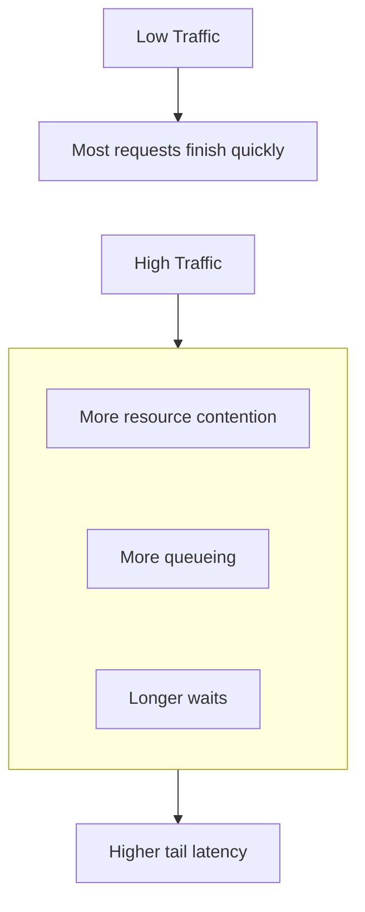
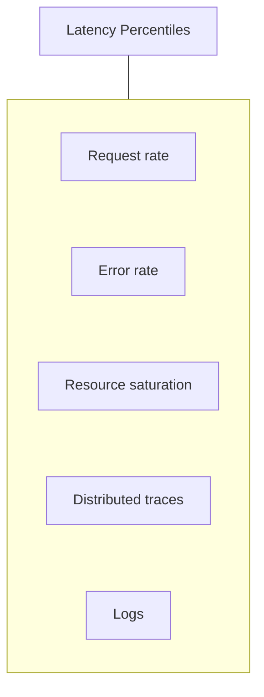
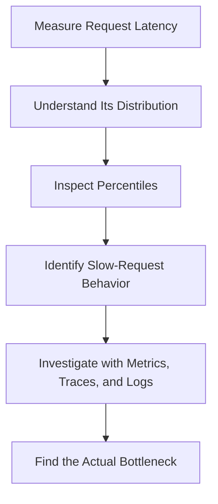

# 10.08 — Latency Percentiles

## Learning Objectives

By the end of this chapter, you should be able to:

- Explain what latency percentiles measure.
- Understand why average latency can hide slow requests.
- Interpret percentile values using a simple example.
- Understand how latency distributions change under load.
- Recognize common mistakes when comparing percentiles.
- Use percentiles to investigate user-facing performance problems.

---

## 1. What Is Latency?

**Latency** is the time taken for an operation to complete.

For a web application, it often means the time between receiving a request and producing its response, although the exact measurement depends on where timing begins and ends.

For example:



Total latency = 200 ms

Not every request takes the same amount of time.

```text
Request A →  50 ms
Request B →  80 ms
Request C → 120 ms
Request D → 900 ms
Request E → 150 ms
```

Some requests finish quickly. Others take much longer.

To understand the overall experience, we need to examine the **distribution of latency**, not just one number.

---

## 2. Why One Average Is Not Enough

Imagine an API receives 100 requests.

- 95 requests take 100 ms.
- 5 requests take 2,000 ms.

The average latency is:

$$
\frac{95(100)+5(2000)}{100}=195\text{ ms}
$$

The average is 195 ms, but five users waited two seconds.

That difference matters.



The average combines all requests into one value. It does not clearly show how slow the slowest requests were.

> **A system can have a reasonable average while a portion of users experience very slow responses.**

---

## 3. What Is a Percentile?

A **percentile** describes a position within a distribution of measured values.

For latency, the p95 value represents the latency at or below which approximately 95% of the measured requests fall.

Similarly, p50 is the median: approximately half the measured requests are at or below that value.

Consider these 10 request latencies, sorted from lowest to highest:

```text
20, 30, 40, 50, 60, 70, 80, 90, 100, 500 ms
```

The values are mostly fast, but one request is much slower.

A percentile summarizes a position in this ordered distribution.

Different tools may use different percentile calculation methods, especially for small datasets. Therefore, the exact result can vary slightly by implementation.

---

## 4. Understanding Percentiles Visually

Imagine 100 requests ordered from fastest to slowest.

```text
Fastest                                      Slowest
  |----------------------------------------------|
  0%                                            100%

  |------------------------|----|----------------|
  0%                      50%  95%             100%
                           p50  p95
```

Conceptually:

- **p50:** the midpoint of the latency distribution.
- **p95:** the boundary below which approximately 95% of requests fall.
- **p99:** the boundary below which approximately 99% of requests fall.

The final 5% beyond p95 contains the slowest 5% of requests. The final 1% beyond p99 contains the slowest 1%.

These are distribution positions, not guarantees about every future request.

---

## 5. Why Percentiles Matter in System Design

Suppose two APIs have these measurements:

| Measurement | API A | API B |
|---|---:|---:|
| Average latency | 100 ms | 110 ms |
| p95 latency | 180 ms | 900 ms |

API B has a slightly higher average, but its p95 is much higher.

That suggests a substantial portion of API B's requests are experiencing worse latency.

Possible causes include:

- Slow database queries.
- Connection pool waiting.
- External API delays.
- Queueing under load.
- Lock contention.
- Uneven workload distribution.

Percentiles help reveal behavior that averages can conceal.

They do not identify the cause by themselves. You still need metrics, logs, traces, and other evidence.

---

## 6. Latency Distributions Can Change Under Load

A service may perform well at low traffic and deteriorate as demand increases.



For example:

| Condition | p50 | p95 |
|---|---:|---:|
| Normal load | 80 ms | 180 ms |
| Heavy load | 100 ms | 750 ms |

The typical request has become only slightly slower, but the slow end of the distribution has deteriorated substantially.

This can indicate that some requests are waiting for limited resources or slow dependencies.

The numbers are illustrative.

---

## 7. Percentiles and User Experience

Different requests can have different performance requirements.

For example:

| Operation | Why latency matters |
|---|---|
| Search suggestions | Users expect quick feedback while typing |
| Product page | Slow responses delay browsing |
| Checkout | Latency can disrupt a critical purchase flow |
| Report generation | Longer processing may be acceptable |
| Background job | Completion time may matter more than immediate response time |

Do not assume that one percentile target should apply to every operation.

Choose measurements that reflect the user experience and the requirements of each service.

---

## 8. Percentiles Need Context

A percentile is meaningful only when you understand what was measured.

Ask:

- Which endpoint or operation?
- Which time window?
- How many requests were measured?
- Which users, regions, or instances were included?
- Were failed requests included?
- Is the measurement from the client, load balancer, or application?
- Is the traffic representative of normal usage?

For example, these measurements are not necessarily comparable:

```text
API p95 over 1 minute
API p95 over 24 hours
```

The traffic mix and operating conditions may differ.

Likewise, client-perceived latency may include network delays that server-side latency does not.

**Always understand the measurement boundary before interpreting the number.**

---

## 9. Percentiles Across Multiple Instances

Suppose an application runs on three instances:

```text
App A → p95 = 100 ms
App B → p95 = 120 ms
App C → p95 = 900 ms
```

Instance C may be experiencing a problem.

Possible explanations include:

- Uneven traffic distribution.
- A slow dependency.
- Resource saturation.
- A noisy neighbor.
- An instance-specific configuration issue.

However, you should not calculate the overall p95 by simply averaging the three p95 values.

Percentiles generally cannot be combined correctly by averaging percentile numbers. Use the underlying observations or a suitable aggregation method supported by the monitoring system.

This is an important rule when building distributed observability dashboards.

---

## 10. Percentiles Are Not the Whole Story

Percentiles are useful, but they do not explain everything.

A latency percentile does not directly tell you:

- Why requests were slow.
- Whether failed requests were excluded.
- How many requests occurred.
- Whether a rare extreme delay occurred beyond the measured percentile.
- Whether the metric was calculated correctly.

Combine latency percentiles with other signals:



For example, rising p95 latency combined with high database connection usage may suggest connection pool contention. Traces and database metrics can help confirm or reject that hypothesis.

---

## 11. Hands-On Exercise

Imagine a checkout API produces these measurements:

| Metric | Normal period | Incident period |
|---|---:|---:|
| Average latency | 120 ms | 180 ms |
| p50 latency | 90 ms | 100 ms |
| p95 latency | 250 ms | 1,200 ms |
| Error rate | 0.5% | 4% |

Answer the following questions.

1. Which latency measurement changed most dramatically?
2. Why might the average alone understate the severity of the incident?
3. What other metrics would you inspect?
4. Which traces or logs could help identify the slow dependency?
5. Would you investigate the database, external services, or application workers first? What evidence would guide that decision?

### Suggested reasoning

The p95 increased from 250 ms to 1,200 ms, while p50 changed only slightly. This suggests the slowdown disproportionately affects the slower portion of requests.

The increase in error rate adds evidence that this may be more than a harmless performance fluctuation.

Next, compare request rate, resource saturation, dependency latency, and traces for slow requests. Do not assume the database is responsible until the evidence supports that conclusion.

---

## 12. Common Mistakes

- **Relying only on average latency:** It can conceal slow requests.
- **Treating p95 as the maximum:** Requests can be slower than p95.
- **Averaging percentiles across instances:** This does not generally produce a valid overall percentile.
- **Ignoring sample size:** Percentiles based on very few requests can be unstable.
- **Comparing different measurement windows:** Traffic and conditions may differ.
- **Ignoring failures:** A latency chart may not include every failed request.
- **Treating a percentile as a root cause:** It describes observed behavior, not why it happened.

---

## 13. Key Principle

> **Latency percentiles help describe how response times are distributed, revealing slow-request behavior that a single average may hide.**

Use them to identify the scope of a performance problem, then investigate the cause using other observability signals.

---

## 14. Quick Reference

| Concept | Meaning |
|---|---|
| Latency | Time taken for an operation to complete |
| Distribution | The spread of measured values |
| Percentile | Position within an ordered distribution |
| p50 | Median latency |
| p95 | Latency boundary for approximately 95% of observations |
| p99 | Latency boundary for approximately 99% of observations |
| Tail latency | Latency among the slower portion of requests |
| Measurement window | Period over which observations are collected |
| Sample size | Number of observations used in a measurement |

---

## 15. Knowledge Check

**1. Why can average latency be misleading?**

Because a small portion of very slow requests can be hidden by many fast requests.

**2. What does p95 latency mean?**

Approximately 95% of measured requests have latency at or below that value, subject to the calculation method.

**3. Does p95 represent the slowest request?**

No. Some requests can be slower than p95.

**4. Can you average three instance-level p95 values to get the system-wide p95?**

Generally, no. A valid aggregate requires the underlying observations or a suitable aggregation method.

**5. What should you do after detecting an increase in p95?**

Investigate related metrics, traces, and logs to understand where the extra time is being spent.

---

## Remember



**Next: 10.09 — p50 / p95 / p99**
