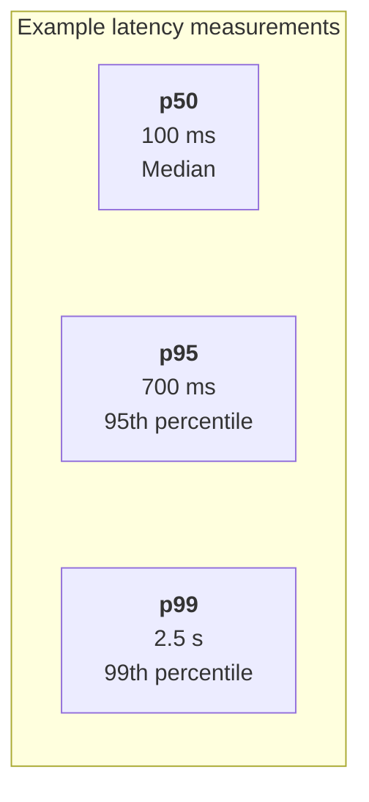
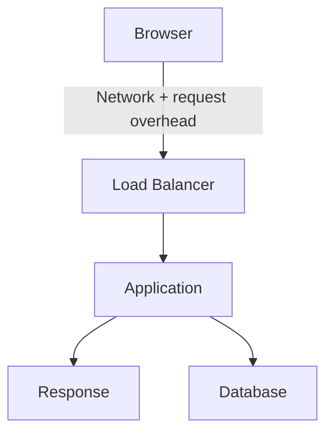
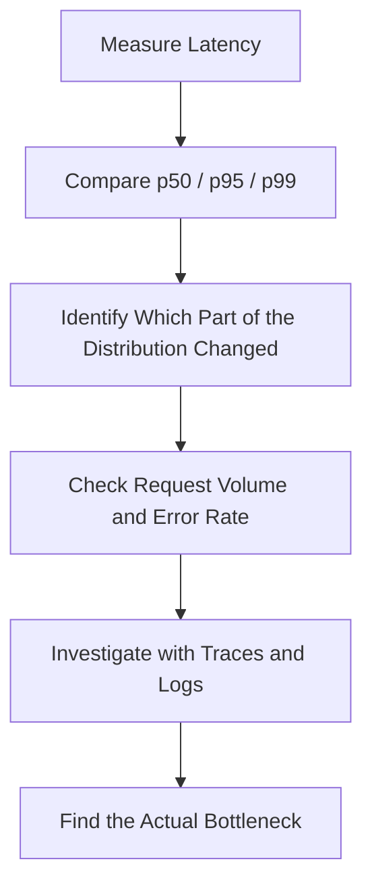

# 10.09 — p50 / p95 / p99

## Learning Objectives

By the end of this chapter, you should be able to:

- Explain the meaning of p50, p95, and p99 latency.
- Interpret percentile values using real-world examples.
- Understand why p95 and p99 are useful for detecting slow requests.
- Compare latency percentiles before and during an incident.
- Recognize why percentiles cannot generally be averaged across servers.
- Use percentiles alongside request volume, error rates, and traces.

---

## 1. What Do p50, p95, and p99 Mean?

A web application receives many requests, and each request takes a different amount of time.

For example:

```text
Request A →  40 ms
Request B →  70 ms
Request C →  90 ms
Request D → 120 ms
Request E → 900 ms
```

A single average cannot fully describe this distribution.

Percentiles help us understand different positions within it.

| Percentile | Meaning |
|---|---|
| **p50** | Approximately 50% of measured requests completed at or below this latency. |
| **p95** | Approximately 95% completed at or below this latency. |
| **p99** | Approximately 99% completed at or below this latency. |

These are calculated from observed latency data over a defined measurement window. Exact results can vary by calculation method.

The higher the percentile, the farther into the slow end of the distribution it describes.

---

## 2. p50 — The Typical Middle

**p50 is the median latency.**

Imagine the sorted request latencies are:

```text
20, 30, 40, 50, 60, 70, 80, 90, 100 ms
```

The middle value is:

```text
p50 = 60 ms
```

Approximately half the requests are at or below this value, and approximately half are at or above it.

p50 is useful for understanding the typical middle of the observed latency distribution.

But it does not tell you whether a smaller group of requests is extremely slow.

For example, a service can have a healthy p50 while some users experience significant delays.

---

## 3. p95 — The Slower 5%

Suppose a service reports:

```text
p50 = 100 ms
p95 = 700 ms
```

This means approximately 95% of measured requests completed within 700 ms, while approximately 5% took longer.

That slower portion may be important.

p95 is often useful when investigating performance that affects a meaningful minority of users.

It does not identify the cause by itself.

---

## 4. p99 — The Slower 1%

Now suppose:

```text
p50 = 100 ms
p95 = 700 ms
p99 = 2,500 ms
```

Approximately 99% of requests completed within 2,500 ms, while approximately 1% took longer.

p99 highlights the slower tail of the distribution.

These requests may be affected by rare or uneven conditions, such as:

- Occasional long-running queries.
- Resource contention.
- Slow dependency responses.
- Garbage-collection pauses.
- Retry delays.
- Requests queued behind other work.

However, p99 is not the maximum latency. Some requests may be much slower.

> **p99 helps reveal tail latency; it does not tell you why the tail exists.**

---

## 5. Compare the Three Percentiles

Consider this illustrative API dashboard:



The gap between p50 and p99 suggests that a smaller portion of requests is substantially slower than the median.

Interpretation:

- **p50 = 100 ms:** the middle of the distribution is relatively fast.
- **p95 = 700 ms:** a noticeable slower tail exists.
- **p99 = 2.5 seconds:** the slowest portion experiences much longer delays.

The next step is to investigate what those slower requests have in common.

---

## 6. Worked Example: Interpret the Percentiles

These example values show how the distribution's shape affects your interpretation.

- **p50 100 ms · p95 500 ms · p99 1,500 ms** — The p95 is much higher than p50. Investigate why the slower portion of requests takes longer. The p99 is much higher than p95, suggesting an especially slow extreme tail.
- **p50 100 ms · p95 250 ms · p99 400 ms** — The gap between p50 and p95 is relatively smaller. Check the p99 as well before concluding that tail latency is healthy. The p99 is relatively close to p95 in this example.
- **p50 100 ms · p95 250 ms · p99 1,200 ms** — The gap between p50 and p95 is relatively smaller. Check the p99 as well before concluding that tail latency is healthy. The p99 is much higher than p95, suggesting an especially slow extreme tail.
- **p50 100 ms · p95 700 ms · p99 1,000 ms** — The p95 is much higher than p50. Investigate why the slower portion of requests takes longer. The p99 is relatively close to p95 in this example.
- **p50 300 ms · p95 200 ms · p99 900 ms** — Check the ordering: p50 ≤ p95 ≤ p99.

These comparisons are diagnostic clues, not universal health thresholds. Actual service requirements determine whether the values are acceptable.

For percentiles from the same latency distribution, higher percentiles should not have lower latency values.

---

## 7. What Happens During an Incident?

Suppose the API normally reports:

| Metric | Normal | During incident |
|---|---:|---:|
| p50 | 90 ms | 100 ms |
| p95 | 250 ms | 1,200 ms |
| p99 | 500 ms | 3,500 ms |
| Error rate | 0.5% | 4% |

The median changes only slightly, but p95 and p99 increase dramatically.

This suggests that the slowdown disproportionately affects the slower portion of requests.

A sensible investigation would be:

1. Check whether request volume increased.
2. Inspect database latency and connection usage.
3. Compare latency across application instances.
4. Open traces for slow requests.
5. Search related logs for timeouts or errors.
6. Check whether a deployment or configuration change coincided with the incident.

Do not assume the database is responsible just because tail latency increased. Use the evidence to locate the bottleneck.

---

## 8. Percentiles and Request Volume

Percentiles become less stable when there are very few observations.

Suppose an endpoint receives only five requests in a minute.

A single slow request can have a large effect on the calculated upper percentiles.

By contrast, an endpoint receiving thousands of requests provides a larger sample over the same period.

Always consider:

- Number of requests.
- Measurement window.
- Traffic distribution.
- Whether traffic changed during the period.
- How the monitoring system calculates percentiles.

For low-volume services, consider longer windows or additional evidence. Do not interpret a noisy percentile as definitive proof of a problem.

---

## 9. Never Average Percentiles Across Servers

Suppose three instances report these p95 values:

| Instance | p95 latency |
|---|---:|
| App A | 100 ms |
| App B | 200 ms |
| App C | 900 ms |

The arithmetic average is 400 ms, but **400 ms is not necessarily the overall p95**.

Why? Each instance has its own latency distribution and may handle a different number or mix of requests.

To estimate an overall percentile correctly, use the underlying observations or an appropriate mergeable histogram or distribution representation supported by your monitoring system.

This is an important rule for distributed observability.

---

## 10. Percentiles Depend on What You Measure

Client-side latency and server-side latency may differ.



A browser may measure the full request journey, while the application measures only its own processing interval.

Therefore, two valid latency measurements may report different percentiles.

---

## 11. Percentiles and Service Objectives

Percentiles are often used to evaluate performance objectives.

For example, a team might define an objective that p95 latency should remain below a chosen limit for a specified endpoint and measurement window.

But percentile targets must be designed carefully. A p95 target alone allows up to roughly 5% of measured requests to exceed that percentile value, and it does not impose a maximum on those slower requests.

Choose a target based on user expectations and service requirements, not simply because a particular percentile is common.

Service Level Indicators and Objectives are covered later in:

- **10.10 — SLI**
- **10.11 — SLO**
- **10.12 — SLA**

---

## 12. Common Mistakes

- **Treating p50 as the complete user experience:** It describes the middle, not the slow tail.
- **Treating p99 as the maximum:** Some requests may be slower.
- **Averaging p95 values across instances:** This generally does not yield the overall p95.
- **Ignoring sample size:** Small samples can produce unstable tail estimates.
- **Comparing incompatible measurements:** Different boundaries and time windows can mislead.
- **Ignoring error rates:** Fast failures do not necessarily mean a healthy service.
- **Assuming high p99 identifies the cause:** It indicates a latency pattern, not its root cause.
- **Setting universal percentile targets:** Acceptable latency depends on the operation and user requirements.

---

## 13. Key Principle

> **p50, p95, and p99 describe different parts of a latency distribution. Together, they help distinguish typical performance from the slower experiences that averages can hide.**

Use them to understand the problem's scope. Then investigate the cause with metrics, traces, logs, and resource measurements.

---

## 14. Quick Reference

| Concept | Meaning |
|---|---|
| p50 | Median latency |
| p95 | Latency at or below which approximately 95% of observations fall |
| p99 | Latency at or below which approximately 99% of observations fall |
| Tail latency | Slow end of the latency distribution |
| Sample size | Number of observations used |
| Measurement window | Period over which observations are collected |
| Histogram | Distribution representation that can support percentile estimation |
| Overall percentile | Percentile calculated across the combined request population, not by averaging instance percentiles |

---

## 15. Knowledge Check

**1. What does p50 represent?**

The median latency: approximately half of measured requests are at or below it.

**2. What does p95 tell you?**

Approximately 95% of measured requests completed at or below that latency; roughly 5% took longer.

**3. Is p99 the maximum latency?**

No. Requests can exceed p99.

**4. Why can p50 remain stable while p99 increases?**

Most requests may remain fast while a smaller portion experiences longer delays.

**5. Can you average server-level p95 values to calculate system-wide p95?**

Generally, no. Use the combined observations or a suitable aggregation method.

**6. What should you investigate when p95 rises sharply?**

Check traffic, errors, resource saturation, dependencies, and traces for slow requests. Follow the evidence to the bottleneck.

---

## Remember



**Next: 10.10 — SLI**
