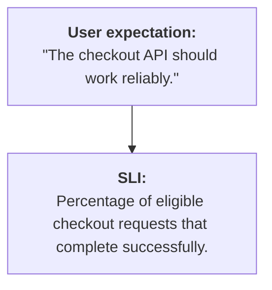
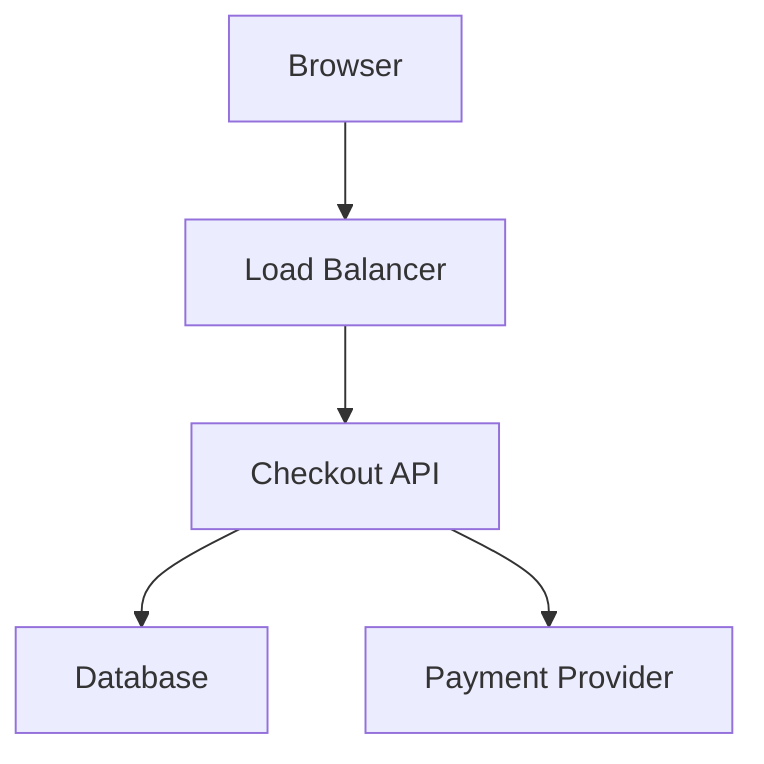
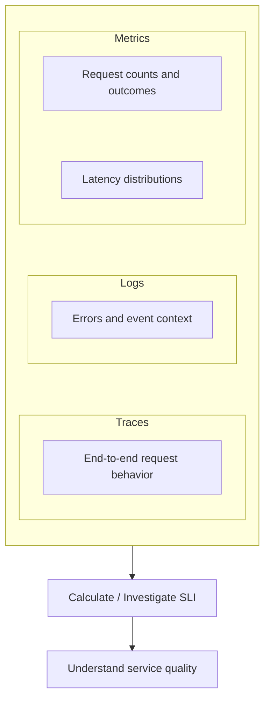
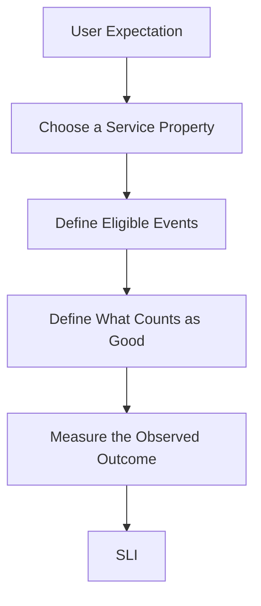

# 10.10 — SLI (Service Level Indicator)

## Learning Objectives

By the end of this chapter, you should be able to:

- Explain what a Service Level Indicator (SLI) is.
- Distinguish an SLI from a metric, SLO, and SLA.
- Choose useful SLIs for web applications and APIs.
- Calculate basic availability and latency indicators.
- Understand good measurement boundaries and eligible events.
- Avoid common mistakes when defining service indicators.

---

## 1. What Is an SLI?

A **Service Level Indicator (SLI)** is a quantitative measurement of a service's behavior that matters to its users.

For example, users care whether:

- A page loads successfully.
- An API responds quickly enough.
- A payment operation completes correctly.
- A service returns errors too often.

An SLI turns one of these expectations into a measurable value.

For example:



An SLI is not simply any number you can measure. It should represent an aspect of service quality that matters.

> **An SLI measures how a service is behaving from a defined user or service perspective.**

---

## 2. Metric vs SLI

A metric is a measurement. An SLI is a metric—or a calculation based on measurements—chosen to represent an important aspect of service quality.

Consider these measurements:

| Measurement | Is it automatically an SLI? |
|---|---|
| CPU utilization | No |
| Memory usage | No |
| Number of HTTP requests | Not by itself |
| Percentage of successful requests | Often a useful SLI |
| Percentage of requests completed within a latency target | Often a useful SLI |
| Successful checkout rate | Often a useful business-facing SLI |

CPU and memory measurements are useful for operating a system, but they do not directly tell us whether users are receiving a good service.

For example, CPU may be at 40% while checkout requests are failing because a payment dependency is unavailable.

The key question is:

**What measurable outcome tells us whether the service is working as expected?**

---

## 3. SLI vs SLO vs SLA

These three terms are related but have different roles.

**SLI — Indicator**
What are we measuring?

Example: 99.8% of eligible requests succeeded.

**SLO — Objective**
What target are we trying to achieve?

Example: At least 99.9% of eligible requests should succeed over 30 days.

**SLA — Agreement**
What formal commitment applies to the customer?

Example: A contract defines availability commitments and remedies if they are missed.

In short:

```text
SLI → Measure actual behavior
SLO → Define the target
SLA → Formalize a commitment, often with consequences
```

This chapter focuses on the SLI. SLOs and SLAs are covered in the following chapters.

---

## 4. Common Types of SLIs

Different services need different indicators.

| SLI category | What it measures | Example |
|---|---|---|
| Availability / success | Whether operations succeed | Successful eligible requests ÷ total eligible requests |
| Latency | Whether operations are fast enough | Percentage of requests completed within 300 ms |
| Correctness | Whether results are correct | Percentage of validated operations producing correct results |
| Freshness | Whether data is sufficiently up to date | Percentage of records updated within the required interval |
| Durability | Whether acknowledged data remains available as required | Percentage of acknowledged writes retained and recoverable |
| Throughput | Whether sufficient work is completed | Successfully processed jobs per minute, when that reflects the service requirement |

Not every service needs every category.

For a public API, success rate and latency may be central. For a data pipeline, freshness and completeness may matter more.

Choose SLIs based on the service's purpose.

---

## 5. Availability as an SLI

Suppose an API receives 10,000 eligible requests during a measurement window.

Of these, 9,980 succeed.

The request success-rate SLI is:

$$
\text{Success rate} =
\frac{\text{Successful eligible requests}}
{\text{Total eligible requests}}\times100
$$

$$
=\frac{9{,}980}{10{,}000}\times100
=99.8\%
$$

The observed SLI is **99.8%** for that window.

This value is meaningful only if the team defines what counts as an eligible request and what counts as success.

For example, the policy might classify server errors and timeouts as failures while excluding invalid requests rejected because of incorrect client input. The correct definition depends on the service and its user expectations.

---

## 6. Latency as an SLI

A latency SLI does not have to be a single percentile.

It can measure the proportion of requests that complete within a defined threshold.

Suppose a service processes 10,000 eligible requests:

- 9,700 complete within 300 ms.
- 300 take longer than 300 ms.

Then:

$$
\text{Latency SLI} =
\frac{\text{Requests within threshold}}
{\text{Eligible requests}}\times100
$$

$$
=\frac{9{,}700}{10{,}000}\times100
=97\%
$$

The latency SLI is **97% of eligible requests completed within 300 ms**.

This answers a concrete question about the service's behavior.

It is different from saying, "p95 latency is 300 ms." A percentile describes a point in the latency distribution; a threshold-based SLI measures the fraction of requests meeting a defined latency requirement.

---

## 7. Choose the Right Measurement Boundary

Consider a checkout request:



Where should we measure success and latency?

Possible boundaries include:

- The browser's end-to-end experience.
- The load balancer's view of HTTP requests.
- The checkout API's view of completed operations.
- The payment provider's response time.

These measurements answer different questions.

For example, a checkout API may return a fast HTTP response that merely confirms a payment job was queued. That does not prove the payment itself has completed successfully.

**Define the SLI at the boundary that represents the outcome you intend to measure.**

---

## 8. Define Eligible Events Carefully

An SLI needs a clear denominator: which events are included in the calculation?

For a request success-rate SLI, possible questions include:

- Are all HTTP requests included?
- Are health checks excluded?
- Are invalid client requests considered failures?
- How are timeouts classified?
- Are retries counted as separate attempts or as one user operation?
- Are asynchronous jobs considered successful when accepted or only when completed?

Different choices can produce different results.

For example, if a payment workflow retries internally three times before succeeding, counting each attempt separately produces a different indicator from counting the overall payment operation once.

Neither approach is universally correct. The definition must match the purpose of the SLI and be applied consistently.

---

## 9. Good SLIs Need Clear Definitions

A useful SLI definition specifies:

1. **What is measured?** Success rate, latency, freshness, or another service property.
2. **What is the event population?** Which requests, jobs, users, or operations count?
3. **What counts as good?** For example, a successful response or latency below a threshold.
4. **What is the measurement window?** For example, one hour or 30 days.
5. **Where is it measured?** Client, API gateway, application, or workflow boundary.
6. **How are missing or incomplete observations handled?** Telemetry gaps must not silently be treated as success.

Without these definitions, two dashboards can report different numbers while both appear reasonable.

---

## 10. SLI and Observability

The previous chapters introduced metrics, logs, traces, and latency percentiles.

They help us measure and investigate SLIs.



For example, a falling checkout success-rate SLI tells the team that success has deteriorated.

Metrics can show when the decline began. Traces can reveal slow dependencies. Logs can provide details about specific failures.

An SLI tells you **what service outcome was observed**. Observability evidence helps explain **why it happened**.

---

## 11. Interactive Example: Calculate an SLI

Use this example to calculate a request success-rate SLI.

```calculator
title: Request success-rate SLI
inputs:
  - id: successful
    label: Successful requests
    unit: requests
    min: 0
    max: 10000
    step: 10
    value: 9980
    atMost: eligible
  - id: eligible
    label: Eligible requests
    unit: requests
    min: 100
    max: 10000
    step: 100
    value: 10000
result:
  label: Observed request success-rate SLI
  operation: percentage
  digits: 3
  unit: "%"
formula: "{successful} successful of {eligible} eligible requests"
caption: This is an observed SLI, not an SLO verdict. Whether it meets a target depends on the defined objective and measurement window.
```

---

## 12. Common Mistakes

- **Using infrastructure health as the only SLI:** Healthy CPU and memory do not guarantee a good user experience.
- **Leaving success undefined:** Different teams may classify the same outcome differently.
- **Ignoring the denominator:** The included events determine what the percentage means.
- **Mixing different boundaries:** Client latency and server latency are not interchangeable.
- **Counting retries inconsistently:** Attempt-level and operation-level success rates answer different questions.
- **Treating missing telemetry as success:** Missing measurements can hide failures.
- **Confusing SLI with SLO:** An observed value is not the target.
- **Tracking too many indicators:** Prefer a small set of indicators that represent important user outcomes.

---

## 13. Key Principle

> **An SLI turns an important aspect of service quality into a clearly defined, measurable indicator.**

A good SLI reflects what users need, defines exactly what is measured, and uses consistent rules to classify good and bad outcomes.

---

## 14. Quick Reference

| Term | Meaning |
|---|---|
| SLI | Quantitative indicator of service behavior |
| Eligible event | Request, operation, or event included in the calculation |
| Good event | Event that meets the defined success or quality condition |
| Success-rate SLI | Good eligible requests divided by total eligible requests |
| Latency SLI | Often the proportion of eligible requests meeting a latency threshold |
| Measurement window | Period over which the SLI is calculated |
| Measurement boundary | Point or workflow where the service outcome is measured |
| SLO | Target defined for an SLI |
| SLA | Formal service commitment, often with remedies or consequences |

---

## 15. Knowledge Check

**1. What is an SLI?**

A quantitative measurement of a service property that matters to users.

**2. How is an SLI different from an SLO?**

The SLI measures observed behavior; the SLO defines the target for that behavior.

**3. Why must eligible events be defined?**

Because the denominator determines what the SLI actually represents.

**4. Is CPU utilization automatically an SLI?**

No. It is a useful system metric, but it may not directly represent the service quality users experience.

**5. Why can client-side and server-side latency indicators differ?**

They may measure different parts of the request journey.

**6. What should a team do when its SLI declines?**

Investigate the relevant metrics, logs, traces, and dependencies to find the cause.

---

## Remember



**Next: 10.11 — SLO**
