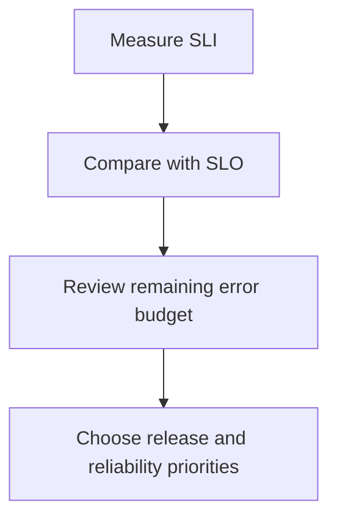
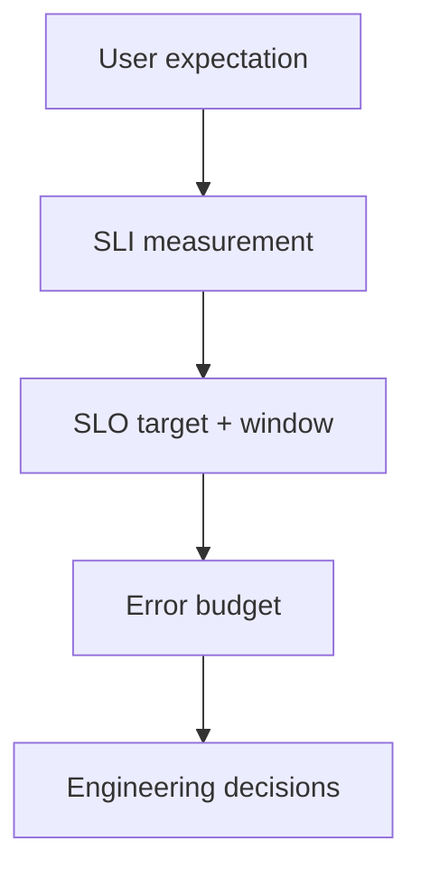

# 10.11 — Service Level Objectives (SLOs)

## Learning Objectives

By the end of this chapter, you should be able to:

- Explain what a **Service Level Objective (SLO)** is.
- Distinguish an SLO from an SLI and an SLA.
- Define an SLO using a measurement, target, and time window.
- Understand how reliability targets affect product decisions.
- Calculate a basic error budget.
- Recognize the difference between request-based and time-based objectives.
- Understand common SLO mistakes.

---

## 1. What Is an SLO?

An **SLO (Service Level Objective)** is a target for a measurable aspect of a service's reliability or performance.

Suppose your application measures successful requests. The current success rate is 99.7%.

Is that good enough?

It depends on what the service promises to users and what the business requires.

An SLO makes the expectation explicit:

> **At least 99.9% of eligible requests must succeed over a rolling 30-day window.**

This tells the team:

- What is measured: request success.
- What the target is: at least 99.9%.
- Which events count: eligible requests.
- When it is evaluated: a rolling 30-day window.

Without a defined target, a team might argue that a service is "reliable enough" without agreeing on what that means.

---

## 2. SLI vs SLO vs SLA

These three terms are related but serve different purposes.

An SLO is an internal reliability target in many organizations. An SLA may be a customer-facing contractual commitment. Their exact relationship depends on the organization and agreement.

---

## 3. The Anatomy of an SLO

A useful SLO should be specific enough that different people can measure it consistently.

For example:

> **99.9% of eligible checkout requests should complete successfully over a rolling 30-day window.**

Break it down:

```text
Measurement:    Successful checkout requests
Target:         At least 99.9%
Population:     Eligible checkout requests
Time window:    Rolling 30 days
```

A practical SLO definition should clarify:

1. **What is measured?** The SLI.
2. **What counts as good?** The success condition or threshold.
3. **What is the target?** The required percentage.
4. **What is the time window?** For example, rolling 30 days.
5. **Where is it measured?** Such as the public API boundary.

If the team cannot agree on these details, the SLO may be ambiguous.

---

## 4. Example: A Request Success SLO

Imagine an online store has this SLO:

> At least 99.9% of eligible API requests must succeed over a rolling 30-day window.

During the evaluation window, the service receives 1,000,000 eligible requests.

Suppose 999,200 succeed.

```text
Successful requests = 999,200
Eligible requests   = 1,000,000

Success rate = 999,200 / 1,000,000 × 100

             = 99.92%
```

The measured success rate is 99.92%.

The SLO is 99.9%.

Therefore, the service is **meeting this SLO for the evaluated window**.

That does not mean every request succeeded. It means the measured result is within the allowed failure budget.

---

## 5. Example: A Latency SLO

Reliability is not only about whether a request succeeds.

A service can return successful responses that are too slow to be useful.

Suppose the SLO is:

> At least 95% of eligible product API requests must complete within 300 milliseconds over a rolling 30-day window.

During the window:

```text
Eligible requests:           100,000
Requests completed ≤ 300 ms:   96,000
```

The SLI is:

```text
96,000 / 100,000 × 100 = 96%
```

The target is 95%, so the service meets the latency SLO.

Notice the difference between these two statements:

- **p95 latency is 300 ms or less.**
- **At least 95% of eligible requests complete within 300 ms.**

These express the same general threshold idea when calculated over the same population and window, but implementations and percentile conventions can differ at boundaries. Define the measurement precisely.

---

## 6. SLOs Are Not Just About Availability

Different services need different objectives.

| SLI category | Example SLO |
|---|---|
| Request success | At least 99.9% of eligible requests succeed |
| Latency | At least 95% of requests complete within 300 ms |
| Data freshness | At least 99% of records become available within 60 seconds |
| Correctness | At least 99.99% of evaluated results are correct |
| Job completion | At least 99% of scheduled jobs finish within 5 minutes |

Choose objectives that reflect the service's purpose.

For example, a background reporting job might care more about completion by a deadline than about HTTP response latency.

A payment service may need to care about both successful processing and correct financial outcomes.

---

## 7. Choosing the Right Target

A higher target sounds better:

```text
99.0%
99.9%
99.99%
99.999%
```

But every additional nine can become harder and more expensive to achieve.

A stricter objective may require:

- more redundancy,
- better failure detection,
- more careful deployments,
- improved dependency reliability,
- additional capacity,
- more testing and operational work.

The right target is not automatically the highest possible number.

It is a target that balances user expectations, business needs, technical feasibility, and cost.

> **Reliability is a product and engineering decision, not just an infrastructure setting.**

---

## 8. What Does 99.9% Mean?

For a request-based SLO:

```text
Target: 99.9% successful requests
Allowed bad-event rate: 0.1%
```

For every 1,000 eligible requests, the target allows an average of up to one bad request within the evaluation window.

This calculation applies to a **request-based** SLO. It does not directly tell you how many minutes of downtime are allowed.

---

## 9. SLOs and Error Budgets

An **error budget** is the amount of unreliability permitted by an SLO over its evaluation window.

For a request-based objective:

```text
Error budget = Eligible events × (1 − SLO target)
```

Suppose:

```text
Eligible requests = 1,000,000
SLO target        = 99.9%

Error budget      = 1,000,000 × (1 − 0.999)
                  = 1,000 bad requests
```

If 600 requests have already failed, 400 bad requests remain within the budget for that window.

```text
Allowed bad requests: 1,000
Already consumed:       600
Remaining budget:       400
```

This lets a team reason about reliability using measurable evidence rather than vague impressions.

Error budgets are covered in detail in **10.13 — Error Budgets**.

---

## 10. Request-Based vs Time-Based Budgets

Do not confuse request-based errors with downtime.

### Request-based SLO

> At least 99.9% of eligible requests succeed.

The budget is based on the number of eligible requests and the number that fail.

### Time-based availability SLO

> The service must be available for 99.9% of the measured time.

For a 30-day window:

```text
30 days × 24 hours × 60 minutes = 43,200 minutes

0.1% × 43,200 minutes = 43.2 minutes
```

So a 99.9% time-based availability objective corresponds to 43.2 minutes of unavailable time in a 30-day window, **if availability is measured strictly as a proportion of time**.

These two models are not interchangeable. A service could be unavailable briefly during a very busy period and fail many requests, or be unavailable during a quiet period and fail few requests. The budget depends on how the SLO is defined.

---

## 11. Why the Time Window Matters

An SLO must specify its evaluation window.

Common choices include:

- **Rolling window:** Always evaluates the most recent period, such as the last 30 days.
- **Calendar window:** Evaluates a fixed period, such as the current calendar month.

A rolling window updates continuously. A calendar window resets at the defined boundary.

```text
Rolling 30-day window:

Today
  |
  └── Evaluate the previous 30 days
      ──────────────────────────>
```

The choice affects reporting and error-budget behavior. Teams should make the window explicit and use it consistently.

---

## 12. SLOs Guide Engineering Decisions

Suppose a team wants to release a major feature.

The service has been meeting its SLO comfortably.

The team may decide the reliability risk is acceptable.

Now imagine the service has already exceeded its error budget.

The team may choose to:

- pause risky releases,
- fix recurring failures,
- improve monitoring,
- investigate unstable dependencies,
- reduce operational risk.

This is not a universal rule that every team must freeze all deployments. It is a decision framework that helps teams balance new features against reliability work.



---

## 13. SLOs and User Experience

A technically healthy service can still be frustrating.

For example:

```text
CPU usage:        40%
Memory usage:     50%
Server health:    Healthy
Product API p95:  2.5 seconds
```

The servers may look healthy, but users could still experience slow product pages.

An SLO should measure behavior that matters to users, not merely infrastructure health.

Useful questions include:

- Can users complete their main task?
- Are responses fast enough?
- Is the returned data correct?
- Does the service behave consistently during peak traffic?

Infrastructure metrics help explain a problem. User-centered SLIs help define the objective.

---

## 14. Avoid Too Many SLOs

Creating an SLO for every metric can make the system difficult to manage.

For example:

```text
CPU target
Memory target
Disk target
Every endpoint target
Every internal function target
Every dependency target
```

Some internal targets may be useful, but not all need to be formal user-facing SLOs.

Start with the most important user journeys and service behaviors.

Examples:

- Successful checkout.
- Product search latency.
- Payment processing correctness.
- Data freshness for a dashboard.

Add more objectives when they support a clear decision.

---

## 15. Common SLO Mistakes

### Mistake 1 — No clear measurement

“Make the API reliable” is not measurable.

Define the SLI, target, event population, and window.

### Mistake 2 — Choosing an arbitrary target

A target should reflect user expectations and business needs, not just a string of nines.

### Mistake 3 — Measuring the wrong boundary

An internal service may be healthy while the user-facing operation fails elsewhere in the request path.

### Mistake 4 — Confusing SLO and SLA

An internal reliability objective is not automatically a contractual commitment.

### Mistake 5 — Confusing request failures with downtime

A request-based error budget and a time-based availability budget measure different things.

### Mistake 6 — Ignoring the denominator

The team must consistently define which requests or events are eligible for measurement.

### Mistake 7 — Creating too many objectives

Too many SLOs can distract teams from the reliability properties that matter most.

### Mistake 8 — Treating the target as proof of reliability

Meeting an SLO over one window does not guarantee the service will meet it in the future.

---

## 16. Hands-On Exercise

Imagine you are designing the SLO for an online store's checkout API.

Use the following starting proposal:

```text
SLI:       Percentage of eligible checkout requests that succeed
Target:    At least 99.9%
Window:    Rolling 30 days
Boundary:  Public checkout API
```

Now answer these questions:

1. Which requests count as eligible?
2. How will timeouts be classified?
3. Will invalid requests from clients count as failures?
4. How will you handle missing telemetry?
5. What happens if the error budget is exhausted?
6. What additional SLO might be needed for checkout latency or payment correctness?

There is no universal answer to every policy question. The goal is to define a consistent measurement and make the consequences explicit.

---

## 17. Key Principle

> **An SLO turns a reliability expectation into a measurable target over a defined period.**

A good SLO connects:



Remember:

**The goal is not to maximize the number of nines. The goal is to provide the level of reliability users need at a cost the system can sustain.**

---

## 18. Quick Reference

| Concept | Meaning |
|---|---|
| SLO | Target for a measurable aspect of service behavior |
| SLI | Measurement used to evaluate service behavior |
| SLA | Formal service commitment, often with consequences |
| Error budget | Unreliability permitted by the SLO within its window |
| Request-based SLO | Evaluates good and bad eligible events |
| Time-based SLO | Evaluates availability across measured time |
| Rolling window | Continuously evaluates the most recent period |
| Calendar window | Evaluates a fixed calendar period |
| Measurement boundary | Point in the system where behavior is measured |

---

## 19. Knowledge Check

1. **What is an SLO?**  
   A target for a measurable aspect of service reliability or performance.

2. **How is an SLO different from an SLI?**  
   An SLI measures observed behavior; an SLO defines the target for that behavior.

3. **How is an SLO different from an SLA?**  
   An SLO is a reliability objective; an SLA is a formal service commitment that may have contractual consequences.

4. **What does a 99.9% request success SLO allow?**  
   A 0.1% bad-event rate among eligible requests over the defined window.

5. **Does a 99.9% request success SLO automatically allow 43.2 minutes of downtime in 30 days?**  
   No. That calculation applies to a time-based availability objective, not directly to a request-based objective.

6. **What is an error budget?**  
   The amount of unreliability permitted by an SLO over its evaluation window.

7. **Should every infrastructure metric have an SLO?**  
   No. Prioritize measurements that reflect important user or business outcomes.

---

## Remember

An SLO should answer four practical questions:

```text
What are we measuring?
What result do we want?
Over what time window?
What decisions follow if we miss the target?
```

If those answers are clear, the SLO can guide engineering decisions instead of becoming a number nobody uses.

**Next: 10.12 — SLA**
