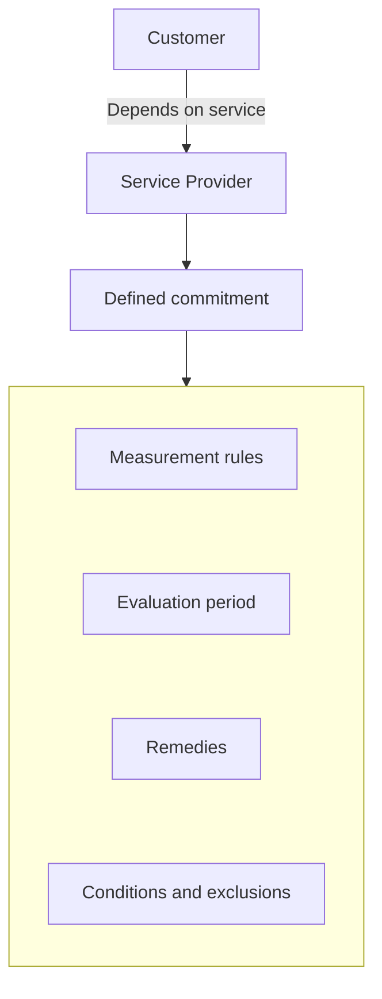
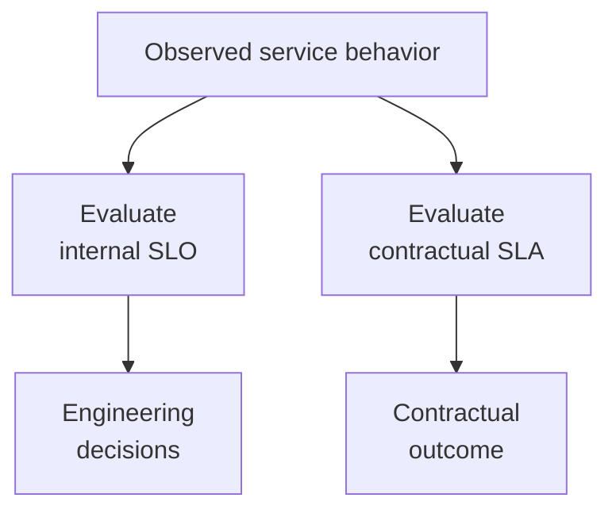
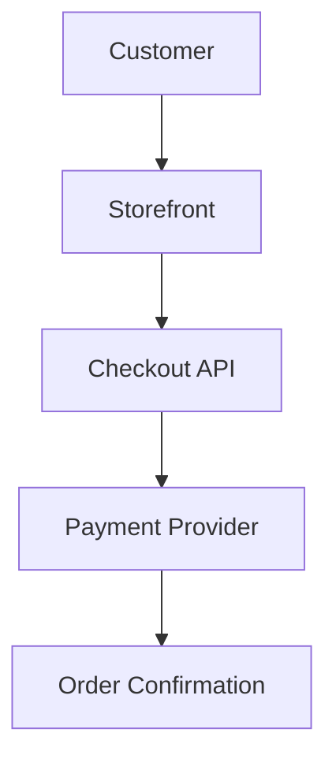
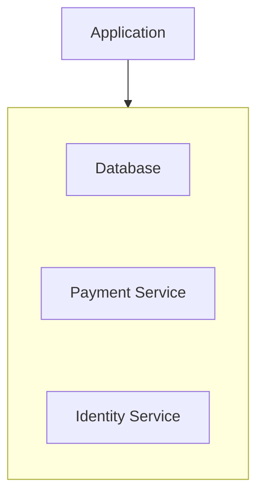
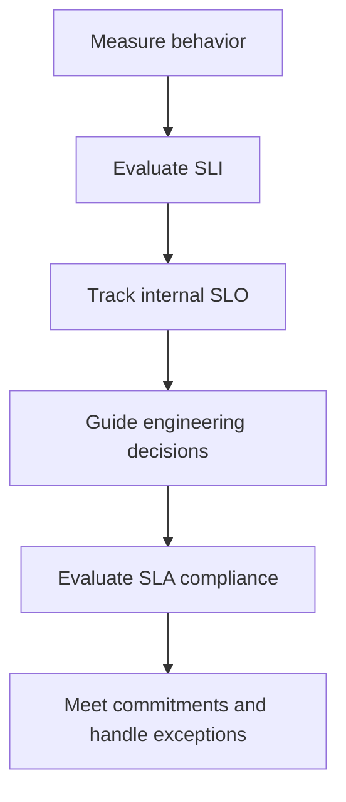

# 10.12 — Service Level Agreements (SLAs)

## Learning Objectives

By the end of this chapter, you should be able to:

- Explain what a **Service Level Agreement (SLA)** is.
- Distinguish an SLA from an SLI and an SLO.
- Understand the common components of an SLA.
- Calculate basic availability percentages and downtime.
- Understand service credits, exclusions, and measurement boundaries.
- Recognize why an SLA should not be treated as the complete reliability strategy.
- Understand how SLAs influence system design and operational decisions.

---

## 1. What Is an SLA?

A **Service Level Agreement (SLA)** is a formal agreement that defines the service level a provider commits to deliver to a customer.

It may specify:

- Required service availability.
- How service performance is measured.
- The period over which compliance is evaluated.
- What happens if the provider misses the commitment.
- How customers report incidents or request remedies.
- Which exclusions or limitations apply.

For example, a cloud provider might offer an SLA that promises a defined level of monthly availability for a particular service.

If the provider fails to meet the contractual conditions, the customer may qualify for service credits or another remedy, depending on the agreement.

> **An SLA defines a formal service commitment and the conditions attached to it.**

The exact obligations depend on the contract. Not every SLA includes the same targets, remedies, or exclusions.

---

## 2. SLI vs SLO vs SLA

These concepts work together, but they answer different questions.

An SLA may use an SLI to measure compliance. An SLO may be stricter than the SLA so the team has room to operate without violating its customer commitment.

This is a common strategy, not a universal contractual rule.

---

## 3. Why Do SLAs Exist?

Customers depend on services they do not fully control.

For example, an online store may depend on:

- A cloud hosting provider.
- A payment provider.
- An email delivery service.
- A managed database.

Customers need to understand what service level they can expect and what happens if the provider does not meet its obligations.

An SLA establishes agreed terms rather than relying only on informal assurances.



An SLA can improve accountability, but it cannot prevent failures by itself.

---

## 4. Common Components of an SLA

A typical SLA may include the following elements.

| Component | What it defines |
|---|---|
| Service scope | Which product, feature, or service is covered |
| Availability target | The required level of availability |
| Measurement method | How compliance is calculated |
| Evaluation window | The period used for measurement |
| Responsibilities | What the provider and customer must do |
| Exclusions | Events or conditions not covered by the commitment |
| Incident process | How incidents must be reported or handled |
| Remedies | Service credits or other contractual remedies |
| Limitations | Conditions that affect the provider's obligations |

The details matter.

For example, two providers may both advertise a 99.9% availability SLA but define eligible services, measurement methods, exclusions, and remedies differently.

The headline percentage alone does not tell you the complete commitment.

---

## 5. Understanding Availability Percentages

Availability is often expressed as a percentage.

For a simple time-based model:

$$
\text{Availability} =
\frac{\text{Eligible service time} - \text{Unavailable time}}
{\text{Eligible service time}} \times 100
$$

Suppose a service is measured over 30 days and is unavailable for 20 minutes.

Assuming the full 30-day period is eligible:

```text
Total time = 30 × 24 × 60
           = 43,200 minutes

Unavailable time = 20 minutes

Availability = (43,200 − 20) / 43,200 × 100
             ≈ 99.954%
```

Under this simplified calculation, availability is approximately 99.954%.

Actual contractual calculations may use different definitions, exclusions, or measurement methods. Always follow the agreement's wording.

---

## 6. What Does 99.9% Availability Mean?

Compare some illustrative targets:

| Availability | Approximate unavailable time in 30 days |
|---|---:|
| 99% | 7 hours, 12 minutes |
| 99.9% | 43 minutes, 12 seconds |
| 99.95% | 21 minutes, 36 seconds |
| 99.99% | 4 minutes, 19 seconds |

These values assume a 30-day period and a pure time-based calculation with no exclusions.

**Important:** Request-based success objectives are different. A request-based SLO or SLA may count successful and failed requests rather than unavailable minutes. Do not convert one model into the other without an explicit measurement rule.

---

## 7. Service Credits

Some SLAs provide **service credits** if the provider fails to meet the agreement's conditions.

For example, a contract might define a credit based on the affected service's charges when availability falls below a specified threshold.

A simplified example:

```text
Monthly service charge: ₹10,000
Contract-defined credit: 10%

Potential credit: ₹1,000
```

This is only an illustration. Actual credits, thresholds, caps, and eligibility conditions depend on the contract.

Service credits are not necessarily automatic. An agreement may require the customer to submit a claim within a defined period and provide supporting information.

A credit also does not necessarily compensate for all business losses caused by an outage.

> **A contractual remedy is not the same as preventing or recovering from a failure.**

---

## 8. SLA vs Actual Reliability

Imagine a service has a 99.9% availability SLA.

During a particular month, it achieves 99.95% availability.

It has met that availability commitment under the assumed measurement model.

But this does not prove that the service is fast, correct, secure, or suitable for every user journey.

Availability alone does not measure all aspects of service quality.

For example:

```text
Service responds:       Yes
Response time:          8 seconds
Returned data:          Incorrect
```

The service may be technically reachable while still delivering a poor user experience.

That is why teams define appropriate SLIs and SLOs for important behaviors, not just availability.

---

## 9. Why Internal SLOs Are Often Stricter

Suppose the contractual SLA requires 99.9% availability.

A team might choose an internal SLO of 99.95%.

```text
Internal SLO: 99.95%
Contractual SLA: 99.9%
```

The stricter internal target provides a buffer.

If the team aims only to meet the contractual minimum, small unexpected failures could cause it to violate the SLA.

An internal SLO can help the team detect reliability problems before they become contractual problems.

However, a stricter SLO does not guarantee compliance. Measurement differences, incidents, and unexpected failures still matter.

---

## 10. SLA and Error Budgets

An SLO creates an error budget based on its target and measurement window. An SLA may define a separate contractual threshold and remedy.

The team can monitor its internal error budget and use it to guide engineering decisions.

The contractual SLA determines whether the service has met its formal commitment under the agreement.

These are related, but they are not necessarily calculated in the same way.



See **10.13 — Error Budgets** for a deeper explanation of how teams use reliability budgets.

---

## 11. Measurement Boundaries Matter

An SLA must define what counts as the service being available.

Consider an online store:



If the payment provider fails, the storefront might still load successfully.

Which service is considered unavailable?

The answer depends on the SLA's scope and measurement rules.

An SLA covering only the storefront's availability may not measure the complete checkout journey. An agreement covering a broader service may define different conditions.

For system design, always ask:

- Which service is covered?
- Where is availability measured?
- Which dependencies are included?
- How are partial failures treated?
- Which events are excluded?

The boundary determines what the percentage actually means.

---

## 12. Exclusions and Shared Responsibility

SLAs may contain exclusions or place specific responsibilities on the customer.

Depending on the agreement, these could involve:

- Scheduled maintenance.
- Customer configuration errors.
- Unsupported usage.
- Failures outside the covered service boundary.
- Failure to follow the incident-reporting process.

These are examples, not universal exclusions. Never assume a particular event is excluded without checking the actual agreement.

Shared responsibility also matters.

A cloud provider may commit to the availability of an infrastructure service, while the customer remains responsible for application configuration, access controls, deployment practices, and recovery design.

A provider's SLA does not automatically guarantee the availability of the customer's entire application.

---

## 13. One Provider SLA Does Not Guarantee End-to-End Availability

Imagine an application depends on three independent services, each with 99.9% availability.

If all three must be available for the request to succeed, a simplified independence model gives:

$$
0.999 \times 0.999 \times 0.999 \approx 99.7003\%
$$

This is an illustrative calculation, not a prediction for real services. Actual failures may be correlated, and provider SLAs may use different measurement rules.

The lesson is that a chain of dependencies can be less available than any individual dependency.



If the request requires all three, failure in any required dependency may prevent completion.

System designers must therefore consider end-to-end reliability, not only individual provider commitments.

---

## 14. SLAs Influence Architecture Decisions

A demanding availability commitment can affect architecture.

A system might need:

- Redundant application instances.
- Health checks and failover.
- Database backups and recovery procedures.
- Multi-zone deployment.
- Tested incident response.
- Dependency timeouts and failure handling.
- Monitoring and alerting.
- Defined recovery objectives.

But more infrastructure does not automatically guarantee higher availability.

Redundancy can introduce new failure modes, and a shared dependency can still bring down multiple instances.

The right architecture depends on the service's required reliability, budget, workload, and recovery needs.

> **Design for the required service level, not for an arbitrary number of servers.**

---

## 15. Common SLA Mistakes

### Mistake 1 — Treating an SLA as a guarantee of zero failures

An availability target permits some level of unavailability under its measurement model.

### Mistake 2 — Looking only at the headline percentage

Scope, exclusions, measurement methods, claim requirements, and remedies matter too.

### Mistake 3 — Assuming provider availability equals application availability

Your application may have additional dependencies and configuration risks.

### Mistake 4 — Confusing SLA and SLO

The SLA is a formal commitment; the SLO is a reliability objective.

### Mistake 5 — Assuming service credits eliminate business impact

Credits may not cover lost revenue, damaged trust, or all consequences of an outage.

### Mistake 6 — Ignoring measurement boundaries

A healthy infrastructure component does not necessarily mean the customer's full workflow is working.

### Mistake 7 — Choosing architecture from the SLA number alone

The correct design also depends on failure modes, recovery requirements, dependencies, cost, and operational capability.

---

## 16. Hands-On Exercise

Imagine your team operates an online store that depends on a cloud provider and a payment service.

The provider's hypothetical agreement states:

```text
Availability commitment: 99.9%
Evaluation window:       Monthly
Remedy:                  Contract-defined service credits
```

Answer these questions:

1. What exact service does the commitment cover?
2. How does the agreement define unavailable time?
3. Which maintenance periods or other events, if any, are excluded?
4. How must a customer request a service credit?
5. Does the provider's commitment cover your complete checkout journey?
6. What internal SLO would help you detect problems before violating the SLA?
7. What redundancy or recovery measures would your application still need?

The goal is not to invent legal terms. It is to identify the information required to understand the commitment and design the system responsibly.

---

## 17. Key Principle

> **An SLA defines a formal commitment to a customer. It does not replace internal reliability targets, operational monitoring, or resilient architecture.**

A healthy reliability practice connects:



The exact relationship between these layers depends on the service and contract.

---

## 18. Quick Reference

| Concept | Meaning |
|---|---|
| SLA | Formal service commitment to a customer |
| SLI | Measurement of actual service behavior |
| SLO | Target for a measured aspect of service behavior |
| Service credit | Contract-defined credit that may apply when conditions are met |
| Availability | Proportion of eligible time or events considered available, as defined |
| Measurement boundary | The service or workflow covered by the measurement |
| Exclusion | Condition that the agreement treats differently or outside its commitment |
| Shared responsibility | Division of duties between provider and customer |

---

## 19. Knowledge Check

1. **What is an SLA?**  
   A formal agreement defining a provider's service commitments and the conditions attached to them.

2. **How is an SLA different from an SLO?**  
   An SLO is a reliability target; an SLA is a formal service commitment that may include remedies.

3. **Does 99.9% availability mean zero downtime?**  
   No. Under a simple time-based model, it permits some unavailability during the evaluation window.

4. **Does a cloud provider's SLA guarantee your complete application will be available?**  
   No. Your application may depend on other services, configuration, and operational practices outside that commitment.

5. **What is a service credit?**  
   A contractual credit that may be available when the agreement's conditions are met.

6. **Why can an internal SLO be stricter than an SLA?**  
   It provides an internal target and buffer to help the team detect and address reliability problems before violating its formal commitment.

7. **Why do measurement boundaries matter?**  
   They determine which service behavior is included in the availability or performance calculation.

---

## Remember

Before relying on an SLA, answer these questions:

```text
What service is covered?
What exactly is measured?
Over what period?
Which conditions are excluded?
What happens if the commitment is missed?
What reliability responsibilities remain with us?
```

An SLA helps define accountability. Your own SLOs, monitoring, recovery plans, and architecture help you deliver a reliable service.

**Next: 10.13 — Error Budgets**
