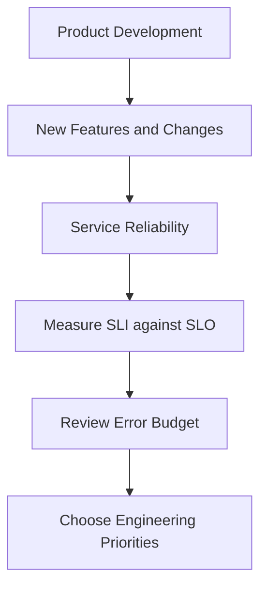
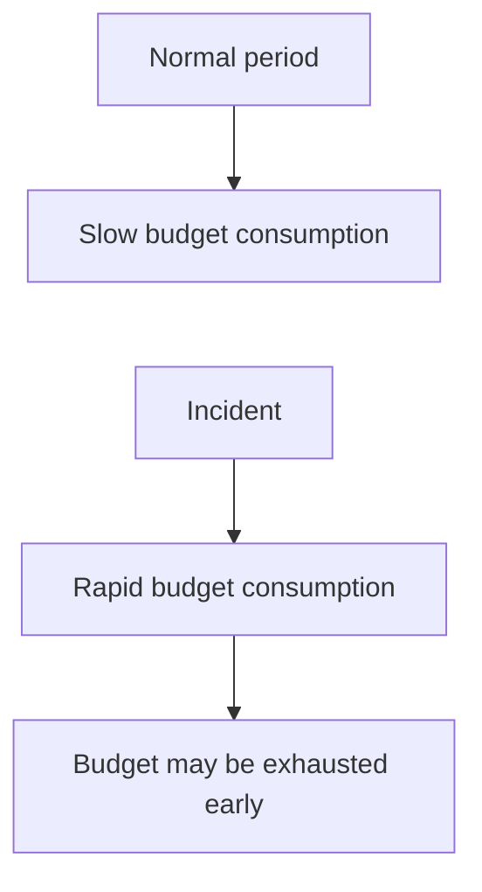
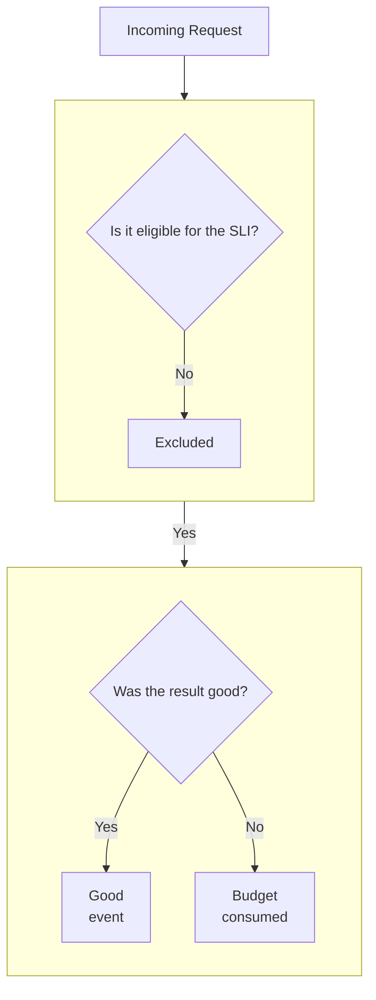
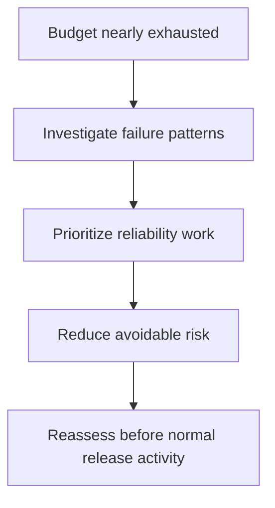
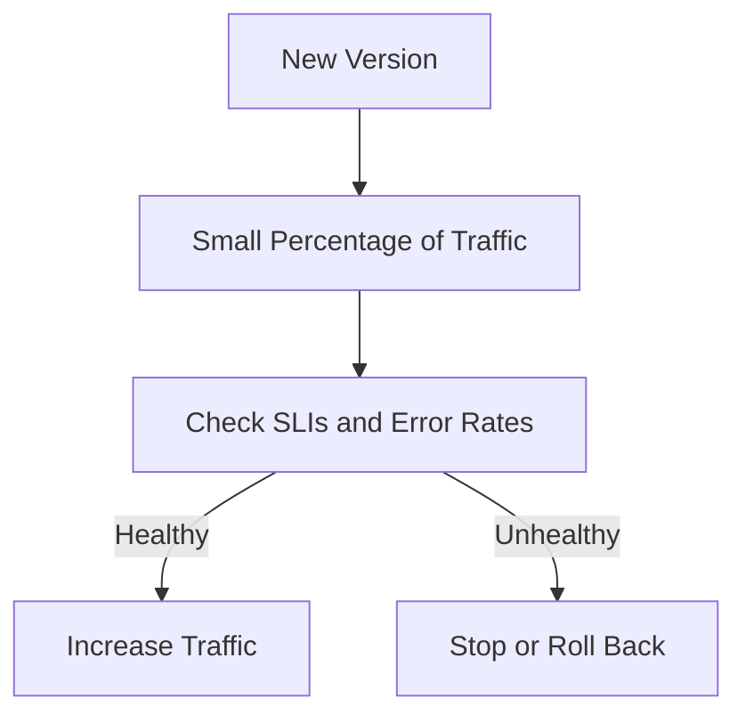
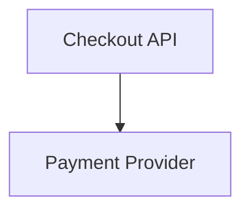
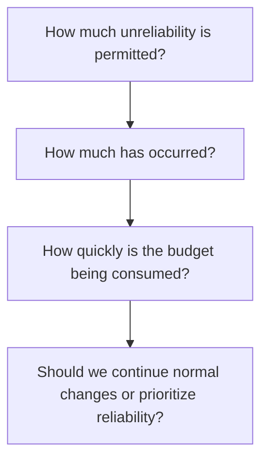

# 10.13 — Error Budgets

## Learning Objectives

By the end of this chapter, you should be able to:

- Explain what an **error budget** is and why teams use it.
- Calculate an error budget from an SLO.
- Distinguish request-based budgets from time-based budgets.
- Understand how failures consume the budget.
- Use budget consumption to guide release and reliability decisions.
- Recognize why error budgets need clear measurement rules.
- Avoid common mistakes when managing reliability.

---

## 1. What Is an Error Budget?

An **error budget** is the amount of unreliability permitted by an SLO during its evaluation window.

Suppose your service has this SLO:

> At least 99.9% of eligible requests must succeed over a rolling 30-day window.

The target is 99.9%, so the permitted failure rate is:

```text
100% − 99.9% = 0.1%
```

That remaining 0.1% is the error budget, measured against the eligible requests in the window.

The budget acknowledges a practical reality:

> **Perfect reliability is expensive, and most services have a defined level of failure they can tolerate.**

An error budget makes that tolerance measurable.

---

## 2. Why Do Error Budgets Exist?

Engineering teams often balance two goals:

- Releasing features and making changes.
- Keeping the service reliable.

Without a shared reliability framework, these goals can conflict.

A product team may want to release faster. An operations team may want to avoid every risky change.

An error budget provides a measurable input to that discussion.



When the service is comfortably meeting its SLO, the team may have room to accept reasonable release risk.

When the budget is nearly exhausted, the team may prioritize reliability work and reduce risky changes.

This is a decision framework, not an automatic rule that every deployment must stop when a particular threshold is reached.

---

## 3. Calculating a Request-Based Error Budget

Suppose:

```text
Eligible requests = 1,000,000
SLO target        = 99.9%
```

The permitted bad-event rate is:

```text
100% − 99.9% = 0.1%
```

Convert the rate to a decimal:

```text
0.1% = 0.001
```

Calculate the budget:

```text
Error budget = Eligible requests × Permitted bad-event rate

             = 1,000,000 × 0.001

             = 1,000 bad requests
```

The service can have up to 1,000 bad eligible requests during the evaluation window while meeting this request-based target.

The precise meaning of a "bad request" must be defined by the SLI.

---

## 4. Budget Consumption

Imagine the service has the same budget:

```text
Total error budget = 1,000 bad requests
```

So far, 350 eligible requests have failed.

```text
Budget consumed   = 350
Budget remaining  = 1,000 − 350
                  = 650
```

The service has consumed 35% of its budget.

```text
Total budget: 1,000

Consumed:       350  ███████░░░░░░░░░░░
Remaining:      650  ░░░░░░░░░░░░░░░░░░
```

This helps answer two practical questions:

- How much unreliability has already occurred?
- How much of the permitted budget remains?

A remaining budget is not a target to use up. The goal is still to provide a reliable service.

---

## 5. Error Budget Consumption Rate

The amount consumed is useful, but the rate of consumption is also important.

Suppose a service uses only 10% of its monthly budget during the first 20 days. Its reliability may be healthy.

Now imagine it consumes 50% of the remaining budget in one hour.

That sudden change may indicate a serious incident.



A team should consider both:

- **Total consumption:** How much budget has been used?
- **Consumption rate:** How quickly is it being used?

Fast consumption can justify investigation or an alert even when the budget has not yet run out.

---

## 6. Request-Based vs Time-Based Error Budgets

The budget depends on how the SLO is defined.

### Request-based SLO

> At least 99.9% of eligible requests must succeed.

The budget depends on the number of eligible requests.

### Time-based availability SLO

> The service must be available for 99.9% of measured time.

For a 30-day period:

```text
Total time = 30 × 24 × 60
           = 43,200 minutes

Unavailable-time budget = 43,200 × 0.001
                        = 43.2 minutes
```

Under this simple model, the budget is 43.2 minutes of unavailable time.

**These budgets are not interchangeable.** A short outage during peak traffic may cause many failed requests, while the same outage during quiet hours may affect few requests.

---

## 7. What Counts as a Bad Event?

The SLI determines what consumes the error budget.

For a request-success SLO, bad events might include:

- Server errors.
- Requests that time out.
- Failed operations caused by the service.
- Other responses explicitly classified as unsuccessful.

But the team must define the rules.

For example, should an invalid request caused by a client count as a service failure? Often it should not, but the answer depends on the service contract and measurement design.



If eligibility rules change without care, the team may appear more reliable simply because fewer events are counted.

---

## 8. Different SLOs Can Have Different Budgets

A service can have multiple SLOs.

For example:

```text
Checkout success:
99.9% of eligible requests succeed

Checkout latency:
95% of eligible requests finish within 300 ms

Payment correctness:
99.99% of evaluated outcomes are correct
```

Each objective measures a different aspect of service behavior.

The service might meet the success SLO while failing the latency SLO. It might respond quickly but still produce incorrect results.

Therefore, there may be separate budgets for different objectives.

Do not combine them into one number unless the measurement model explicitly defines how they relate.

---

## 9. What Happens When the Budget Is Low?

Suppose an application has consumed 90% of its error budget halfway through the evaluation window.

The team should investigate why.

Possible actions include:

- Review recent deployments.
- Identify the dominant source of failures.
- Fix recurring defects.
- Improve dependency handling.
- Add missing tests.
- Reduce risky changes.
- Improve rollback or recovery procedures.

A team might temporarily restrict certain high-risk releases until reliability improves.



The response should follow an agreed policy rather than an improvised reaction during every incident.

---

## 10. What If the Budget Is Exhausted?

Exhausting an error budget means the service has exceeded the unreliability allowed by the SLO for the relevant window.

It does not necessarily mean the service is completely down.

For example, a 99.9% request-success SLO can be violated even while most requests still succeed.

Possible responses include:

- Pausing or limiting risky changes.
- Prioritizing fixes for recurring reliability problems.
- Reviewing the incident and its contributing factors.
- Improving tests, deployment safety, or observability.
- Reassessing whether the current architecture meets the service's requirements.

The goal is not to punish teams for failures.

The goal is to use evidence to reduce avoidable failures and make informed decisions.

---

## 11. Error Budgets and Releases

Consider two situations.

### Situation A — Healthy reliability

```text
SLO:              99.9%
Budget consumed:  10%
Recent failures:  Stable
```

The team may proceed with normal release practices while continuing to monitor the service.

### Situation B — Reliability under pressure

```text
SLO:              99.9%
Budget consumed:  95%
Recent failures:  Increasing
```

The team may reduce release risk and focus on reliability work.

The exact policy depends on the business, the severity of recent incidents, and the type of change being considered.

A small documentation change and a risky database migration should not necessarily be treated identically.

> **Error budgets inform release decisions; they do not replace engineering judgment.**

---

## 12. Error Budgets and Deployment Safety

A budget is only one input into a safe deployment process.

Teams can also reduce release risk through:

- Automated tests.
- Gradual rollouts.
- Canary deployments.
- Feature flags.
- Fast rollback.
- Health checks.
- Monitoring of important SLIs.

These techniques help detect problems early and limit the impact of a bad release.

For example:



A healthy error budget does not make an unsafe deployment safe. It simply indicates that the service has not exceeded its defined reliability allowance.

---

## 13. Error Budgets Are Not Permission to Fail

A common misunderstanding is:

> "We have budget left, so we can afford to break the service."

That is the wrong mindset.

An error budget represents permitted unreliability under a defined measurement model. It is not a goal, and it does not make avoidable failures desirable.

The team should still prevent incidents and minimize user impact.

The budget is useful because it makes trade-offs explicit, not because it encourages the team to consume the allowance.

---

## 14. Error Budgets Need Consistent Measurement

A budget is only meaningful if the SLI is measured consistently.

Consider these questions:

- Which events are eligible?
- What counts as a good or bad event?
- What is the evaluation window?
- Where is the measurement taken?
- How are missing telemetry and delayed data handled?
- Are retries counted as separate attempts or as one logical operation?

For example, if one logical checkout attempt produces three retries, counting all four attempts as independent user requests may distort the measurement unless that is the intended definition.

Define the measurement rules before using the budget to make important decisions.

---

## 15. Error Budgets and Dependencies

Suppose checkout depends on a payment provider.



If the payment provider becomes slow, checkout requests may time out and consume the checkout SLO's error budget.

The checkout team should investigate both its own code and the dependency behavior.

Possible improvements include:

- Appropriate timeouts.
- Safe retry policies.
- Circuit breakers.
- Clear handling of unknown payment outcomes.
- Graceful degradation where business rules permit it.
- Better dependency monitoring.

A dependency's own SLA does not automatically prevent it from consuming your application's error budget.

---

## 16. Common Error Budget Mistakes

### Mistake 1 — Treating the budget as a target

The goal is to meet the SLO, not to consume all permitted failures.

### Mistake 2 — Ignoring consumption rate

A budget that is disappearing rapidly can signal an incident before it is exhausted.

### Mistake 3 — Mixing request and time budgets

A request-based budget is not the same as a time-based downtime allowance.

### Mistake 4 — Changing eligibility rules casually

Changing the denominator can make reliability figures misleading.

### Mistake 5 — Automatically freezing every deployment

Policies should consider risk, recent failures, business needs, and the nature of the change.

### Mistake 6 — Ignoring individual SLOs

Success, latency, correctness, and freshness can fail independently.

### Mistake 7 — Treating exhausted budget as team failure

The budget should guide learning, prioritization, and improvement—not blame.

---

## 17. Hands-On Exercise

Imagine your service has this request-based SLO:

```text
Target: 99.9% successful eligible requests
Window: Rolling 30 days
Eligible requests so far: 500,000
Bad requests so far: 420
```

Answer the following:

1. What is the permitted bad-event rate?
2. What would the total budget be if the window contained 1,000,000 eligible requests?
3. How much budget has been consumed so far, assuming a 1,000,000-request reference budget?
4. How many bad requests remain against that reference budget?
5. What would you investigate if consumption suddenly accelerated?
6. What release policy would you use if the budget were nearly exhausted?

### Answers

1. `100% − 99.9% = 0.1%`.
2. `1,000,000 × 0.001 = 1,000` bad requests.
3. `420 / 1,000 = 42%` of the reference budget.
4. `1,000 − 420 = 580` bad requests.
5. Investigate recent deployments, dependency failures, traffic changes, timeouts, and the distribution of errors.
6. Follow an agreed policy that prioritizes reliability and limits unnecessary release risk while accounting for the impact and risk of each change.

**Note:** In a real rolling-window calculation, the final budget depends on the actual number of eligible events within that same window. The 1,000,000-request figure here is a reference for the exercise.

---

## 18. Key Principle

> **An error budget turns an SLO into a practical way to balance reliability and change.**

It helps a team answer:



A good error-budget policy makes those decisions clear before an incident happens.

---

## 19. Quick Reference

| Concept | Meaning |
|---|---|
| Error budget | Permitted unreliability under an SLO |
| Budget consumption | Amount of the budget already used |
| Consumption rate | Speed at which the budget is being used |
| Request-based budget | Based on eligible good and bad events |
| Time-based budget | Based on measured unavailable time |
| Budget exhaustion | The service has exceeded the permitted unreliability for the window |
| Release policy | Agreed approach to changes as reliability risk increases |

---

## 20. Knowledge Check

1. **What is an error budget?**  
   The amount of unreliability permitted by an SLO during its evaluation window.

2. **What is the error budget for a 99.9% request-success SLO?**  
   A 0.1% bad-event rate among eligible requests.

3. **Why track consumption rate?**  
   Rapid consumption may indicate a developing reliability problem even before the budget is exhausted.

4. **Does an exhausted budget mean the service is completely down?**  
   No. It means the service has exceeded the defined reliability allowance.

5. **Should a team automatically stop every deployment when the budget is low?**  
   Not necessarily. It should follow a clear policy that considers reliability risk and the nature of the change.

6. **Can a service meet its success SLO but fail its latency SLO?**  
   Yes. Success and latency measure different service behaviors.

7. **Why must SLI rules remain consistent?**  
   Changing event eligibility or counting rules can make budget comparisons misleading.

---

## Remember

An error budget is not a reason to tolerate careless failures. It is a measurable tool for deciding where engineering effort should go.

**Measure the service. Track budget consumption. Investigate rapid changes. Make release decisions deliberately.**

**Next: 10.14 — Monitoring & Alerting**
