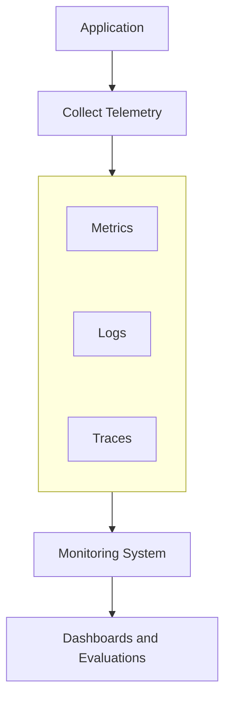
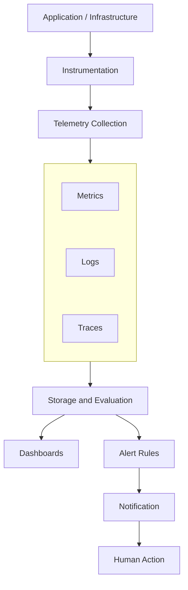
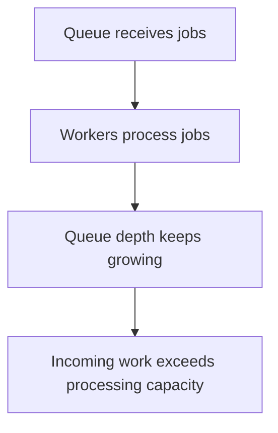
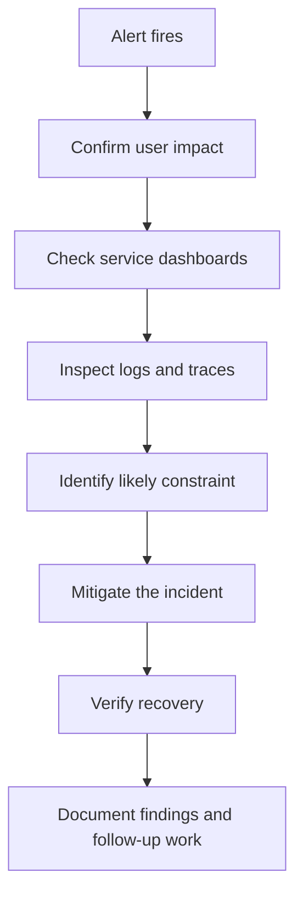
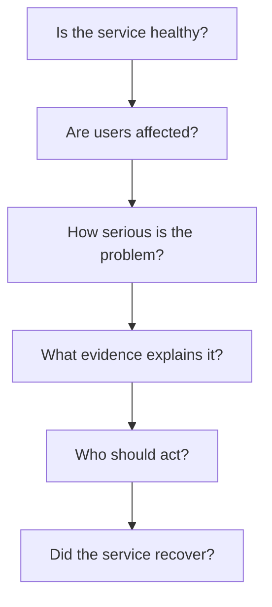

# 10.14 — Monitoring & Alerting

## Learning Objectives

By the end of this chapter, you should be able to:

- Explain the difference between monitoring and alerting.
- Understand how logs, metrics, and traces support incident detection.
- Design alerts around user impact and SLOs.
- Distinguish symptoms from possible causes.
- Understand alert thresholds, windows, and severity levels.
- Reduce noisy alerts and alert fatigue.
- Design a basic monitoring and alerting workflow.

---

## 1. What Is Monitoring?

**Monitoring** is the ongoing collection and evaluation of information about a system's behavior and health.

It helps answer questions such as:

- Is the application responding?
- Are requests becoming slower?
- Are errors increasing?
- Is the database running out of connections?
- Is the service meeting its SLO?

Monitoring turns system activity into information that engineers can use.



Monitoring does not automatically mean someone will be notified. That is where alerting comes in.

---

## 2. What Is Alerting?

**Alerting** notifies a person or automated response system when a defined condition requires attention.

For example:

```text
Monitor:
Checkout error rate is increasing.

Condition:
Error rate exceeds the defined threshold
for the configured evaluation window.

Alert:
Notify the on-call engineer.
```

An alert should prompt a useful action, such as investigating an incident, mitigating an outage, or responding to a capacity problem.

> **Monitoring helps you understand what is happening. Alerting tells you when something needs attention.**

---

## 3. Monitoring vs Alerting

| Monitoring | Alerting |
|---|---|
| Collects and evaluates system information | Notifies people or systems about defined conditions |
| Helps identify trends and patterns | Helps trigger timely action |
| Supports dashboards and investigations | Supports incident response |
| Can be useful without generating an alert | Should be tied to an actionable condition |

For example, a CPU dashboard might show utilization gradually increasing from 30% to 70%. That information can be useful even if no alert is triggered.

If CPU saturation begins affecting requests, an alert may be appropriate.

---

## 4. What Should We Monitor?

Start with the service behavior that matters to users.

Useful categories include:

| Category | Example |
|---|---|
| Availability | Percentage of successful eligible requests |
| Latency | p95 or p99 request latency |
| Errors | HTTP 5xx rate or failed operations |
| Traffic | Requests per second |
| Saturation | Worker, connection, or resource capacity |
| Dependencies | Database query latency or payment-provider failures |
| Background work | Queue depth and job completion delay |
| SLO health | Error-budget consumption rate |

The right signals depend on the system.

A web API and a background job processor may need different monitoring strategies.

---

## 5. A Monitoring Pipeline

A simplified monitoring architecture looks like this:



Real deployments may use separate tools for collection, storage, querying, alert evaluation, and notifications.

The important idea is that collecting telemetry is only part of the process. The system must also make the information useful.

---

## 6. What Makes a Good Alert?

A good alert should answer three questions:

1. **What is wrong?**
2. **How urgent is it?**
3. **What should the recipient do next?**

Example:

```text
Alert: Checkout API error rate is elevated

Impact:
A larger-than-normal percentage of checkout
requests are failing.

Evidence:
The error-rate condition has remained above
the configured threshold for five minutes.

Action:
Check the checkout dashboard, recent deployments,
and payment-provider traces.
```

The threshold and duration above are illustrative. Actual values should come from service requirements and observed behavior.

An alert that says only “Metric exceeded threshold” may be technically correct but operationally unhelpful.

A useful alert should include, where available:

- Service name.
- Environment.
- Severity.
- Time of detection.
- Relevant dashboard.
- Related logs or traces.
- Runbook or response instructions.
- Owning team.

Do not include secrets, access tokens, passwords, or sensitive customer information in alert messages.

---

## 7. Multi-Window, Multi-Burn-Rate Alerting

A more advanced approach uses both short and longer evaluation windows to distinguish severe incidents from slower degradation.

Conceptually:

```text
Short window:
Is the service degrading rapidly right now?

Longer window:
Is the problem sustained enough to threaten
the reliability objective?
```

For example, a team may evaluate both a fast and a sustained error-budget consumption rate.

This helps avoid two problems:

- **Too slow:** A serious incident goes unnoticed because the alert waits too long.
- **Too sensitive:** Brief, harmless spikes trigger unnecessary pages.

Exact burn-rate thresholds and windows should be chosen for the service's SLO, traffic volume, and response requirements.

You do not need to memorize one universal configuration. There isn't one.

---

## 8. Paging vs Ticketing

Not every alert should wake someone up.

### Paging

Used for conditions requiring immediate human attention, typically because the issue is urgent and cannot safely wait.

Examples:

- Checkout is largely unavailable.
- A critical service is failing and users are affected.
- A rapidly consuming error budget indicates a severe incident.

### Ticketing or notification

Used for problems that need follow-up but do not require immediate interruption.

Examples:

- Disk usage is trending upward but capacity remains adequate.
- A non-critical background job is delayed.
- A low-priority dependency warning needs investigation.

A useful test is:

> **If this alert fires at 3 AM, must someone act immediately to prevent significant harm?**

If the answer is no, a page may not be appropriate.

---

## 9. Health Checks Are Not Enough

A health check asks whether a component meets a defined health condition.

Monitoring examines ongoing behavior across the system.

A health check might report:

```text
Application process: Running
```

But the application could still have:

```text
Database connections exhausted
Checkout latency: 8 seconds
Error rate: 12%
```

Therefore, a successful health check does not prove the system is performing well.

Use health checks as one signal among several.

---

## 10. Monitoring Background Jobs and Queues

Not every service responds directly to an HTTP request.

A background worker may accept jobs from a queue and process them later.

Useful signals include:

- Queue depth.
- Age of the oldest queued job.
- Job failure rate.
- Processing latency.
- Retry count.
- Dead-letter queue size.

For example:



A growing queue may indicate that workers are too slow, insufficient, or blocked by a dependency.

The **age of the oldest job** can be more meaningful than queue depth alone. A large queue may be acceptable for one workload, while a small queue containing a very old critical job may require urgent attention.

---

## 11. Monitoring Can Fail Too

Monitoring infrastructure is itself a dependency.

Telemetry can be:

- Delayed.
- Dropped.
- Misconfigured.
- Incomplete.
- Incorrectly labeled.
- Unavailable during an incident.

This creates an important question:

> **How do you know the system is healthy if your monitoring data has stopped arriving?**

Useful safeguards include:

- Monitoring telemetry pipeline health.
- Alerting on missing expected data.
- Using independent checks for critical services.
- Avoiding the assumption that missing data means zero errors.
- Testing alert delivery and escalation paths.

A blank dashboard does not automatically mean the system is healthy.

---

## 12. A Practical Incident Workflow

Imagine checkout latency increases sharply.

A useful response flow is:



The immediate priority is to restore an acceptable service level safely.

Root-cause analysis can continue after the immediate impact has been controlled.

Do not assume that identifying a cause is always the first step. In a severe incident, mitigation may need to come first.

---

## 13. Hands-On Exercise

Imagine you operate an online store with these conditions:

```text
Checkout SLO:
At least 99.9% of eligible requests succeed.

Current observations:
- Checkout error rate has increased.
- Product API latency is normal.
- Payment-provider timeouts are increasing.
- Database CPU is normal.
- Error-budget consumption is accelerating.
```

Design a basic monitoring and alerting response.

Answer these questions:

1. Which signal should trigger the primary user-impact alert?
2. Which evidence would help identify the likely dependency problem?
3. Should this condition page someone or create a routine ticket? Explain your decision using user impact and urgency.
4. What dashboard or trace should the alert link to?
5. What would you check after mitigation to confirm recovery?
6. How would you reduce repeated notifications if many checkout requests fail for the same underlying reason?

There is no universal threshold or severity for every service. Define them according to the service's requirements and incident policy.

---

## 14. Common Monitoring and Alerting Mistakes

### Mistake 1 — Monitoring only CPU and memory

Infrastructure metrics alone may not reveal user-facing failures.

### Mistake 2 — Alerting on every threshold breach

Brief or harmless fluctuations can create unnecessary noise.

### Mistake 3 — No clear action

An alert without an owner or useful next step slows incident response.

### Mistake 4 — Ignoring SLOs

A service may appear operational while its user-facing reliability target is being violated.

### Mistake 5 — Paging for non-urgent problems

Use pages for urgent, actionable issues; route other conditions appropriately.

### Mistake 6 — Treating missing telemetry as healthy

Missing measurements may indicate a monitoring failure.

### Mistake 7 — Creating duplicate alerts

One underlying incident should not overwhelm responders with redundant notifications.

### Mistake 8 — Never reviewing alert quality

Alert rules should evolve as workloads, services, and operational experience change.

---

## 15. Key Principle

> **Monitoring turns telemetry into operational understanding. Alerting turns important conditions into action.**

A useful monitoring system helps the team answer:



The goal is not to watch every metric constantly. It is to detect meaningful problems, investigate them efficiently, and restore the service safely.

---

## 16. Quick Reference

| Concept | Meaning |
|---|---|
| Monitoring | Ongoing collection and evaluation of system behavior |
| Alerting | Notification when a defined condition needs attention |
| Golden signals | Latency, traffic, errors, and saturation |
| Threshold alert | Alert based on a measurement crossing a defined boundary |
| SLO-based alert | Alert based on reliability-target or error-budget conditions |
| Alert fatigue | Reduced responsiveness caused by excessive or noisy alerts |
| Deduplication | Preventing repeated notifications for the same event |
| Alert routing | Directing notifications to the responsible team |
| Runbook | Documented steps for investigating or responding to a condition |
| Telemetry health | Whether monitoring data is arriving and can be trusted |

---

## 17. Knowledge Check

1. **What is the difference between monitoring and alerting?**  
   Monitoring collects and evaluates system information; alerting notifies people or systems when a condition needs attention.

2. **What are the four golden signals?**  
   Latency, traffic, errors, and saturation.

3. **Why should alerts focus on meaningful conditions?**  
   Excessive non-actionable alerts create noise and can cause responders to miss important incidents.

4. **Why can a healthy CPU metric coexist with a checkout outage?**  
   The problem may be caused by a dependency, network failure, application logic, or another constraint.

5. **What is alert fatigue?**  
   A condition in which too many noisy or unhelpful alerts reduce people's responsiveness to important notifications.

6. **Why is missing telemetry not proof of health?**  
   Data may have stopped arriving because the monitoring pipeline or instrumentation has failed.

7. **Why should alerts include ownership and useful context?**  
   Responders need to know who should act and where to begin investigating.

8. **Why monitor error-budget consumption?**  
   Rapid consumption can reveal reliability degradation before the full evaluation window has ended.

---

## Remember

A useful alert should tell you:

```text
What is wrong?
Who is affected?
How urgent is it?
Where should I investigate?
What should happen next?
```

**Collect the right signals. Alert on meaningful conditions. Reduce noise. Make every urgent alert actionable.**

**Next: Level 10 complete — Observability.**
