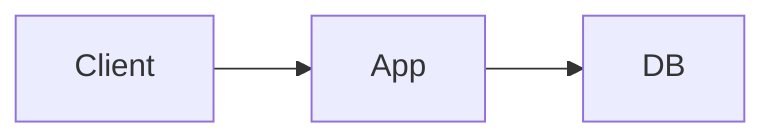

This file exists only to check rendering. It lives in `content/_samples/`, which is loaded by `astro dev` and excluded from production builds. Replace nothing here with real teaching content.

## Paragraphs and inline formatting

Plain text, **bold text**, *italic text*, `inline code`, and a [link to the home page](/). Straight "quotes", double hyphens -- and three dots ... must stay exactly as written.

## Lists

- First item
- Second item with `code`
  - Nested item
  - Another nested item
- Third item

1. Ordered one
2. Ordered two
3. Ordered three

- [x] Completed task
- [ ] Open task

## Callouts

> [!MENTAL-MODEL]
> Mental model callout body.

> [!PROBLEM]
> Problem callout body.

> [!TRADE-OFF]
> Trade-off callout body with **bold** and `code`.
>
> A second paragraph inside the same callout.

> [!FAILURE] Custom failure title
> Failure callout with a custom title.

> [!EVOLUTION]
> Evolution callout body.

> [!LOCK-IN]
> Lock-in callout body.

> [!NOTE]
> Standard GitHub note.

> [!WARNING]
> Standard GitHub warning.

> A plain blockquote stays a blockquote.

## Code

```ts
interface Request {
  path: string;
  headers: Record<string, string>;
}

export function handle(request: Request): number {
  return request.path === '/health' ? 200 : 404;
}
```

```sql
SELECT id, email FROM users WHERE created_at > now() - interval '1 day';
```

```text
V1

Client
  ↓
Monolith
  ↓
Database
```

A very long line to check horizontal scrolling inside code blocks on narrow screens:

```sh
curl -sS -H "Accept: application/json" "https://example.com/api/v1/resources?limit=100&offset=0&sort=created_at"
```



## Table

| Column A | Column B | Column C | Column D |
|---|---|---|---|
| Short | A longer cell to check wrapping behaviour on small screens | `code` | 1 |
| Row two | Value | Value | 2 |

## Heading levels

### Third-level heading

#### Fourth-level heading

---

Text after a horizontal rule.
